# Flujo Completo del Agent Orchestrator Service

## 1. Flujo de Entrada desde Frontend

```mermaid
graph TB
    subgraph "Frontend (Chat Público)"
        A[Usuario Anónimo] -->|1. Inicia chat| B[Widget Chat]
        B -->|2. Obtiene agent_id de URL| C[Envía Mensaje]
    end
    
    subgraph "API Gateway - Orchestrator"
        C -->|3. POST /chat/message| D[ChatEndpoint]
        D -->|4. Valida formato| E{Validación}
        E -->|No válido| F[Error 400]
        E -->|Válido| G[Obtener Tenant Info]
        
        G -->|5. Query Redis/DB| H[tenant:agent:{agent_id}]
        H -->|6. Retorna| I[tenant_id + tier + limits]
        
        I -->|7. Check Rate Limit| J{Rate Limit OK?}
        J -->|No| K[Error 429 - Too Many Requests]
        J -->|Sí| L[Crear ChatSendMessageAction]
        
        L -->|8. Encolar| M[Redis Queue]
    end
    
    subgraph "Datos Enviados"
        N[/"Frontend envía:
        {
            agent_id: 'uuid',
            session_id: 'session-123',
            message: 'Hola',
            user_info: {
                ip: '1.2.3.4',
                user_agent: '...'
            }
        }"/]
    end
    
    subgraph "Datos Enriquecidos"
        O[/"Orchestrator agrega:
        {
            tenant_id: 'tenant-abc',
            tenant_tier: 'pro',
            rate_limits: {
                rpm: 100,
                tokens_per_day: 50000
            },
            billing_info: {
                track_to: 'tenant-abc'
            }
        }"/]
    end
```

## 2. Propagación a Servicios Internos

```mermaid
sequenceDiagram
    participant O as Orchestrator
    participant R as Redis Queue
    participant AE as Agent Execution
    participant E as Embedding Service
    participant Q as Query Service
    
    Note over O: Información enriquecida con tenant/billing
    
    O->>R: Encola en agent:tenant-abc:execute:normal
    Note right of R: Cola incluye:<br/>- tenant_id<br/>- agent_id<br/>- tier info<br/>- billing metadata
    
    AE->>R: BRPOP cola
    AE->>AE: Procesa mensaje
    
    alt Necesita RAG
        AE->>E: Genera embedding
        Note right of E: Incluye tenant_id<br/>para tracking
        E->>E: Track tokens usados
        E->>R: Reporta uso a billing:{tenant_id}
        
        AE->>Q: Búsqueda vectorial
        Note right of Q: Incluye tenant_id<br/>y límites de búsqueda
        Q->>Q: Track tokens Groq
        Q->>R: Reporta uso a billing:{tenant_id}
    end
    
    AE->>R: Callback con resultado + métricas
    O->>R: Obtiene callback
    O->>O: Consolida métricas totales
    O->>R: Actualiza usage:{tenant_id}:{date}
```



## 3. Sistema de Colas y Redis

### Estructura de Colas

```
# Formato estándar: {domain}:{tenant_id}:{action}:{priority}

## Colas de entrada (desde Orchestrator)
agent:tenant-abc:execute:high        # Mensajes prioritarios (Enterprise)
agent:tenant-abc:execute:normal      # Mensajes normales
agent:tenant-abc:execute:low         # Mensajes batch/background

## Colas de callback (hacia Orchestrator)
orchestrator:tenant-abc:websocket_send:high    # Respuestas al usuario
orchestrator:tenant-abc:status_update:normal   # Actualizaciones de progreso
orchestrator:tenant-abc:billing_update:low     # Consolidación de métricas

## Estructura en Redis
tenant:agent:{agent_id}              # Mapeo agent -> tenant + info
tenant:info:{tenant_id}              # Info del tenant (tier, limits)
rate_limit:{tenant_id}:chat          # Rate limiting (sorted set)
usage:{tenant_id}:{date}             # Uso diario (hash)
action_status:{tenant_id}:{task_id}  # Estado de tareas
queue_stats:{tenant_id}              # Estadísticas de cola
```

### Rate Limiting por Tier

```yaml
Tiers:
  Free:
    requests_per_minute: 10
    requests_per_hour: 100
    tokens_per_day: 5000
    max_queue_size: 5
    priority: low
    
  Starter:
    requests_per_minute: 30
    requests_per_hour: 500
    tokens_per_day: 50000
    max_queue_size: 20
    priority: normal
    
  Pro:
    requests_per_minute: 60
    requests_per_hour: 2000
    tokens_per_day: 500000
    max_queue_size: 50
    priority: normal
    
  Enterprise:
    requests_per_minute: unlimited
    requests_per_hour: unlimited
    tokens_per_day: unlimited
    max_queue_size: 200
    priority: high
```

## 4. Flujo de WebSocket y Respuestas

```mermaid
graph LR
    subgraph "Agent Execution"
        A[Procesa Mensaje] -->|Genera respuesta| B[Callback Queue]
    end
    
    subgraph "Orchestrator Worker"
        B -->|BRPOP| C[ActionWorker]
        C -->|Procesa callback| D[WebSocketSendAction]
    end
    
    subgraph "WebSocket Manager"
        D -->|send_to_session| E[Encuentra conexiones]
        E -->|Por session_id| F[WebSocket activos]
        F -->|send_text| G[Cliente recibe]
    end
    
    subgraph "Tracking"
        C -->|Actualiza| H[usage:{tenant_id}]
        H -->|Contiene| I[tokens_used<br/>requests_count<br/>total_cost]
    end
```

## 5. Validaciones y Seguridad

### En el Orchestrator:

1. **Validación de Agent ID**
   - Verificar que existe
   - Obtener tenant propietario
   - Verificar que está activo/público

2. **Rate Limiting**
   - Por tenant (no por usuario)
   - Ventana deslizante
   - Diferentes límites por tier

3. **Validación de Mensajes**
   - Tamaño máximo
   - Contenido no vacío
   - Sanitización básica

### Propagación de Contexto:

```json
{
  "action_id": "task-123",
  "tenant_id": "tenant-abc",
  "agent_id": "agent-xyz",
  "billing_context": {
    "tier": "pro",
    "track_to_tenant": "tenant-abc",
    "cost_center": "chat_api",
    "rate_limits": {
      "tokens_remaining": 45000,
      "requests_remaining": 1950
    }
  },
  "execution_context": {
    "timeout": 30,
    "max_tokens": 1000,
    "temperature": 0.7
  }
}
```

## 6. Monitoreo y Métricas

### Métricas a Trackear:

1. **Por Tenant:**
   - Requests totales
   - Tokens consumidos (OpenAI, Groq)
   - Latencia promedio
   - Errores por tipo

2. **Por Sistema:**
   - Tamaño de colas
   - Workers activos
   - Conexiones WebSocket
   - Redis memory/CPU

3. **Alertas:**
   - Rate limit alcanzado
   - Cola llena
   - Errores recurrentes
   - Latencia alta

## 7. Consideraciones de Implementación

### Ya Implementado ✅:
- Domain Actions pattern
- WebSocket manager
- Queue manager básico
- Action processors
- Error handling

### Por Implementar 🚧:
- Validación agent -> tenant
- Rate limiting real
- Propagación de billing context
- Métricas dinámicas
- Consolidación de uso
- Persistencia de WebSocket state

### Optimizaciones Futuras 💡:
- Cache de agent info
- Batch processing para Free tier
- Priority queues por tier
- Circuit breaker para servicios
- Horizontal scaling con Redis Cluster