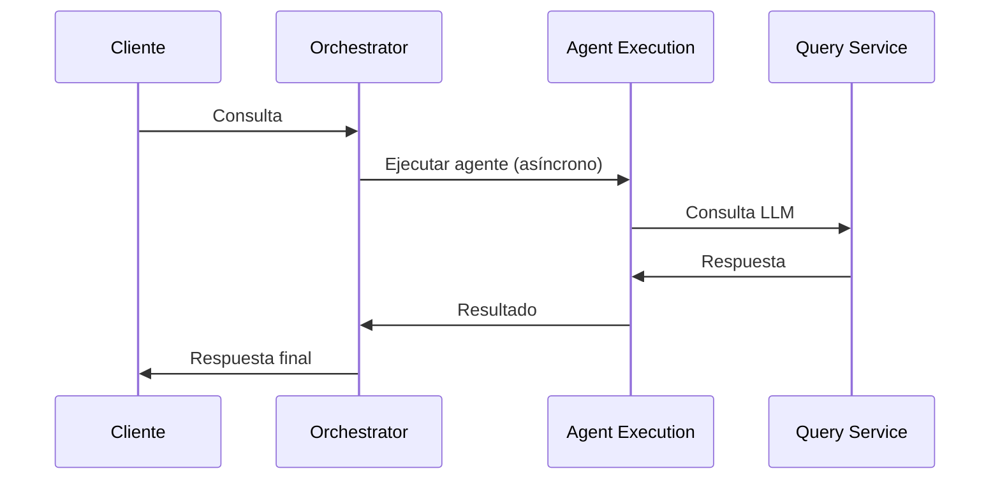
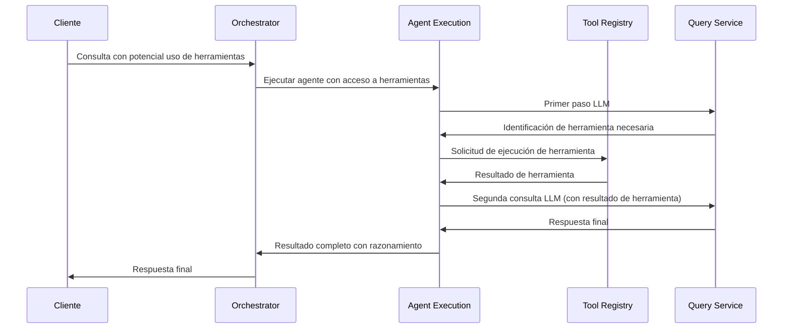
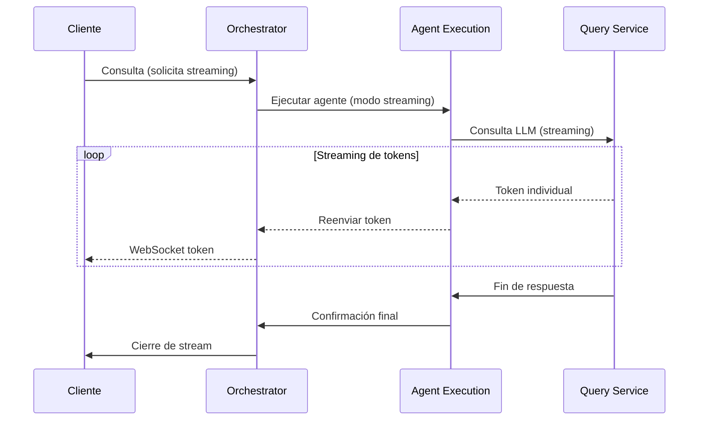
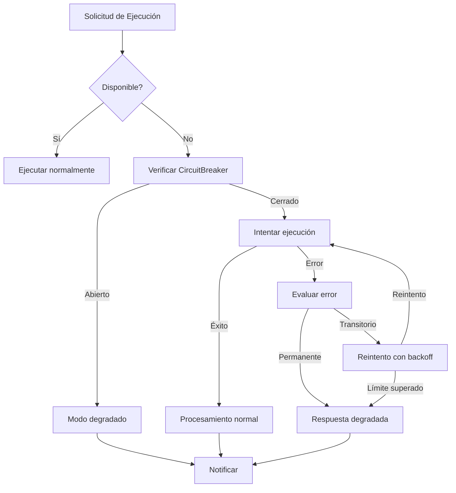

# Comunicación con Agent Execution Service

*Versión: 1.0.0*  
*Última actualización: 2025-06-03*  
*Responsable: Equipo Nooble Backend*

## Índice
- [Comunicación con Agent Execution Service](#comunicación-con-agent-execution-service)
  - [Índice](#índice)
  - [1. Visión General](#1-visión-general)
  - [2. Integración en Flujos de Trabajo](#2-integración-en-flujos-de-trabajo)
  - [3. Estructura de Colas](#3-estructura-de-colas)
  - [4. Formato de Mensajes](#4-formato-de-mensajes)
  - [5. Comunicación WebSocket](#5-comunicación-websocket)
  - [6. REST API](#6-rest-api)
  - [7. Gestión de Errores](#7-gestión-de-errores)

## 1. Visión General

El Agent Orchestrator Service interactúa con el Agent Execution Service para ejecutar la lógica principal de los agentes, procesar solicitudes de los usuarios y coordinar llamadas a herramientas y servicios de LLM. Esta comunicación es esencial para la ejecución de los flujos de trabajo operacionales de la plataforma.

### 1.1 Principios de Interacción

- **Separación Funcional**: El Agent Execution Service encapsula toda la lógica específica de ejecución de agentes, mientras que el Orchestrator se enfoca en la coordinación de alto nivel
- **Comunicación Bidireccional**: El Orchestrator delega la ejecución y recibe respuestas y notificaciones de progreso
- **Streaming Integrado**: Soporte para respuestas incrementales en tiempo real
- **Autonomía Controlada**: El Agent Execution Service puede iniciar llamadas a herramientas y otros servicios dentro de un contexto de ejecución autorizado por el Orchestrator


## 2. Integración en Flujos de Trabajo

### 2.1 Consulta Simple (Nivel 1)



### 2.2 Ejecución con Herramientas (Nivel 2)



### 2.3 Respuesta en Streaming (Nivel 2)



## 3. Estructura de Colas

El Orchestrator interactúa con el Agent Execution Service a través de las siguientes colas Redis:

### 3.1 Colas que Produce el Orchestrator 

| Cola | Propósito | Formato de Mensaje | Consumidor |
|------|-----------|-------------------|------------|
| `agent.execution.{tenant_id}` | Cola principal para tareas de ejecución | [AgentExecutionTaskMessage](#41-agentexecutiontaskmessage) | Agent Execution Service |
| `agent.execution.priority.{tenant_id}` | Cola para ejecuciones prioritarias | [AgentExecutionTaskMessage](#41-agentexecutiontaskmessage) | Agent Execution Service |
| `agent.execution.cancellation.{tenant_id}` | Solicitudes de cancelación | [ExecutionCancellationMessage](#44-executioncancellationmessage) | Agent Execution Service |

### 3.2 Colas que Consume el Orchestrator

| Cola | Propósito | Formato de Mensaje | Productor |
|------|-----------|-------------------|-----------|
| `agent.responses.{tenant_id}.{execution_id}` | Resultados de ejecución de agentes | [AgentResponseMessage](#42-agentresponsemessage) | Agent Execution Service |
| `agent.streaming.{tenant_id}.{execution_id}` | Respuestas en streaming | [AgentStreamingMessage](#43-agentstreamingmessage) | Agent Execution Service |
| `agent.execution.status.{tenant_id}` | Actualizaciones de estado de ejecución | [ExecutionStatusUpdateMessage](#45-executionstatusupdatemessage) | Agent Execution Service |

## 4. Formato de Mensajes

<a id="41-agentexecutiontaskmessage"></a>
## 4. Formato de Mensajes

### 4.1 Estructura Base de Mensajes

Todos los mensajes intercambiados entre Agent Orchestrator Service y Agent Execution Service siguen esta estructura base definida en el documento de estándares:

```json
{
  "message_id": "uuid-v4",
  "tenant_id": "tenant-identifier",
  "timestamp": "ISO-8601-datetime",
  "version": "1.0",
  "type": "request|response|event",
  "source": "service-name",
  "destination": "service-name",
  "correlation_id": "uuid-v4",
  "task_id": "uuid-v4",
  "session_id": "session-id",
  "status": "pending|completed|failed",
  "priority": 0-9,
  "payload": {}
}
```

### 4.2 AgentExecutionTaskMessage

```json
{
  "message_id": "uuid-v4",
  "tenant_id": "tenant-identifier",
  "timestamp": "2025-06-03T16:40:15Z",
  "version": "1.0",
  "type": "request",
  "source": "orchestrator",
  "destination": "agent-execution",
  "correlation_id": "request-correlation-id",
  "task_id": "uuid-v4",
  "session_id": "session-identifier",
  "status": "pending",
  "priority": 5,
  "metadata": {
    "conversation_id": "conversation-id",
    "workflow_id": "optional-workflow-id",
    "agent_id": "agent-identifier",
    "execution_id": "execution-uuid"
  },
  "payload": {
    "operation": "execute_agent",
    "query": "¿Cómo puedo configurar mi agente para procesamiento de documentos?",
    "streaming": true,
    "agent_config": {
      "model": "gpt-4",
      "temperature": 0.7,
      "max_tokens": 1000,
      "tools_enabled": true,
      "system_prompt": "Eres un asistente experto..."
    },
    "context": {
      "conversation_history": [
        {"role": "user", "content": "..."},
        {"role": "assistant", "content": "..."}
      ],
      "user_info": {
        "user_id": "user-uuid",
        "preferences": {}
      }
    }
  }
}
```

<a id="42-agentresponsemessage"></a>
### 4.2 AgentResponseMessage

```json
{
  "task_id": "uuid-v4",
  "original_task_id": "uuid-from-request",
  "tenant_id": "tenant-identifier",
  "agent_id": "agent-identifier",
  "execution_id": "execution-uuid",
  "created_at": "2025-06-03T16:40:45Z",
  "status": "completed",
  "type": "agent_response",
  "metadata": {
    "conversation_id": "conversation-id",
    "session_id": "session-identifier",
    "workflow_id": "optional-workflow-id",
    "execution_time_ms": 2500,
    "token_usage": {
      "prompt_tokens": 420,
      "completion_tokens": 350,
      "total_tokens": 770
    }
  },
  "payload": {
    "response": "Para configurar tu agente para procesamiento de documentos, necesitas seguir estos pasos...",
    "tool_calls": [
      {
        "tool_id": "document_processor",
        "inputs": {
          "document_type": "pdf",
          "extraction_level": "full"
        },
        "outputs": {
          "supported_formats": ["pdf", "docx", "txt"],
          "configuration_options": ["básico", "avanzado"]
        }
      }
    ],
    "thinking_process": "El usuario quiere información sobre configuración...",
    "additional_contexts": [
      {
        "source": "knowledge_base",
        "content": "Fragmento de documentación sobre configuración..."
      }
    ]
  }
}
```

<a id="43-agentstreamingmessage"></a>
### 4.3 AgentStreamingMessage

```json
{
  "task_id": "uuid-v4",
  "original_task_id": "uuid-from-request",
  "tenant_id": "tenant-identifier",
  "agent_id": "agent-identifier",
  "execution_id": "execution-uuid",
  "created_at": "2025-06-03T16:40:35Z",
  "type": "agent_streaming",
  "metadata": {
    "conversation_id": "conversation-id",
    "session_id": "session-identifier",
    "sequence": 12,
    "is_final": false
  },
  "payload": {
    "token": "configuración",
    "finish_reason": null
  }
}
```

<a id="44-executioncancellationmessage"></a>
### 4.4 ExecutionCancellationMessage

```json
{
  "task_id": "uuid-v4",
  "tenant_id": "tenant-identifier",
  "created_at": "2025-06-03T16:41:05Z",
  "type": "execution_cancellation",
  "priority": 9,
  "payload": {
    "execution_id": "execution-uuid",
    "reason": "user_requested|timeout|error|workflow_cancelled"
  }
}
```

<a id="45-executionstatusupdatemessage"></a>
### 4.5 ExecutionStatusUpdateMessage

```json
{
  "task_id": "uuid-v4",
  "original_task_id": "uuid-from-request",
  "tenant_id": "tenant-identifier",
  "agent_id": "agent-identifier",
  "execution_id": "execution-uuid",
  "created_at": "2025-06-03T16:41:15Z",
  "type": "execution_status_update",
  "payload": {
    "status": "started|processing|tool_calling|completing|completed|failed",
    "progress": 65,
    "current_operation": "llamando a herramienta document_processor",
    "estimated_completion_time": "2025-06-03T16:41:45Z",
    "error": null
  }
}
```

## 5. Comunicación WebSocket

El Orchestrator recibe y envía eventos WebSocket al Agent Execution Service para actualizaciones en tiempo real.

### 5.1 Eventos que Recibe el Orchestrator

| Evento | Propósito | Origen | Acción |
|--------|-----------|--------|--------|
| `agent_execution_progress` | Actualización de progreso | Agent Execution Service | Actualizar estado y notificar al cliente |
| `agent_response_token` | Token individual en modo streaming | Agent Execution Service | Reenviar inmediatamente al cliente |
| `tool_call_requested` | Solicitud de llamada a herramienta | Agent Execution Service | Coordinar con Tool Registry |
| `agent_execution_completed` | Ejecución finalizada | Agent Execution Service | Actualizar estado y notificar al cliente |
| `agent_execution_failed` | Error en ejecución | Agent Execution Service | Manejo de errores y notificación |

### 5.2 Eventos que Envía el Orchestrator

| Evento | Propósito | Destino | Acción |
|--------|-----------|---------|--------|
| `execution_request` | Solicitar nueva ejecución | Agent Execution Service | Iniciar procesamiento |
| `execution_cancel` | Cancelar ejecución en progreso | Agent Execution Service | Detener procesamiento |
| `tool_result` | Resultado de llamada a herramienta | Agent Execution Service | Incorporar en ejecución |

### 5.3 Implementación 

```python
# En el Orchestrator
async def handle_agent_execution_event(event_data):
    event_type = event_data.get("event")
    tenant_id = event_data.get("tenant_id")
    task_id = event_data.get("task_id")
    global_task_id = event_data.get("global_task_id")
    
    if event_type == "agent_response_token":
        # Reenviar token de streaming al cliente
        token = event_data["data"]["token"]
        is_final = event_data["data"].get("is_final", False)
        session_id = event_data["data"]["session_id"]
        
        await websocket_manager.send_token_to_session(
            tenant_id, 
            session_id, 
            token, 
            is_final
        )
        
    elif event_type == "tool_call_requested":
        # Coordinar llamada a herramienta
        tool_request = event_data["data"]
        execution_id = tool_request["execution_id"]
        
        # Delegar a Tool Registry
        result = await coordinate_tool_call(tenant_id, tool_request)
        
        # Devolver resultado al Agent Execution
        await notify_tool_result(
            tenant_id,
            execution_id,
            tool_request["tool_call_id"],
            result
        )
        
    elif event_type == "agent_execution_completed":
        # Procesar finalización
        execution_id = event_data["data"]["execution_id"]
        result = event_data["data"]["result"]
        
        # Actualizar estado y notificar al cliente
        await update_execution_status(tenant_id, execution_id, "completed")
        await notify_client_execution_completed(tenant_id, global_task_id, result)
```

## 6. REST API

Además de la comunicación asíncrona, el Orchestrator también utiliza las siguientes APIs REST del Agent Execution Service:

### 6.1 Endpoints Utilizados

| Endpoint | Método | Propósito | Parámetros |
|----------|--------|-----------|------------|
| `/api/v1/execute/{agent_id}` | POST | Ejecutar agente (síncrono) | agent_id, query, context |
| `/api/v1/executions/{execution_id}` | GET | Obtener estado de ejecución | execution_id |
| `/api/v1/executions/{execution_id}/cancel` | POST | Cancelar ejecución | execution_id |
| `/api/v1/internal/agent/{agent_id}/validate` | POST | Validar configuración del agente | agent_id, config |
| `/api/v1/internal/streaming/{execution_id}` | GET | Conectar a stream existente | execution_id |

### 6.2 Ejemplos de Comunicación REST

**Ejecución Síncrona (para consultas simples)**:
```python
async def execute_agent_sync(tenant_id, agent_id, query, context=None, timeout_ms=5000):
    """Ejecuta un agente de forma síncrona para consultas rápidas"""
    url = f"{AGENT_EXECUTION_SERVICE_URL}/api/v1/execute/{agent_id}"
    payload = {
        "tenant_id": tenant_id,
        "query": query,
        "context": context or {},
        "timeout_ms": timeout_ms,
        "stream": False
    }
    
    async with httpx.AsyncClient(timeout=timeout_ms/1000 + 1) as client:
        response = await client.post(
            url,
            json=payload,
            headers={"Authorization": f"Bearer {SERVICE_TOKEN}"}
        )
        
        if response.status_code == 200:
            return response.json()["data"]
        else:
            logger.error(f"Error executing agent: {response.text}")
            raise ServiceCommunicationError(f"Error executing agent: {response.status_code}")
```

**Verificar Estado de Ejecución**:
```python
async def check_execution_status(tenant_id, execution_id):
    """Verifica el estado actual de una ejecución"""
    url = f"{AGENT_EXECUTION_SERVICE_URL}/api/v1/executions/{execution_id}"
    params = {
        "tenant_id": tenant_id
    }
    
    async with httpx.AsyncClient() as client:
        response = await client.get(
            url,
            params=params,
            headers={"Authorization": f"Bearer {SERVICE_TOKEN}"}
        )
        
        if response.status_code == 200:
            return response.json()["data"]
        elif response.status_code == 404:
            raise ExecutionNotFoundError(f"Execution {execution_id} not found")
        else:
            logger.error(f"Error checking execution: {response.text}")
            raise ServiceCommunicationError(f"Error checking execution: {response.status_code}")
```

## 7. Gestión de Errores

### 7.1 Errores Comunes y Estrategias

| Error | Causa | Estrategia de Manejo |
|-------|-------|----------------------|
| `AgentNotFoundError` | ID de agente no existe | Notificar al usuario y sugerir alternativas |
| `InvalidAgentConfigError` | Configuración de agente no válida | Utilizar configuración por defecto, logear error |
| `LLMProviderError` | Error en proveedor LLM | Reintentar con otro proveedor si está disponible |
| `ToolExecutionFailed` | Error en ejecución de herramienta | Continuar sin resultado de herramienta, notificar limitación |
| `ExecutionTimeoutError` | Timeout de ejecución | Devolver respuesta parcial o solicitar refinamiento |
| `AgentRateLimitError` | Límite de tasa excedido | Encolar con prioridad baja, notificar demora |

### 7.2 Circuito de Recuperación



### 7.3 Política de Reintentos

- **Exponential Backoff**: Retraso inicial de 2s, duplicando hasta 32s
- **Jitter**: +/- 20% del valor de retraso para prevenir tormentas de sincronización
- **Máximo de Intentos**: 3 para operaciones de usuario, 5 para operaciones de sistema
- **Circuit Breaker**: Se activa después de 3 fallos consecutivos del mismo tipo, timeout de reset de 60s
