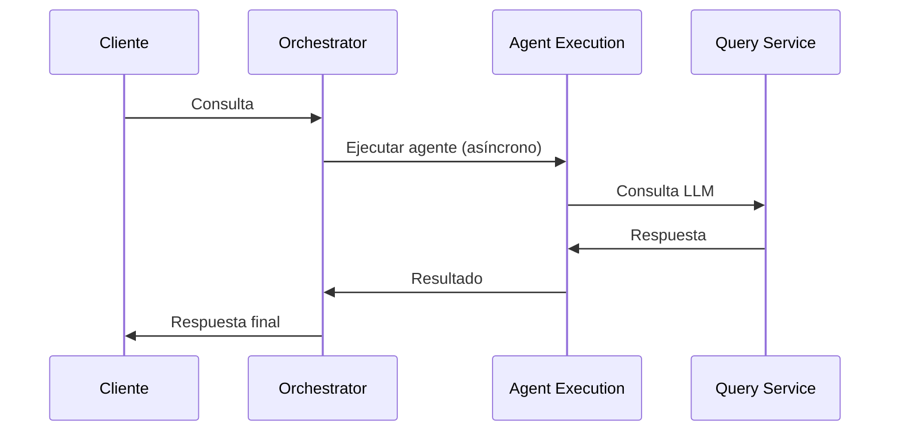
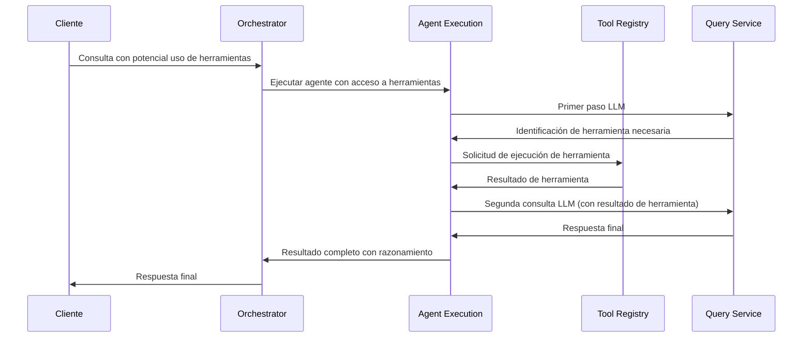
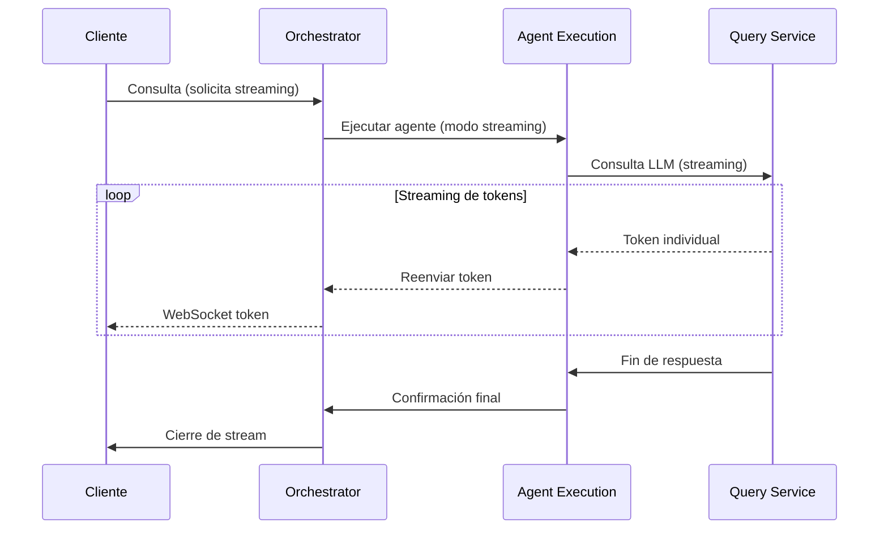
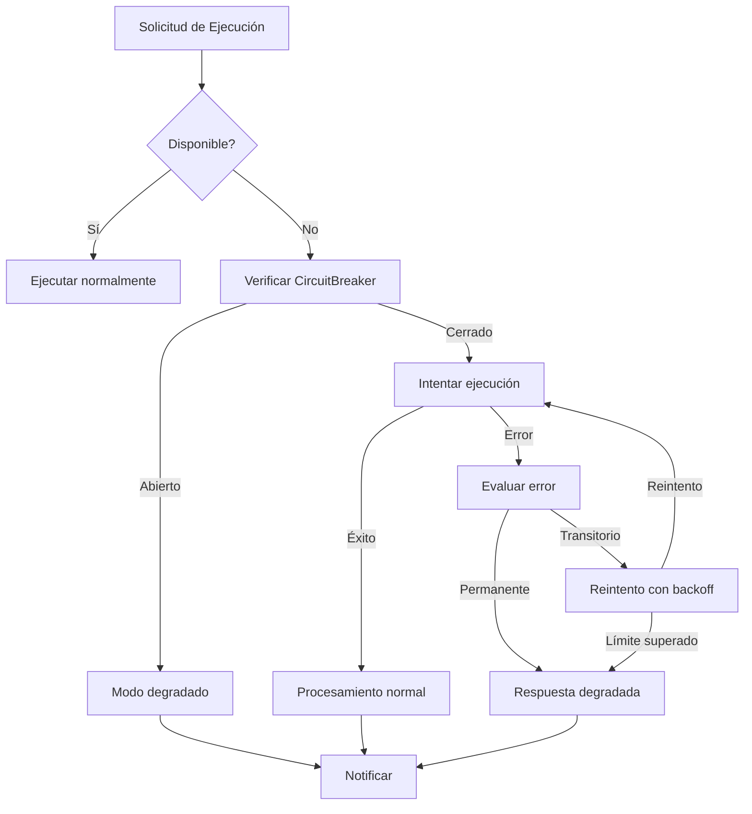

# Comunicación con Agent Execution Service

*Versión: 1.0.0*  
*Última actualización: 2025-06-03*  
*Responsable: Equipo Nooble Backend*

## Índice
- [Comunicación con Agent Execution Service](#comunicación-con-agent-execution-service)
  - [Índice](#índice)
  - [1. Visión General](#1-visión-general)
  - [2. Integración en Flujos de Trabajo](#2-integración-en-flujos-de-trabajo)
  - [3. Estructura de Colas](#3-estructura-de-colas)
  - [4. Formato de Mensajes](#4-formato-de-mensajes)
  - [5. Comunicación WebSocket](#5-comunicación-websocket)
  - [6. REST API](#6-rest-api)
  - [7. Gestión de Errores](#7-gestión-de-errores)

## 1. Visión General

El Agent Orchestrator Service interactúa con el Agent Execution Service para ejecutar la lógica principal de los agentes, procesar solicitudes de los usuarios y coordinar llamadas a herramientas y servicios de LLM. Esta comunicación es esencial para la ejecución de los flujos de trabajo operacionales de la plataforma.

### 1.1 Principios de Interacción

- **Separación Funcional**: El Agent Execution Service encapsula toda la lógica específica de ejecución de agentes, mientras que el Orchestrator se enfoca en la coordinación de alto nivel
- **Comunicación Bidireccional**: El Orchestrator delega la ejecución y recibe respuestas y notificaciones de progreso
- **Streaming Integrado**: Soporte para respuestas incrementales en tiempo real
- **Autonomía Controlada**: El Agent Execution Service puede iniciar llamadas a herramientas y otros servicios dentro de un contexto de ejecución autorizado por el Orchestrator


## 2. Integración en Flujos de Trabajo

### 2.1 Consulta Simple (Nivel 1)



### 2.2 Ejecución con Herramientas (Nivel 2)



### 2.3 Respuesta en Streaming (Nivel 2)



## 3. Estructura de Colas

El Orchestrator interactúa con el Agent Execution Service a través de las siguientes colas Redis:

### 3.1 Colas que Produce el Orchestrator 

| Cola | Propósito | Formato de Mensaje | Consumidor |
|------|-----------|-------------------|------------|
| `agent.execution.{tenant_id}` | Cola principal para tareas de ejecución | [AgentExecutionTaskMessage](#41-agentexecutiontaskmessage) | Agent Execution Service |
| `agent.execution.priority.{tenant_id}` | Cola para ejecuciones prioritarias | [AgentExecutionTaskMessage](#41-agentexecutiontaskmessage) | Agent Execution Service |
| `agent.execution.cancellation.{tenant_id}` | Solicitudes de cancelación | [ExecutionCancellationMessage](#44-executioncancellationmessage) | Agent Execution Service |

### 3.2 Colas que Consume el Orchestrator

| Cola | Propósito | Formato de Mensaje | Productor |
|------|-----------|-------------------|-----------|
| `agent.responses.{tenant_id}.{execution_id}` | Resultados de ejecución de agentes | [AgentResponseMessage](#42-agentresponsemessage) | Agent Execution Service |
| `agent.streaming.{tenant_id}.{execution_id}` | Respuestas en streaming | [AgentStreamingMessage](#43-agentstreamingmessage) | Agent Execution Service |
| `agent.execution.status.{tenant_id}` | Actualizaciones de estado de ejecución | [ExecutionStatusUpdateMessage](#45-executionstatusupdatemessage) | Agent Execution Service |

## 4. Formato de Mensajes

<a id="41-agentexecutiontaskmessage"></a>
## 4. Formato de Mensajes

### 4.1 Estructura Base de Mensajes

Todos los mensajes intercambiados entre Agent Orchestrator Service y Agent Execution Service utilizan la estructura base estandarizada definida en [message_schemas.md](./message_schemas.md):

```json
{
  "message_id": "uuid-v4",              // Identificador único del mensaje
  "task_id": "uuid-v4",               // ID de tarea asociada
  "tenant_id": "tenant-identifier",    // ID del tenant
  "session_id": "session-identifier",  // ID de sesión (cuando aplique)
  "conversation_id": "uuid-v4",        // ID de la conversación (cuando aplique)
  "correlation_id": "uuid-v4",         // ID de correlación para trazabilidad
  "created_at": "ISO-8601",           // Timestamp de creación
  "schema_version": "1.1",            // Versión del esquema
  "status": "pending|processing|completed|error",  // Estado
  "type": {                           // Tipo estructurado
    "domain": "agent",                 // Dominio funcional
    "action": "execute|status|response|error"  // Acción solicitada
  },
  "priority": 0-9,                     // Prioridad (0=más alta, 9=más baja)
  "source_service": "agent_orchestrator", // Servicio que origina el mensaje
  "target_service": "agent_execution",   // Servicio destinatario
  "metadata": {},                      // Metadatos extensibles
  "payload": {}                        // Contenido específico del mensaje
}
```

### 4.2 Solicitud de Ejecución de Agente

**Domain**: `agent`  
**Action**: `execute`

```json
{
  "message_id": "550e8400-e29b-41d4-a716-446655440000",
  "task_id": "550e8400-e29b-41d4-a716-446655440001",
  "tenant_id": "tenant-ab123",
  "session_id": "session-xyz789",
  "conversation_id": "conv-123456",
  "correlation_id": "550e8400-e29b-41d4-a716-446655440002",
  "created_at": "2025-06-04T10:15:30.123Z",
  "schema_version": "1.1",
  "status": "pending",
  "type": {
    "domain": "agent",
    "action": "execute"
  },
  "priority": 3, // Mayor prioridad para actualizaciones de estado
  "source_service": "agent_orchestrator",
  "target_service": "agent_execution",
  "metadata": {
    "source": "api",
    "user_id": "user-123",
    "timeout_ms": 60000,
    "expected_duration_ms": 15000,
    "trace_id": "trace-abc123",
    "client_version": "1.5.0"
  },
  "payload": {
    "query": "¿Cómo puedo optimizar mi campaña de marketing digital?",
    "agent_config": {
      "agent_id": "marketing-advisor",
      "version": "1.2",
      "parameters": {
        "temperature": 0.7,
        "model": "gpt-4",
        "response_format": "markdown"
      }
    },
    "context": [
      {
        "type": "conversation_history",
        "content": [...]
      },
      {
        "type": "user_preferences",
        "content": {
          "industry": "tecnología",
          "budget_range": "mid",
          "goals": ["brand_awareness", "lead_generation"]
        }
      }
    ],
    "stream": true,
    "tools": [
      {
        "name": "search_analytics",
        "description": "Buscar datos analíticos",
        "parameters": {
          "type": "object",
          "properties": {
            "query": {
              "type": "string",
              "description": "Consulta de búsqueda"
            },
            "period": {
              "type": "string",
              "enum": ["last_week", "last_month", "last_3_months", "last_year"],
              "description": "Período de tiempo"
            }
          },
          "required": ["query"]
        }
      }
    ],
    "max_tokens": 2000
  }
}
```

### 4.3 Notificación de Estado

**Domain**: `agent`  
**Action**: `status`

```json
{
  "message_id": "550e8400-e29b-41d4-a716-446655440010",
  "task_id": "550e8400-e29b-41d4-a716-446655440001", // Mismo task_id que la solicitud
  "tenant_id": "tenant-ab123",
  "session_id": "session-xyz789",
  "conversation_id": "conv-123456",
  "correlation_id": "550e8400-e29b-41d4-a716-446655440002", // Mismo correlation_id
  "created_at": "2025-06-04T10:15:32.456Z",
  "schema_version": "1.1",
  "status": "processing",
  "type": {
    "domain": "agent",
    "action": "status"
  },
  "priority": 2, // Mayor prioridad para actualizaciones de estado
  "source_service": "agent_execution",
  "target_service": "agent_orchestrator",
  "metadata": {
    "trace_id": "trace-abc123",
    "processed_at": "2025-06-04T10:15:32.456Z"
  },
  "payload": {
    "progress": 25,
    "status_detail": "Analizando estrategias de marketing digital",
    "estimated_completion_seconds": 45,
    "stream_content": {
      "type": "thinking",
      "content": "Examinando mejores prácticas de optimización de campañas..."
    }
  }
}
```

### 4.4 Respuesta Final del Agente

**Domain**: `agent`  
**Action**: `response`

```json
{
  "message_id": "550e8400-e29b-41d4-a716-446655440020",
  "task_id": "550e8400-e29b-41d4-a716-446655440001", // Mismo task_id que solicitud original
  "tenant_id": "tenant-ab123",
  "session_id": "session-xyz789",
  "conversation_id": "conv-123456",
  "correlation_id": "550e8400-e29b-41d4-a716-446655440002", // Mismo correlation_id
  "created_at": "2025-06-04T10:15:50.789Z",
  "schema_version": "1.1",
  "status": "completed",
  "type": {
    "domain": "agent",
    "action": "response"
  },
  "priority": 2,
  "source_service": "agent_execution",
  "target_service": "agent_orchestrator",
  "metadata": {
    "trace_id": "trace-abc123",
    "completed_at": "2025-06-04T10:15:50.789Z",
    "processing_time_ms": 20666
  },
  "payload": {
    "response": "# Optimización de Campañas de Marketing Digital\n\nPara optimizar su campaña de marketing digital, recomiendo enfocarse en cinco áreas clave:\n\n1. **Segmentación del público**...\n",
    "completion_tokens": 756,
    "total_tokens": 1234,
    "tool_calls": [
      {
        "tool_name": "search_analytics",
        "parameters": {
          "query": "tasas de conversión marketing digital 2025",
          "period": "last_3_months"
        },
        "result": { /* contenido del resultado */ }
      }
    ],
    "sources": [
      {
        "document_id": "doc-456",
        "chunks": [1, 2],
        "relevance_score": 0.95
      }
    ],
    "thinking_process": "Primero analicé las tendencias actuales en marketing digital..."
  }
}
```

### 4.5 Streaming de Tokens

**Domain**: `agent`  
**Action**: `token`

```json
{
  "message_id": "550e8400-e29b-41d4-a716-446655440030",
  "task_id": "550e8400-e29b-41d4-a716-446655440001",
  "tenant_id": "tenant-ab123",
  "session_id": "session-xyz789",
  "conversation_id": "conv-123456",
  "correlation_id": "550e8400-e29b-41d4-a716-446655440002",
  "created_at": "2025-06-04T10:15:35.123Z",
  "schema_version": "1.1",
  "status": "processing",
  "type": {
    "domain": "agent",
    "action": "token"
  },
  "priority": 1, // Prioridad máxima para tokens en streaming
  "source_service": "agent_execution",
  "target_service": "agent_orchestrator",
  "metadata": {
    "trace_id": "trace-abc123",
    "sequence": 15
  },
  "payload": {
    "token": "Para",
    "is_last": false,
    "content_type": "response" // o "thinking", "tool_call", etc.
  }
}
```

### 4.6 Cancelación de Ejecución

**Domain**: `agent`  
**Action**: `cancel`

```json
{
  "message_id": "550e8400-e29b-41d4-a716-446655440040",
  "task_id": "550e8400-e29b-41d4-a716-446655440001",
  "tenant_id": "tenant-ab123",
  "session_id": "session-xyz789",
  "conversation_id": "conv-123456",
  "correlation_id": "550e8400-e29b-41d4-a716-446655440002",
  "created_at": "2025-06-04T10:15:45.789Z",
  "schema_version": "1.1",
  "status": "cancelled",
  "type": {
    "domain": "agent",
    "action": "cancel"
  },
  "priority": 1, // Alta prioridad para cancelaciones
  "source_service": "agent_orchestrator", // Puede ser iniciado por el orquestador
  "target_service": "agent_execution",
  "metadata": {
    "trace_id": "trace-abc123",
    "reason_code": "user_requested" // o "timeout", "error", "system"
  },
  "payload": {
    "reason": "Cancelado por solicitud del usuario",
    "immediate": true,
    "save_state": false
  }
}
```

### 4.7 Solicitud de Estado

**Domain**: `agent`  
**Action**: `query_status`

```json
{
  "message_id": "550e8400-e29b-41d4-a716-446655440050",
  "task_id": "550e8400-e29b-41d4-a716-446655440060", // Nuevo task_id para consulta
  "tenant_id": "tenant-ab123",
  "correlation_id": "550e8400-e29b-41d4-a716-446655440002", // Correlation ID de la ejecución original
  "created_at": "2025-06-04T10:16:30.123Z",
  "schema_version": "1.1",
  "status": "pending",
  "type": {
    "domain": "agent",
    "action": "query_status"
  },
  "priority": 3,
  "source_service": "agent_orchestrator",
  "target_service": "agent_execution",
  "metadata": {
    "trace_id": "trace-abc123"
  },
  "payload": {
    "original_task_id": "550e8400-e29b-41d4-a716-446655440001",
    "include_details": true
  }
}
```

## 5. Comunicación WebSocket

El Orchestrator recibe y envía mensajes WebSocket al Agent Execution Service para actualizaciones en tiempo real. Estos mensajes utilizan el mismo formato estandarizado que la comunicación por colas, pero se transmiten a través de WebSockets para mayor inmediatez.

### 5.1 Mensajes que Recibe el Orchestrator

| Domain | Action | Propósito | Origen | Procesamiento |
|--------|--------|-----------|--------|---------------|
| `agent` | `status` | Actualización de progreso | Agent Execution Service | Actualizar estado interno y notificar al cliente |
| `agent` | `token` | Token individual en modo streaming | Agent Execution Service | Reenviar inmediatamente al cliente |
| `agent` | `tool_request` | Solicitud de llamada a herramienta | Agent Execution Service | Coordinar llamada con Tool Registry Service |
| `agent` | `response` | Respuesta final del agente | Agent Execution Service | Actualizar estado y notificar al cliente |
| `agent` | `error` | Error en ejecución | Agent Execution Service | Manejo de errores y notificación |

### 5.2 Mensajes que Envía el Orchestrator

| Domain | Action | Propósito | Destino | Procesamiento |
|--------|--------|-----------|---------|---------------|
| `agent` | `execute` | Solicitar nueva ejecución | Agent Execution Service | Iniciar procesamiento de agente |
| `agent` | `cancel` | Cancelar ejecución en progreso | Agent Execution Service | Detener procesamiento |
| `agent` | `tool_result` | Resultado de llamada a herramienta | Agent Execution Service | Incorporar resultado en ejecución |
| `agent` | `query_status` | Consultar estado de ejecución | Agent Execution Service | Obtener estado actual |

### 5.3 Implementación con Nuevo Formato

```python
# En el Orchestrator Service
async def handle_agent_execution_message(message):
    # Extraer campos comunes estandarizados
    message_id = message.get("message_id")
    task_id = message.get("task_id")
    tenant_id = message.get("tenant_id")
    correlation_id = message.get("correlation_id")
    session_id = message.get("session_id")
    conversation_id = message.get("conversation_id")
    
    # Obtener tipo de mensaje
    domain = message.get("type", {}).get("domain")
    action = message.get("type", {}).get("action")
    status = message.get("status")
    
    # Procesar según domain/action
    if domain == "agent" and action == "token":
        # Procesar token en modo streaming
        token = message["payload"]["token"]
        is_last = message["payload"].get("is_last", False)
        content_type = message["payload"].get("content_type", "response")
        
        # Reenviar al cliente
        await websocket_manager.send_token_to_session(
            tenant_id, 
            session_id, 
            token, 
            is_last,
            content_type
        )
        
    elif domain == "agent" and action == "tool_request":
        # Coordinar llamada a herramienta
        tool_request = message["payload"]
        tool_name = tool_request.get("tool_name")
        tool_parameters = tool_request.get("parameters")
        call_id = tool_request.get("call_id")
        
        # Delegar a Tool Registry
        result = await tool_registry_service.execute_tool(
            tenant_id=tenant_id,
            tool_name=tool_name,
            parameters=tool_parameters,
            session_id=session_id
        )
        
        # Enviar resultado de vuelta al Agent Execution
        await send_tool_result(
            tenant_id=tenant_id,
            task_id=task_id,
            correlation_id=correlation_id,
            call_id=call_id,
            result=result
        )
        
    elif domain == "agent" and action == "response":
        # Procesar respuesta final
        response_text = message["payload"]["response"]
        tool_calls = message["payload"].get("tool_calls", [])
        sources = message["payload"].get("sources", [])
        
        # Actualizar conversación y notificar al cliente
        await conversation_service.add_agent_message(
            tenant_id=tenant_id,
            conversation_id=conversation_id,
            content=response_text,
            metadata={
                "tool_calls": tool_calls,
                "sources": sources,
                "task_id": task_id
            }
        )
        
        # Notificar finalización al cliente
        await websocket_manager.notify_execution_completed(
            tenant_id=tenant_id,
            session_id=session_id,
            task_id=task_id
        )
```

## 6. REST API

Además de la comunicación asíncrona, el Orchestrator también utiliza las siguientes APIs REST del Agent Execution Service. Los endpoints siguen el mismo estándar de estructura de mensajes con domain/action para mantener la coherencia en toda la plataforma.

### 6.1 Endpoints Utilizados

| Endpoint | Método | Domain | Action | Propósito |
|----------|--------|--------|--------|------------|
| `/api/v1/agents/{agent_id}/execute` | POST | agent | execute | Ejecutar agente (síncrono o asíncrono) |
| `/api/v1/tasks/{task_id}` | GET | agent | query_status | Obtener estado de una tarea |
| `/api/v1/tasks/{task_id}/cancel` | POST | agent | cancel | Cancelar ejecución en progreso |
| `/api/v1/agents/{agent_id}/validate` | POST | agent | validate | Validar configuración del agente |
| `/api/v1/tasks/{task_id}/stream` | GET | agent | stream | Conectar a stream de tokens existente |

### 6.2 Ejemplos de Comunicación REST

**Ejecución de Agente (usando nuevos estándares)**:
```python
async def execute_agent(tenant_id, agent_id, query, context=None, session_id=None, conversation_id=None, stream=False):
    """Ejecuta un agente utilizando el formato estandarizado"""
    url = f"{AGENT_EXECUTION_SERVICE_URL}/api/v1/agents/{agent_id}/execute"
    
    # Generar identificadores únicos
    task_id = str(uuid.uuid4())
    message_id = str(uuid.uuid4())
    correlation_id = str(uuid.uuid4())
    
    payload = {
        "message_id": message_id,
        "task_id": task_id,
        "tenant_id": tenant_id,
        "session_id": session_id,
        "conversation_id": conversation_id,
        "correlation_id": correlation_id,
        "created_at": datetime.utcnow().isoformat(),
        "schema_version": "1.1",
        "status": "pending",
        "type": {
            "domain": "agent",
            "action": "execute"
        },
        "priority": 3,
        "source_service": "agent_orchestrator",
        "target_service": "agent_execution",
        "metadata": {
            "source": "api",
            "user_id": context.get("user_id") if context else None,
            "timeout_ms": 60000,
            "trace_id": f"trace-{str(uuid.uuid4())[:8]}",
            "client_version": "1.5.0"
        },
        "payload": {
            "query": query,
            "agent_config": {
                "agent_id": agent_id,
                "version": "latest",
                "parameters": {
                    "temperature": 0.7,
                    "model": "gpt-4",
                    "response_format": "markdown"
                }
            },
            "context": context or [],
            "stream": stream
        }
    }
    
    async with httpx.AsyncClient(timeout=120) as client:
        response = await client.post(
            url,
            json=payload,
            headers={
                "Authorization": f"Bearer {SERVICE_TOKEN}",
                "X-Tenant-ID": tenant_id,
                "X-Schema-Version": "1.1"
            }
        )
        
        if response.status_code == 200:
            return response.json()
        else:
            logger.error(f"Error executing agent: {response.text}")
            raise AgentExecutionError(f"Failed to execute agent: {response.status_code}")
```

**Verificación de Estado (usando nuevos estándares)**:
```python
async def check_task_status(tenant_id, task_id):
    """Verifica el estado actual de una tarea usando el formato estandarizado"""
    url = f"{AGENT_EXECUTION_SERVICE_URL}/api/v1/tasks/{task_id}"
    
    # Generar identificadores únicos para la solicitud
    message_id = str(uuid.uuid4())
    correlation_id = str(uuid.uuid4())
    
    # Crear solicitud con el formato estandarizado
    query_payload = {
        "message_id": message_id,
        "task_id": str(uuid.uuid4()),  # Nuevo task_id para la consulta
        "tenant_id": tenant_id,
        "correlation_id": correlation_id,
        "created_at": datetime.utcnow().isoformat(),
        "schema_version": "1.1",
        "status": "pending",
        "type": {
            "domain": "agent",
            "action": "query_status"
        },
        "priority": 3,
        "source_service": "agent_orchestrator",
        "target_service": "agent_execution",
        "metadata": {
            "trace_id": f"trace-{str(uuid.uuid4())[:8]}"
        },
        "payload": {
            "original_task_id": task_id,
            "include_details": true
        }
    }
    
    async with httpx.AsyncClient() as client:
        response = await client.get(
            url,
            headers={
                "Authorization": f"Bearer {SERVICE_TOKEN}",
                "X-Tenant-ID": tenant_id,
                "X-Schema-Version": "1.1",
                "X-Correlation-ID": correlation_id
            }
        )
        
        if response.status_code == 200:
            return response.json()
        elif response.status_code == 404:
            return {
                "status": "not_found",
                "message_id": str(uuid.uuid4()),
                "task_id": task_id,
                "tenant_id": tenant_id,
                "created_at": datetime.utcnow().isoformat(),
                "schema_version": "1.1",
                "status": "error",
                "type": {
                    "domain": "agent",
                    "action": "error"
                },
                "metadata": {
                    "error_code": "NOT_FOUND",
                    "error_category": "client",
                    "error_message": "Task not found"
                }
            }
        else:
            logger.error(f"Error checking task status: {response.text}")
            return {
                "status": "error", 
                "message": "Failed to check task status",
                "code": response.status_code
            }
```

## 7. Gestión de Errores

### 7.1 Códigos de Error Estandarizados

Todos los errores siguen el formato estandarizado con domain/action y códigos de error definidos en el documento global de esquemas de mensajes. A continuación, se detallan los errores específicos para la integración con Agent Execution Service:

| Error Code | Domain | Action | Error Category | Causa | Estrategia de Manejo |
|------------|--------|--------|---------------|-------|----------------------|
| `AGENT_NOT_FOUND` | `agent` | `error` | `client` | ID de agente no existe | Notificar al usuario y sugerir alternativas |
| `INVALID_AGENT_CONFIG` | `agent` | `error` | `validation` | Configuración de agente no válida | Utilizar configuración por defecto, logear error |
| `LLM_PROVIDER_ERROR` | `agent` | `error` | `dependency` | Error en proveedor LLM | Reintentar con otro proveedor si está disponible |
| `TOOL_EXECUTION_FAILED` | `tool` | `error` | `execution` | Error en ejecución de herramienta | Continuar sin resultado de herramienta, notificar limitación |
| `EXECUTION_TIMEOUT` | `agent` | `error` | `timeout` | Timeout de ejecución | Devolver respuesta parcial o solicitar refinamiento |
| `RATE_LIMIT_EXCEEDED` | `agent` | `error` | `quota` | Límite de tasa excedido | Encolar con prioridad baja, notificar demora |

### 7.2 Ejemplo de Mensaje de Error

```json
{
  "message_id": "550e8400-e29b-41d4-a716-446655440099",
  "task_id": "550e8400-e29b-41d4-a716-446655440001",
  "tenant_id": "tenant-ab123",
  "correlation_id": "550e8400-e29b-41d4-a716-446655440002",
  "created_at": "2025-06-04T10:22:30.123Z",
  "schema_version": "1.1",
  "status": "error",
  "type": {
    "domain": "agent",
    "action": "error"
  },
  "priority": 5, // Mayor prioridad para notificaciones de error
  "source_service": "agent_execution",
  "target_service": "agent_orchestrator",
  "metadata": {
    "trace_id": "trace-abc123",
    "error_code": "LLM_PROVIDER_ERROR",
    "error_category": "dependency",
    "error_source": "openai",
    "retry_count": 3,
    "error_id": "err-a1b2c3d4"
  },
  "payload": {
    "original_task_id": "550e8400-e29b-41d4-a716-446655440001",
    "error_message": "Error al conectar con el proveedor de LLM",
    "error_details": "El servicio OpenAI reportó error 503 Service Unavailable",
    "remediation_steps": [
      "Intentar nuevamente en unos minutos",
      "Probar con un modelo alternativo",
      "Verificar la cuota y límites del servicio"
    ],
    "diagnostic_info": {
      "http_status": 503,
      "latency_ms": 12500,
      "model": "gpt-4"
    }
  }
}
```

### 7.3 Circuito de Recuperación



### 7.3 Política de Reintentos

- **Exponential Backoff**: Retraso inicial de 2s, duplicando hasta 32s
- **Jitter**: +/- 20% del valor de retraso para prevenir tormentas de sincronización
- **Máximo de Intentos**: 3 para operaciones de usuario, 5 para operaciones de sistema
- **Circuit Breaker**: Se activa después de 3 fallos consecutivos del mismo tipo, timeout de reset de 60s
