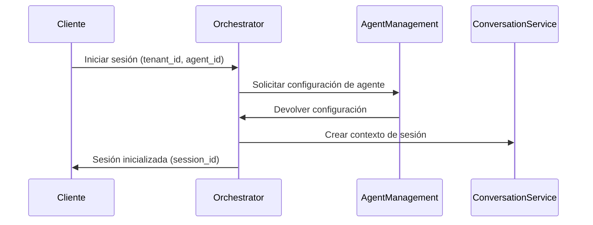
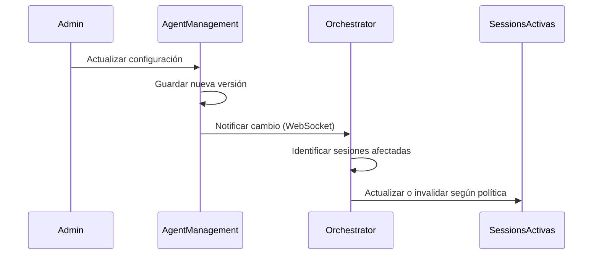
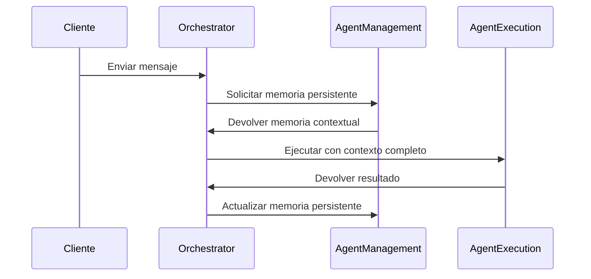

# Comunicación con Agent Management Service

*Versión: 1.0.0*  
*Última actualización: 2025-06-03*  
*Responsable: Equipo Nooble Backend*

## Índice
- [Comunicación con Agent Management Service](#comunicación-con-agent-management-service)
  - [Índice](#índice)
  - [1. Visión General](#1-visión-general)
  - [2. Integración en Flujos de Trabajo](#2-integración-en-flujos-de-trabajo)
  - [3. Estructura de Colas](#3-estructura-de-colas)
  - [4. Formato de Mensajes](#4-formato-de-mensajes)
  - [5. Comunicación WebSocket](#5-comunicación-websocket)
  - [6. REST API](#6-rest-api)
  - [7. Gestión de Errores](#7-gestión-de-errores)
  - [8. Ejemplos de Código](#8-ejemplos-de-código)
  - [9. Registro de Cambios](#9-registro-de-cambios)

## 1. Visión General

Este documento detalla los mecanismos de comunicación entre el Agent Orchestrator Service (nivel 1) y el Agent Management Service (nivel 2), responsable de la gestión del ciclo de vida de agentes, configuraciones y memoria persistente de los agentes.

### 1.1 Responsabilidades del Agent Management Service

El Agent Management Service es responsable de:

- Gestionar la configuración y personalización de agentes por tenant
- Manejar la persistencia de memoria de los agentes
- Proporcionar capacidades de versionamiento de agentes
- Gestionar permisos y capacidades de los agentes
- Facilitar la configuración y personalización de agentes

### 1.2 Principios de Comunicación

- **Exclusividad de Nivel**: El Agent Orchestrator se comunica directamente con Agent Management (nivel 2) y nunca con servicios de nivel 3
- **Independencia**: El Agent Management Service mantiene su estado independientemente del Orchestrator
- **Consistencia**: Todas las operaciones mantienen consistencia de datos del agente
- **Multi-tenant**: Estricta segregación de datos y agentes por tenant

## 2. Integración en Flujos de Trabajo

El Agent Orchestrator Service interactúa con el Agent Management Service en los siguientes casos de uso principales:

### 2.1 Inicialización de Sesiones



### 2.2 Actualización de Agentes

Cuando se actualiza la configuración de un agente, el Orchestrator debe ser notificado para afectar las sesiones activas:



### 2.3 Gestión de Memoria Persistente de Agentes



## 3. Estructura de Colas

### 3.1 Colas de Comunicación

| Nombre de Cola | Dirección | Propósito | Formato |
|--------------|-----------|-----------|---------|
| `agent_management.configuration.{tenant_id}` | Orchestrator → Management | Solicitudes de configuración | JSON |
| `agent_management.updates.{tenant_id}` | Management → Orchestrator | Notificaciones de actualización | JSON |
| `agent_management.memory.{tenant_id}.{agent_id}` | Bidireccional | Gestión de memoria persistente | JSON |

### 3.2 Campos de Control

Cada mensaje en las colas incluye campos de control específicos:

- `tenant_id`: Identificador del tenant (obligatorio)
- `agent_id`: Identificador único del agente (obligatorio)
- `version`: Versión de la configuración del agente (obligatorio en actualizaciones)
- `session_ids`: Lista de sesiones afectadas (opcional)
- `update_type`: Tipo de actualización (`config`, `memory`, `permissions`)

## 4. Formato de Mensajes

### 4.1 Solicitud de Configuración de Agente

```json
{
  "task_id": "550e8400-e29b-41d4-a716-446655440000",
  "tenant_id": "acme-corp",
  "created_at": "2025-06-03T20:15:00Z",
  "status": "pending",
  "type": "agent_config_request",
  "priority": 1,
  "metadata": {
    "source_service": "orchestrator",
    "correlation_id": "550e8400-e29b-41d4-a716-446655440000",
    "session_id": "session-123"
  },
  "payload": {
    "agent_id": "customer-support-agent",
    "include_memory": true,
    "version": "latest"
  }
}
```

### 4.2 Respuesta de Configuración de Agente

```json
{
  "task_id": "550e8400-e29b-41d4-a716-446655440000",
  "tenant_id": "acme-corp",
  "created_at": "2025-06-03T20:15:01Z",
  "completed_at": "2025-06-03T20:15:01Z",
  "status": "completed",
  "type": "agent_config_response",
  "metadata": {
    "source_service": "agent_management",
    "correlation_id": "550e8400-e29b-41d4-a716-446655440000",
    "session_id": "session-123"
  },
  "payload": {
    "agent_id": "customer-support-agent",
    "version": "2.5.0",
    "name": "Asistente de Soporte",
    "description": "Agente especializado en atención al cliente",
    "parameters": {
      "temperature": 0.7,
      "max_tokens": 1024,
      "model": "gpt-4"
    },
    "system_prompt": "Eres un asistente de soporte técnico...",
    "tools": [
      {
        "tool_id": "knowledge_base_search",
        "parameters": {
          "collections": ["faq", "troubleshooting"]
        }
      }
    ],
    "memory": {
      "factual_knowledge": [
        {"fact": "El horario de soporte es de 9am a 6pm", "confidence": 1.0}
      ],
      "preferences": {
        "communication_style": "formal",
        "response_format": "structured"
      }
    },
    "permissions": {
      "can_use_tools": true,
      "allowed_collections": ["public", "support", "products"]
    }
  }
}
```

### 4.3 Notificación de Actualización de Agente

```json
{
  "task_id": "661f9500-f38c-42d5-b818-557766550111",
  "tenant_id": "acme-corp",
  "created_at": "2025-06-03T21:30:00Z",
  "status": "notification",
  "type": "agent_updated",
  "priority": 2,
  "metadata": {
    "source_service": "agent_management",
    "update_type": "config"
  },
  "payload": {
    "agent_id": "customer-support-agent",
    "previous_version": "2.4.0",
    "new_version": "2.5.0",
    "active_sessions": ["session-123", "session-456"],
    "update_summary": {
      "changed_parameters": ["temperature", "system_prompt"],
      "added_tools": ["knowledge_base_search"],
      "removed_tools": []
    },
    "update_policy": "apply_to_new_interactions"
  }
}
```

## 5. Comunicación WebSocket

### 5.1 Eventos WebSocket

El Agent Management Service notifica al Orchestrator sobre cambios en los agentes mediante WebSockets:

| Evento | Descripción | Dirección | Contenido |
|-------|------------|----------|----------|
| `agent_updated` | Actualización de configuración | Management → Orchestrator | Detalles de la actualización |
| `agent_memory_updated` | Actualización de memoria | Management → Orchestrator | Cambios en memoria persistente |
| `active_sessions_requested` | Solicitud de sesiones activas | Management → Orchestrator | Filtros de sesiones |
| `session_switch_request` | Solicitud de cambio de versión | Management → Orchestrator | Nueva versión a aplicar |

### 5.2 Conexión WebSocket

```python
# Ejemplo de conexión desde Orchestrator para recibir notificaciones
async def connect_to_agent_management():
    uri = f"{AGENT_MANAGEMENT_SERVICE_WEBSOCKET_URL}/ws/notifications"
    headers = {"Authorization": f"Bearer {SERVICE_TOKEN}"}
    
    async with websockets.connect(uri, extra_headers=headers) as websocket:
        await register_as_orchestrator(websocket)
        
        while True:
            data = await websocket.recv()
            message = json.loads(data)
            
            if message["event"] == "agent_updated":
                await handle_agent_update(message)
            elif message["event"] == "agent_memory_updated":
                await handle_memory_update(message)
```

## 6. REST API

El Agent Orchestrator Service utiliza estos endpoints REST del Agent Management Service:

### 6.1 Endpoints Principales

| Método | Endpoint | Propósito |
|--------|----------|----------|
| GET | `/api/v1/agents/{tenant_id}/{agent_id}` | Obtener configuración de agente |
| GET | `/api/v1/agents/{tenant_id}/{agent_id}/memory` | Obtener memoria persistente |
| POST | `/api/v1/agents/{tenant_id}/{agent_id}/memory` | Actualizar memoria persistente |
| GET | `/api/v1/agents/{tenant_id}` | Listar agentes disponibles |
| GET | `/api/v1/agents/{tenant_id}/{agent_id}/versions` | Obtener historial de versiones |

### 6.2 Ejemplo de Solicitud

```python
async def get_agent_configuration(tenant_id, agent_id):
    """Obtiene la configuración de un agente"""
    url = f"{AGENT_MANAGEMENT_SERVICE_URL}/api/v1/agents/{tenant_id}/{agent_id}"
    headers = {
        "Authorization": f"Bearer {get_service_token()}",
        "X-Tenant-ID": tenant_id
    }
    
    async with httpx.AsyncClient() as client:
        response = await client.get(url, headers=headers)
        
        if response.status_code == 200:
            return response.json()
        elif response.status_code == 404:
            logger.error(f"Agente no encontrado: {agent_id} para tenant {tenant_id}")
            return None
        else:
            logger.error(f"Error obteniendo configuración: {response.status_code}")
            raise ServiceCommunicationError("Error de comunicación con Agent Management Service")
```

## 7. Gestión de Errores

### 7.1 Escenarios de Error Comunes

| Escenario | Código HTTP | Estrategia |
|----------|------------|-----------|
| Agente no encontrado | 404 | Notificar al usuario, ofrecer alternativas |
| Error de configuración | 400 | Log detallado, usar versión anterior |
| Timeout | 408 | Reintentar con backoff exponencial |
| Servicio no disponible | 503 | Circuit breaker, respuesta degradada |

### 7.2 Estrategia de Circuit Breaker

```python
# En orchestrator/services/agent_management_client.py
from circuitbreaker import circuit

@circuit(failure_threshold=5, recovery_timeout=30)
async def fetch_agent_memory(tenant_id, agent_id, session_id):
    """Obtiene la memoria persistente del agente con circuit breaker"""
    try:
        url = f"{AGENT_MANAGEMENT_URL}/api/v1/agents/{tenant_id}/{agent_id}/memory"
        # Implementación de solicitud...
    except Exception as e:
        logger.error(f"Error recuperando memoria: {str(e)}")
        return get_fallback_memory(agent_id)  # Memoria por defecto
```

## 8. Ejemplos de Código

### 8.1 Inicialización de Sesión con Configuración de Agente

```python
# En orchestrator/services/session_manager.py
async def initialize_session(tenant_id, user_id, agent_id):
    """Inicializa una nueva sesión de chat con configuración del agente"""
    # Generar un ID de sesión
    session_id = generate_session_id()
    
    # Solicitar configuración del agente
    agent_config = await agent_manager_client.get_agent_configuration(
        tenant_id=tenant_id, 
        agent_id=agent_id
    )
    
    if not agent_config:
        raise AgentNotFoundError(f"No se encontró el agente: {agent_id}")
    
    # Inicializar sesión con la configuración obtenida
    session = {
        "session_id": session_id,
        "tenant_id": tenant_id,
        "user_id": user_id,
        "agent_id": agent_id,
        "agent_version": agent_config["version"],
        "created_at": datetime.utcnow().isoformat(),
        "status": "active",
        "agent_config": agent_config
    }
    
    # Guardar en Redis
    await redis_client.set(
        f"orchestrator:session:{tenant_id}:{session_id}", 
        json.dumps(session),
        ex=SESSION_EXPIRY
    )
    
    # Registrar en el sistema de seguimiento de sesiones
    await session_registry.register_session(session)
    
    return session_id, agent_config
```

### 8.2 Manejador de Actualización de Agente

```python
# En orchestrator/websocket/handlers.py
async def handle_agent_update(message):
    """Maneja notificaciones de actualización de agentes"""
    tenant_id = message["tenant_id"]
    agent_id = message["payload"]["agent_id"]
    new_version = message["payload"]["new_version"]
    active_sessions = message["payload"]["active_sessions"]
    update_policy = message["payload"]["update_policy"]
    
    logger.info(f"Actualización de agente recibida: {agent_id} v{new_version}")
    
    # Aplicar política de actualización
    if update_policy == "apply_to_new_interactions":
        # Solo aplicar a nuevas interacciones - no hacer nada con sesiones existentes
        pass
    
    elif update_policy == "notify_sessions":
        # Notificar a las sesiones activas sobre la actualización
        for session_id in active_sessions:
            await notify_session_about_update(tenant_id, session_id, agent_id, new_version)
    
    elif update_policy == "force_update_sessions":
        # Forzar actualización en todas las sesiones activas
        for session_id in active_sessions:
            await update_session_agent_config(tenant_id, session_id, agent_id, new_version)
```

## 9. Registro de Cambios

| Versión | Fecha | Cambios |
|---------|-------|---------|
| 1.0.0 | 2025-06-03 | Versión inicial |
