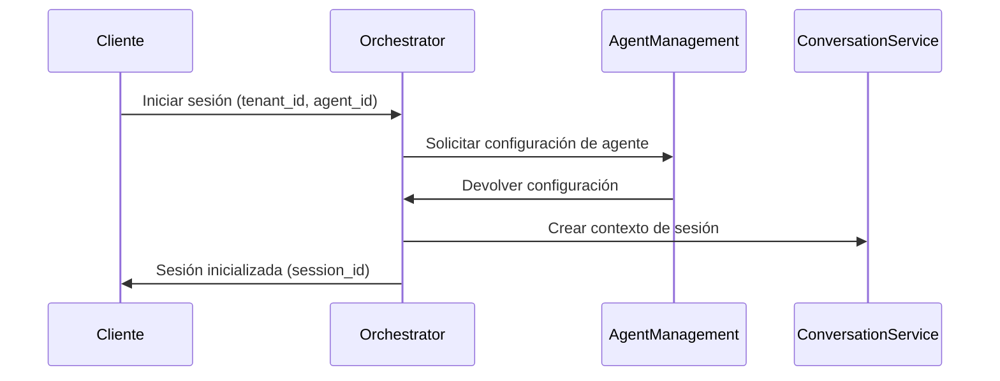
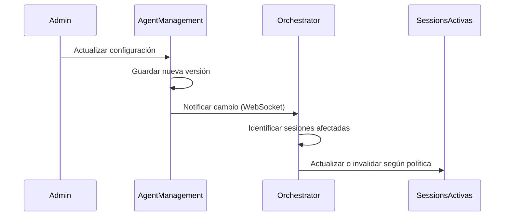
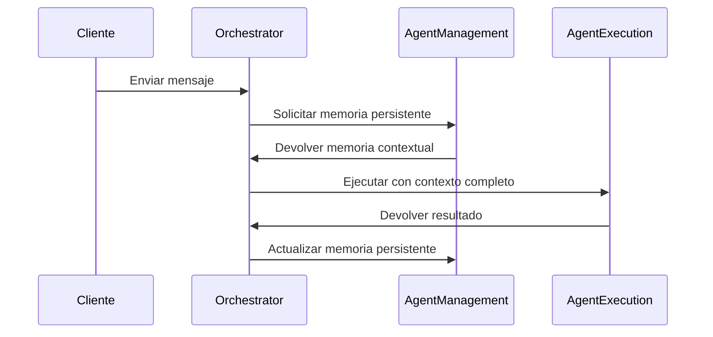

# Comunicación con Agent Management Service

*Versión: 1.0.0*  
*Última actualización: 2025-06-03*  
*Responsable: Equipo Nooble Backend*

## Índice
- [Comunicación con Agent Management Service](#comunicación-con-agent-management-service)
  - [Índice](#índice)
  - [1. Visión General](#1-visión-general)
  - [2. Integración en Flujos de Trabajo](#2-integración-en-flujos-de-trabajo)
  - [3. Estructura de Colas](#3-estructura-de-colas)
  - [4. Formato de Mensajes](#4-formato-de-mensajes)
  - [5. Comunicación WebSocket](#5-comunicación-websocket)
  - [6. REST API](#6-rest-api)
  - [7. Gestión de Errores](#7-gestión-de-errores)
  - [8. Ejemplos de Código](#8-ejemplos-de-código)
  - [9. Registro de Cambios](#9-registro-de-cambios)

## 1. Visión General

Este documento detalla los mecanismos de comunicación entre el Agent Orchestrator Service (nivel 1) y el Agent Management Service (nivel 2), responsable de la gestión del ciclo de vida de agentes, configuraciones y memoria persistente de los agentes.

### 1.1 Responsabilidades del Agent Management Service

El Agent Management Service es responsable de:

- Gestionar la configuración y personalización de agentes por tenant
- Manejar la persistencia de memoria de los agentes
- Proporcionar capacidades de versionamiento de agentes
- Gestionar permisos y capacidades de los agentes
- Facilitar la configuración y personalización de agentes

### 1.2 Principios de Comunicación

- **Exclusividad de Nivel**: El Agent Orchestrator se comunica directamente con Agent Management (nivel 2) y nunca con servicios de nivel 3
- **Independencia**: El Agent Management Service mantiene su estado independientemente del Orchestrator
- **Consistencia**: Todas las operaciones mantienen consistencia de datos del agente
- **Multi-tenant**: Estricta segregación de datos y agentes por tenant

## 2. Integración en Flujos de Trabajo

El Agent Orchestrator Service interactúa con el Agent Management Service en los siguientes casos de uso principales:

### 2.1 Inicialización de Sesiones



### 2.2 Actualización de Agentes

Cuando se actualiza la configuración de un agente, el Orchestrator debe ser notificado para afectar las sesiones activas:



### 2.3 Gestión de Memoria Persistente de Agentes



## 3. Estructura de Colas

### 3.1 Colas de Comunicación

Las colas siguen el formato estándar `service-name.[priority].[domain].[action]` para mantener coherencia con el sistema global de comunicación.

| Nombre de Cola | Domain | Action | Dirección | Propósito |
|---------------|--------|--------|-----------|------------|
| `agent_management.high.agent.configuration` | `agent` | `configuration` | Orchestrator → Management | Solicitudes de obtención de configuración de agentes |
| `agent_management.medium.agent.update` | `agent` | `update` | Management → Orchestrator | Notificaciones de actualización de configuración |
| `agent_management.medium.agent.memory` | `agent` | `memory` | Bidireccional | Gestión de memoria persistente de agentes |
| `agent_management.low.agent.version` | `agent` | `version` | Orchestrator → Management | Consultas sobre versiones disponibles |
| `agent_management.high.agent.list` | `agent` | `list` | Orchestrator → Management | Solicitudes de listado de agentes disponibles |

### 3.2 Campos de Control

Cada mensaje en las colas incluye campos de control específicos:

- `tenant_id`: Identificador del tenant (obligatorio)
- `agent_id`: Identificador único del agente (obligatorio)
- `version`: Versión de la configuración del agente (obligatorio en actualizaciones)
- `session_ids`: Lista de sesiones afectadas (opcional)
- `update_type`: Tipo de actualización (`config`, `memory`, `permissions`)

## 4. Formato de Mensajes

### 4.1 Solicitud de Configuración de Agente

**Domain**: `agent`  
**Action**: `configuration`

```json
{
  "message_id": "550e8400-e29b-41d4-a716-446655440099",
  "task_id": "550e8400-e29b-41d4-a716-446655440000",
  "tenant_id": "acme-corp",
  "correlation_id": "550e8400-e29b-41d4-a716-446655440000",
  "created_at": "2025-06-03T20:15:00.123Z",
  "schema_version": "1.1",
  "status": "pending",
  "type": {
    "domain": "agent",
    "action": "configuration"
  },
  "priority": 1,
  "source_service": "agent_orchestrator",
  "target_service": "agent_management",
  "metadata": {
    "trace_id": "trace-abc123",
    "session_id": "session-123",
    "conversation_id": "conv-456"
  },
  "payload": {
    "agent_id": "customer-support-agent",
    "include_memory": true,
    "version": "latest",
    "environment": "production"
  }
}
```

### 4.2 Respuesta de Configuración de Agente

**Domain**: `agent`  
**Action**: `configuration`

```json
{
  "message_id": "550e8400-e29b-41d4-a716-446655440098",
  "task_id": "550e8400-e29b-41d4-a716-446655440000",
  "tenant_id": "acme-corp",
  "correlation_id": "550e8400-e29b-41d4-a716-446655440000",
  "created_at": "2025-06-03T20:15:01.045Z",
  "completed_at": "2025-06-03T20:15:01.145Z",
  "schema_version": "1.1",
  "status": "completed",
  "type": {
    "domain": "agent",
    "action": "configuration"
  },
  "priority": 1,
  "source_service": "agent_management",
  "target_service": "agent_orchestrator",
  "metadata": {
    "trace_id": "trace-abc123",
    "session_id": "session-123",
    "conversation_id": "conv-456",
    "processing_time_ms": 95
  },
  "payload": {
    "agent_id": "customer-support-agent",
    "version": "2.5.0",
    "name": "Asistente de Soporte",
    "description": "Agente especializado en atención al cliente",
    "parameters": {
      "temperature": 0.7,
      "max_tokens": 1024,
      "model": "gpt-4"
    },
    "system_prompt": "Eres un asistente de soporte técnico...",
    "tools": [
      {
        "tool_id": "knowledge_base_search",
        "parameters": {
          "collections": ["faq", "troubleshooting"]
        }
      }
    ],
    "memory": {
      "factual_knowledge": [
        {"fact": "El horario de soporte es de 9am a 6pm", "confidence": 1.0}
      ],
      "preferences": {
        "communication_style": "formal",
        "response_format": "structured"
      }
    },
    "permissions": {
      "can_use_tools": true,
      "allowed_collections": ["public", "support", "products"]
    }
  }
}
```

### 4.3 Notificación de Actualización de Agente

**Domain**: `agent`  
**Action**: `update`

```json
{
  "message_id": "661f9500-f38c-42d5-b818-557766550111",
  "task_id": "661f9500-f38c-42d5-b818-557766550112",
  "tenant_id": "acme-corp",
  "correlation_id": "661f9500-f38c-42d5-b818-557766550000",
  "created_at": "2025-06-03T21:30:00.433Z",
  "schema_version": "1.1",
  "status": "completed",
  "type": {
    "domain": "agent",
    "action": "update"
  },
  "priority": 2,
  "source_service": "agent_management",
  "target_service": "agent_orchestrator",
  "metadata": {
    "trace_id": "trace-def456",
    "update_type": "config",
    "update_by": "user-789",
    "update_reason": "performance_improvement"
  },
  "payload": {
    "agent_id": "customer-support-agent",
    "previous_version": "2.4.0",
    "new_version": "2.5.0",
    "active_sessions": ["session-123", "session-456"],
    "update_summary": {
      "changed_parameters": ["temperature", "system_prompt"],
      "added_tools": ["knowledge_base_search"],
      "removed_tools": []
    },
    "update_policy": "apply_to_new_interactions",
    "requires_restart": false,
    "compatibility": "backward_compatible"
  }
}
```

## 5. Comunicación WebSocket

### 5.1 Mensajes WebSocket

El Agent Management Service notifica al Orchestrator sobre cambios en los agentes mediante WebSockets. Estos mensajes utilizan el mismo formato estandarizado con domain/action que la comunicación por colas:

| Domain | Action | Descripción | Dirección | Contenido |
|--------|--------|------------|----------|----------|
| `agent` | `update` | Actualización de configuración | Management → Orchestrator | Detalles de la actualización y política a aplicar |
| `agent` | `memory_update` | Actualización de memoria | Management → Orchestrator | Cambios en memoria persistente del agente |
| `session` | `list` | Solicitud de sesiones activas | Management → Orchestrator | Criterios de filtrado para consulta |
| `session` | `version_switch` | Solicitud de cambio de versión | Management → Orchestrator | Nueva versión a aplicar en sesiones |
| `agent` | `status` | Cambio de estado del agente | Management → Orchestrator | Estado actual (active, disabled, maintenance) |

### 5.2 Conexión WebSocket

```python
# Ejemplo de conexión desde Orchestrator para recibir notificaciones
async def connect_to_agent_management():
    uri = f"{AGENT_MANAGEMENT_SERVICE_WEBSOCKET_URL}/ws/notifications"
    headers = {
        "Authorization": f"Bearer {SERVICE_TOKEN}",
        "X-Schema-Version": "1.1"
    }
    
    async with websockets.connect(uri, extra_headers=headers) as websocket:
        # Registrar el Orchestrator como suscriptor
        register_message = {
            "message_id": str(uuid.uuid4()),
            "task_id": str(uuid.uuid4()),
            "type": {
                "domain": "orchestrator",
                "action": "register"
            },
            "source_service": "agent_orchestrator",
            "schema_version": "1.1",
            "payload": {
                "service_id": "agent_orchestrator_1",
                "subscriptions": ["agent.update", "agent.memory_update", "agent.status"]
            }
        }
        await websocket.send(json.dumps(register_message))
        
        # Recibir y procesar mensajes
        while True:
            data = await websocket.recv()
            message = json.loads(data)
            
            # Procesar según domain/action
            domain = message.get("type", {}).get("domain")
            action = message.get("type", {}).get("action")
            
            if domain == "agent" and action == "update":
                await handle_agent_update(message)
            elif domain == "agent" and action == "memory_update":
                await handle_memory_update(message)
            elif domain == "agent" and action == "status":
                await handle_agent_status_change(message)
            elif domain == "session" and action == "list":
                # Responder con la lista de sesiones activas
                sessions = await get_active_sessions(message["payload"]["filters"])
                response = {
                    "message_id": str(uuid.uuid4()),
                    "correlation_id": message.get("correlation_id"),
                    "task_id": str(uuid.uuid4()),
                    "type": {
                        "domain": "session",
                        "action": "list_response"
                    },
                    "status": "completed",
                    "payload": {
                        "sessions": sessions
                    }
                }
                await websocket.send(json.dumps(response))
```

## 6. REST API

El Agent Orchestrator Service utiliza estos endpoints REST del Agent Management Service. Cada endpoint está mapeado a un domain/action específico para mantener coherencia con el sistema de mensajería estándar:

### 6.1 Endpoints Principales

| Método | Endpoint | Domain | Action | Propósito |
|--------|----------|--------|--------|----------|
| GET | `/api/v1/agents/{tenant_id}/{agent_id}` | `agent` | `configuration` | Obtener configuración de agente |
| GET | `/api/v1/agents/{tenant_id}/{agent_id}/memory` | `agent` | `memory` | Obtener memoria persistente |
| POST | `/api/v1/agents/{tenant_id}/{agent_id}/memory` | `agent` | `memory_update` | Actualizar memoria persistente |
| GET | `/api/v1/agents/{tenant_id}` | `agent` | `list` | Listar agentes disponibles |
| GET | `/api/v1/agents/{tenant_id}/{agent_id}/versions` | `agent` | `version` | Obtener historial de versiones |
| POST | `/api/v1/agents/{tenant_id}/{agent_id}/status` | `agent` | `status` | Cambiar estado del agente |

### 6.2 Ejemplo de Solicitud con Formato Estandarizado

```python
async def get_agent_configuration(tenant_id, agent_id, version="latest"):
    """Obtiene la configuración de un agente usando el formato estandarizado"""
    url = f"{AGENT_MANAGEMENT_SERVICE_URL}/api/v1/agents/{tenant_id}/{agent_id}"
    
    # Crear identificadores para trazabilidad
    correlation_id = str(uuid.uuid4())
    request_id = str(uuid.uuid4())
    
    headers = {
        "Authorization": f"Bearer {get_service_token()}",
        "X-Tenant-ID": tenant_id,
        "X-Correlation-ID": correlation_id,
        "X-Request-ID": request_id,
        "X-Schema-Version": "1.1",
        "Content-Type": "application/json"
    }
    
    # Incluir parámetros como query params
    params = {
        "version": version,
        "include_memory": "true"
    }
    
    async with httpx.AsyncClient() as client:
        response = await client.get(url, headers=headers, params=params)
        
        if response.status_code == 200:
            result = response.json()
            
            # Verificar formato domain/action esperado
            response_domain = result.get("type", {}).get("domain")
            response_action = result.get("type", {}).get("action")
            
            if response_domain != "agent" or response_action != "configuration":
                logger.warning(f"Formato de respuesta inesperado: {response_domain}.{response_action}")
                
            return result.get("payload", {})
        elif response.status_code == 404:
            logger.error(f"Agente no encontrado: {agent_id} para tenant {tenant_id}")
            return None
        else:
            logger.error(f"Error obteniendo configuración: {response.status_code}")
            error_data = response.json() if response.headers.get("content-type") == "application/json" else {}
            error_code = error_data.get("metadata", {}).get("error_code", "UNKNOWN_ERROR")
            raise AgentServiceError(f"Error de comunicación: {error_code}", status_code=response.status_code)
```

### 6.3 Ejemplo de Actualización de Memoria de Agente

```python
async def update_agent_memory(tenant_id, agent_id, memory_update):
    """Actualiza la memoria persistente del agente"""
    url = f"{AGENT_MANAGEMENT_SERVICE_URL}/api/v1/agents/{tenant_id}/{agent_id}/memory"
    
    # Crear mensaje con formato estandarizado
    message = {
        "message_id": str(uuid.uuid4()),
        "task_id": str(uuid.uuid4()),
        "tenant_id": tenant_id,
        "correlation_id": str(uuid.uuid4()),
        "created_at": datetime.utcnow().isoformat(),
        "schema_version": "1.1",
        "status": "pending",
        "type": {
            "domain": "agent",
            "action": "memory_update"
        },
        "priority": 2,
        "source_service": "agent_orchestrator",
        "target_service": "agent_management",
        "metadata": {
            "session_id": memory_update.get("session_id"),
            "conversation_id": memory_update.get("conversation_id"),
            "trace_id": f"trace-{str(uuid.uuid4())[:8]}"
        },
        "payload": {
            "agent_id": agent_id,
            "memory_updates": memory_update.get("updates", []),
            "memory_operations": memory_update.get("operations", [])
        }
    }
    
    headers = {
        "Authorization": f"Bearer {get_service_token()}",
        "X-Tenant-ID": tenant_id,
        "X-Schema-Version": "1.1",
        "Content-Type": "application/json"
    }
    
    async with httpx.AsyncClient() as client:
        response = await client.post(url, headers=headers, json=message)
        
        if response.status_code == 200:
            return response.json().get("payload", {})
        elif response.status_code == 404:
            logger.error(f"Agente no encontrado: {agent_id}")
            return {"success": False, "error": "AGENT_NOT_FOUND"}
        else:
            logger.error(f"Error actualizando memoria: {response.status_code}")
            return {"success": False, "error": "MEMORY_UPDATE_FAILED"}
```

## 7. Gestión de Errores

### 7.1 Códigos de Error Estándar

Los códigos de error mantienen coherencia con el sistema global utilizando el formato `domain.action.error_type`:

| Código | Domain | Action | Descripción | Solución Recomendada |
|--------|--------|--------|------------|------------------|
| `agent.configuration.not_found` | `agent` | `configuration` | Agente no encontrado | Verificar ID, tenant y disponibilidad |
| `agent.version.invalid` | `agent` | `version` | Versión de agente no válida | Solicitar versión existente o usar 'latest' |
| `agent.memory.access_denied` | `agent` | `memory` | Sin permiso para acceder a memoria | Verificar permisos y rol del servicio |
| `agent.memory.invalid_operation` | `agent` | `memory` | Operación de memoria no soportada | Revisar tipo de operación solicitada |
| `service.unavailable` | `service` | `*` | Servicio no disponible temporalmente | Implementar circuit breaker con reintentos exponenciales |
| `service.timeout` | `service` | `*` | Tiempo de espera agotado | Ajustar timeouts o verificar carga del servicio |
| `security.authentication` | `security` | `authentication` | Error de autenticación | Verificar token de servicio y permisos |
| `schema.validation` | `schema` | `validation` | Error de validación de esquema | Verificar formato del mensaje con schema_version |

### 7.2 Ejemplo de Respuesta de Error

```json
{
  "message_id": "550e8400-e29b-41d4-a716-446655441111",
  "correlation_id": "550e8400-e29b-41d4-a716-446655440000",
  "tenant_id": "acme-corp",
  "created_at": "2025-06-03T20:15:03.123Z",
  "schema_version": "1.1",
  "status": "error",
  "type": {
    "domain": "agent",
    "action": "configuration"
  },
  "source_service": "agent_management",
  "target_service": "agent_orchestrator",
  "metadata": {
    "trace_id": "trace-abc123",
    "error": {
      "code": "agent.configuration.not_found",
      "http_status": 404,
      "message": "El agente solicitado no existe para el tenant especificado",
      "details": {
        "agent_id": "customer-support-agent",
        "tenant_id": "acme-corp",
        "requested_version": "3.0.1"
      },
      "retry_allowed": false
    }
  },
  "payload": {}
}
```

### 7.3 Circuit Breaker y Reintentos

Para garantizar la resiliencia en la comunicación entre servicios, se implementa un patrón de circuit breaker:

```python
# Configuración del circuit breaker
agent_management_cb = CircuitBreaker(
    failure_threshold=5,           # Número de fallos para abrir el circuito
    recovery_timeout=30,           # Segundos antes de intentar cerrar el circuito
    expected_exceptions=[          # Excepciones que cuentan como fallos
        httpx.ReadTimeout,
        httpx.ConnectTimeout,
        AgentServiceError
    ],
    retry_pattern="exponential_backoff",
    max_retries=3
)

@agent_management_cb
async def fetch_agent_memory(tenant_id, agent_id, session_id):
    """Obtiene la memoria persistente del agente con circuit breaker"""
    try:
        url = f"{AGENT_MANAGEMENT_SERVICE_URL}/api/v1/agents/{tenant_id}/{agent_id}/memory"
        headers = {
            "Authorization": f"Bearer {get_service_token()}",
            "X-Tenant-ID": tenant_id,
            "X-Session-ID": session_id,
            "X-Schema-Version": "1.1"
        }
        
        async with httpx.AsyncClient() as client:
            response = await client.get(url, headers=headers)
            
            if response.status_code == 200:
                return response.json().get("payload", {})
            else:
                error_message = response.json() if response.headers.get("content-type") == "application/json" else {}
                raise AgentServiceError(
                    code=error_message.get("metadata", {}).get("error", {}).get("code", "service.unknown_error"),
                    message="Error al recuperar memoria de agente",
                    status_code=response.status_code
                )
    except Exception as e:
        logger.error(f"Error en domain=agent action=memory: {str(e)}")
        # Retornar memoria de respaldo cuando el servicio falla
        return get_fallback_memory(agent_id, session_id)
```

## 8. Ejemplos de Código

### 8.1 Inicialización de Sesión con Configuración de Agente

```python
# En orchestrator/services/session_manager.py
async def initialize_session(tenant_id, user_id, agent_id, conversation_id=None):
    """Inicializa una nueva sesión de chat con configuración del agente usando el estándar domain/action"""
    # Generar identificadores
    session_id = generate_session_id()
    conversation_id = conversation_id or str(uuid.uuid4())
    trace_id = f"trace-{str(uuid.uuid4())[:8]}"
    
    # Crear mensaje de solicitud de configuración siguiendo el estándar domain/action
    config_request = {
        "message_id": str(uuid.uuid4()),
        "task_id": str(uuid.uuid4()),
        "tenant_id": tenant_id,
        "correlation_id": str(uuid.uuid4()),
        "created_at": datetime.utcnow().isoformat(),
        "schema_version": "1.1",
        "status": "pending",
        "type": {
            "domain": "agent",
            "action": "configuration"
        },
        "priority": 1,
        "source_service": "agent_orchestrator",
        "target_service": "agent_management",
        "metadata": {
            "trace_id": trace_id,
            "session_id": session_id,
            "conversation_id": conversation_id,
            "user_id": user_id
        },
        "payload": {
            "agent_id": agent_id,
            "include_memory": True,
            "version": "latest",
            "environment": "production"
        }
    }
    
    # Solicitar configuración del agente
    agent_config_response = await fetch_agent_configuration(tenant_id, agent_id, config_request)
    if not agent_config_response or "payload" not in agent_config_response:
        raise AgentServiceError(
            code="agent.configuration.unavailable",
            message=f"No se pudo obtener configuración para {agent_id}",
            status_code=503,
            details={
                "agent_id": agent_id,
                "tenant_id": tenant_id,
                "trace_id": trace_id
            }
        )
    
    agent_config = agent_config_response["payload"]
    
    # Crear sesión inicial siguiendo el mismo formato estándar
    session = {
        "session_id": session_id,
        "tenant_id": tenant_id,
        "user_id": user_id,
        "agent_id": agent_id,
        "agent_version": agent_config["version"],
        "created_at": datetime.utcnow().isoformat(),
        "last_interaction": None,
        "status": "active",
        "conversation_id": conversation_id,
        "configuration": agent_config,
        "memory": {},
        "trace_id": trace_id
    }
    
    # Guardar en Redis
    await redis_client.set(
        f"orchestrator:session:{tenant_id}:{session_id}", 
        json.dumps(session),
        ex=SESSION_EXPIRY
    )
    
    # Registrar en el sistema de seguimiento de sesiones
    await session_registry.register_session(session)
    
    return session_id, agent_config
```

### 8.2 Manejador de Actualización de Agente

```python
# En orchestrator/websocket/handlers.py
async def handle_agent_update(message):
    """Maneja notificaciones de actualización de agentes usando el estándar domain/action"""
    # Extraer información del mensaje estandarizado
    message_type = message.get("type", {})
    domain = message_type.get("domain")
    action = message_type.get("action")
    
    # Verificar que sea un mensaje de actualización de agente
    if domain != "agent" or action != "update":
        logger.warning(f"Mensaje de tipo inesperado: {domain}.{action}")
        return
    
    # Extraer datos relevantes
    tenant_id = message["tenant_id"]
    correlation_id = message.get("correlation_id")
    trace_id = message.get("metadata", {}).get("trace_id")
    payload = message.get("payload", {})
    
    agent_id = payload.get("agent_id")
    new_version = payload.get("new_version")
    active_sessions = payload.get("active_sessions", [])
    update_policy = payload.get("update_policy")
    requires_restart = payload.get("requires_restart", False)
    
    logger.info(f"Actualización de agente recibida: {agent_id} v{new_version}, trace_id: {trace_id}")
    
    # Aplicar política de actualización
    if update_policy == "apply_to_new_interactions":
        # Solo aplicar a nuevas interacciones - no hacer nada con sesiones existentes
        await update_agent_cache(tenant_id, agent_id, new_version)
    
    elif update_policy == "notify_sessions":
        # Notificar a las sesiones activas sobre la actualización
        for session_id in active_sessions:
            # Crear mensaje de notificación en formato estandarizado
            notification = {
                "message_id": str(uuid.uuid4()),
                "correlation_id": correlation_id,
                "tenant_id": tenant_id,
                "created_at": datetime.utcnow().isoformat(),
                "type": {
                    "domain": "agent",
                    "action": "update_notification"
                },
                "metadata": {
                    "trace_id": trace_id,
                    "session_id": session_id
                },
                "payload": {
                    "agent_id": agent_id,
                    "new_version": new_version,
                    "update_type": "optional",
                    "changes_summary": payload.get("update_summary", {}),
                    "requires_restart": requires_restart
                }
            }
            await notify_session_about_update(tenant_id, session_id, notification)
    
    elif update_policy == "force_update_sessions":
        # Forzar actualización en todas las sesiones activas
        update_tasks = []
        for session_id in active_sessions:
            update_tasks.append(
                update_session_agent_config(tenant_id, session_id, agent_id, new_version, trace_id)
            )
        # Ejecutar actualizaciones en paralelo
        await asyncio.gather(*update_tasks)
```

## 9. Registro de Cambios

| Versión | Fecha | Cambios |
|---------|-------|---------|
| 1.0.0 | 2025-06-03 | Versión inicial |
