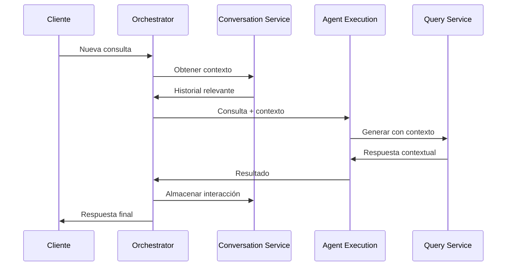
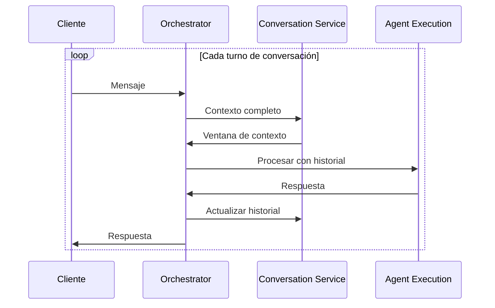
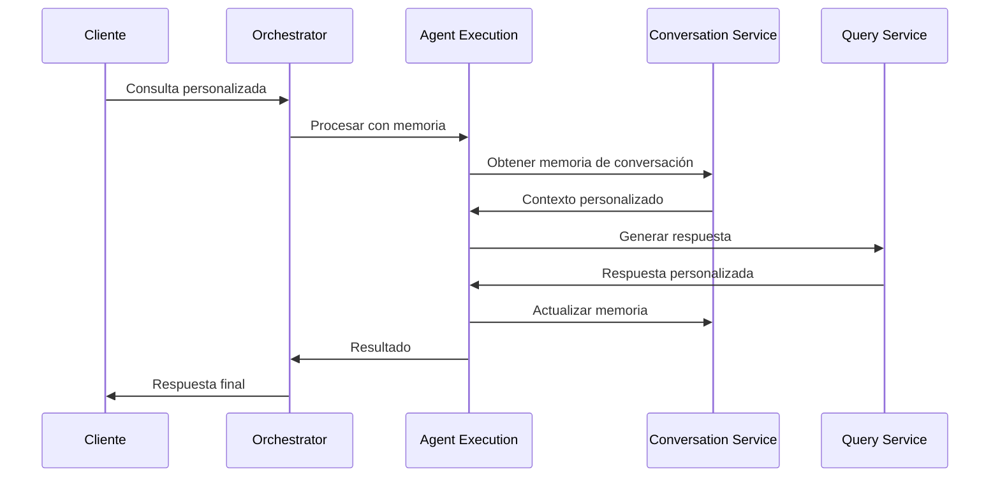
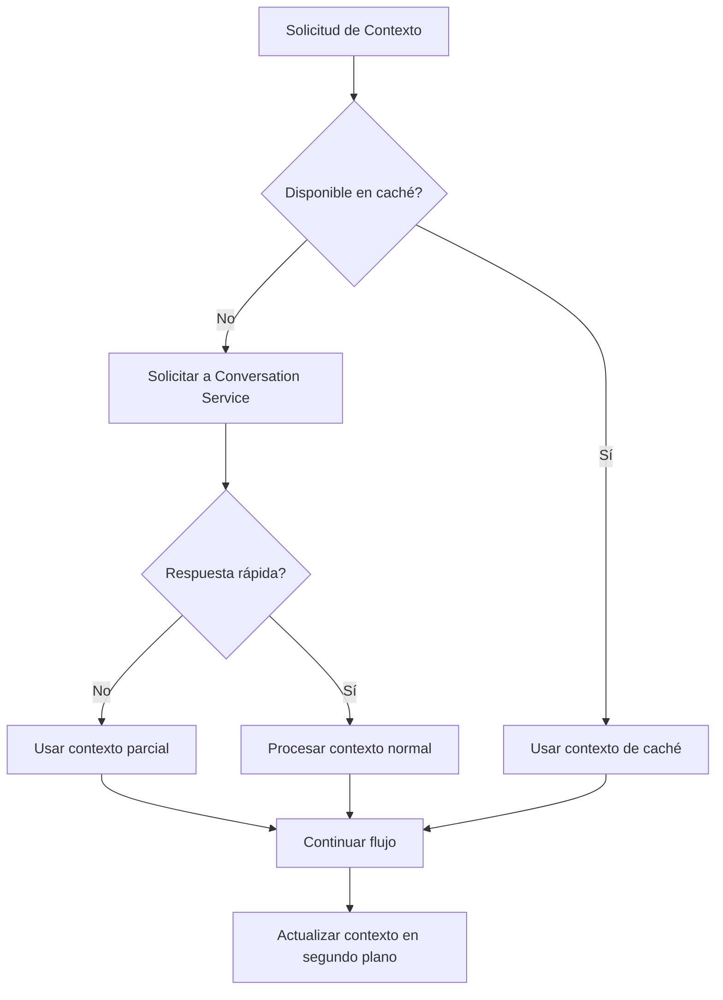

# Comunicación con Conversation Service

*Versión: 1.0.0*  
*Última actualización: 2025-06-03*  
*Responsable: Equipo Nooble Backend*

## Índice
- [Comunicación con Conversation Service](#comunicación-con-conversation-service)
  - [Índice](#índice)
  - [1. Visión General](#1-visión-general)
  - [2. Integración en Flujos de Trabajo](#2-integración-en-flujos-de-trabajo)
  - [3. Estructura de Colas](#3-estructura-de-colas)
  - [4. Formato de Mensajes](#4-formato-de-mensajes)
  - [5. Comunicación WebSocket](#5-comunicación-websocket)
  - [6. REST API](#6-rest-api)
  - [7. Gestión de Errores](#7-gestión-de-errores)

## 1. Visión General

El Agent Orchestrator Service interactúa con el Conversation Service para mantener el historial, el contexto y la memoria de las sesiones de conversación. Esta comunicación es fundamental para la continuidad de las conversaciones multi-turno y para proporcionar contexto relevante a otros servicios como el Agent Execution Service.

### 1.1 Principios de Interacción

- **Fuente de Verdad**: El Conversation Service es la fuente de verdad definitiva para todo el historial y contexto de conversaciones
- **Comunicación Bidireccional**: El Orchestrator tanto consulta como actualiza datos en el Conversation Service
- **Separación de Responsabilidades**: El Conversation Service solo gestiona el almacenamiento y recuperación de conversaciones, mientras que el Orchestrator decide cuándo y cómo utilizarlas
- **Procesamiento Asincrónico**: Las operaciones intensivas de almacenamiento y procesamiento de contexto se delegan al Conversation Service de forma asíncrona


## 2. Integración en Flujos de Trabajo

### 2.1 Consulta con Contexto (Nivel 1)



### 2.2 Conversación Multi-turno (Nivel 2)



### 2.3 Generación con Memoria (Nivel 2)



## 3. Estructura de Colas

El Orchestrator interactúa con el Conversation Service a través de las siguientes colas Redis:

### 3.1 Colas que Produce el Orchestrator 

| Cola | Propósito | Formato de Mensaje | Consumidor |
|------|-----------|-------------------|------------|
| `conversation:tasks:{tenant_id}` | Cola principal para tareas de conversación | [ConversationTaskMessage](#31-conversationtaskmessage) | Conversation Service |
| `conversation:store:{tenant_id}` | Almacenamiento de nuevos mensajes | [StoreMessageMessage](#32-storemessagemessage) | Conversation Service |
| `conversation:retrieval:{tenant_id}` | Solicitudes de recuperación de contexto | [RetrieveContextMessage](#33-retrievecontextmessage) | Conversation Service |

### 3.2 Colas que Consume el Orchestrator

| Cola | Propósito | Formato de Mensaje | Productor |
|------|-----------|-------------------|-----------|
| `conversation:context:{tenant_id}:{session_id}` | Resultados de recuperación de contexto | [ContextResultMessage](#34-contextresultmessage) | Conversation Service |
| `conversation:updates:{tenant_id}` | Notificaciones de actualizaciones | [ConversationUpdateMessage](#35-conversationupdatemessage) | Conversation Service |

## 4. Formato de Mensajes

<a id="31-conversationtaskmessage"></a>
### 4.1 ConversationTaskMessage

```json
{
  "task_id": "uuid-v4",
  "tenant_id": "tenant-identifier",
  "created_at": "2025-06-03T16:30:45Z",
  "status": "pending",
  "type": "store_message|retrieve_context|update_memory",
  "priority": 5,
  "metadata": {
    "session_id": "session-uuid",
    "user_id": "user-uuid",
    "agent_id": "agent-uuid"
  },
  "payload": {
    // Contenido específico de la tarea
  }
}
```

<a id="32-storemessagemessage"></a>
### 4.2 StoreMessageMessage

```json
{
  "task_id": "uuid-v4",
  "tenant_id": "tenant-identifier",
  "created_at": "2025-06-03T16:32:10Z",
  "status": "pending",
  "type": "store_message",
  "priority": 5,
  "metadata": {
    "session_id": "session-uuid",
    "user_id": "user-uuid",
    "agent_id": "agent-uuid",
    "conversation_id": "conversation-uuid"
  },
  "payload": {
    "message": {
      "role": "user|assistant|system",
      "content": "Contenido del mensaje",
      "timestamp": "2025-06-03T16:32:05Z"
    },
    "update_context": true
  }
}
```

<a id="33-retrievecontextmessage"></a>
### 4.3 RetrieveContextMessage

```json
{
  "task_id": "uuid-v4",
  "tenant_id": "tenant-identifier",
  "created_at": "2025-06-03T16:33:20Z",
  "status": "pending",
  "type": "retrieve_context",
  "priority": 7,
  "metadata": {
    "session_id": "session-uuid",
    "user_id": "user-uuid",
    "agent_id": "agent-uuid",
    "conversation_id": "conversation-uuid"
  },
  "payload": {
    "message_count": 10,
    "include_system_messages": true,
    "max_tokens": 4000,
    "recency_bias": 0.7
  }
}
```

<a id="34-contextresultmessage"></a>
### 4.4 ContextResultMessage

```json
{
  "task_id": "uuid-v4",
  "original_task_id": "uuid-v4-from-request",
  "tenant_id": "tenant-identifier",
  "created_at": "2025-06-03T16:33:45Z",
  "status": "completed",
  "type": "context_result",
  "metadata": {
    "session_id": "session-uuid",
    "agent_id": "agent-uuid",
    "conversation_id": "conversation-uuid"
  },
  "payload": {
    "messages": [
      {
        "id": "msg-uuid-1",
        "role": "user",
        "content": "¿Cómo puedo configurar mi agente?",
        "timestamp": "2025-06-03T16:30:00Z"
      },
      {
        "id": "msg-uuid-2",
        "role": "assistant",
        "content": "Puedes configurar tu agente desde el dashboard...",
        "timestamp": "2025-06-03T16:30:20Z"
      },
      // ... más mensajes ...
    ],
    "context_summary": "Conversación sobre configuración de agentes y opciones disponibles",
    "total_messages": 12,
    "included_messages": 10,
    "total_tokens": 1250
  }
}
```

<a id="35-conversationupdatemessage"></a>
### 4.5 ConversationUpdateMessage

```json
{
  "event": "conversation_updated",
  "timestamp": "2025-06-03T16:34:10Z",
  "tenant_id": "tenant-identifier",
  "data": {
    "conversation_id": "conversation-uuid",
    "session_id": "session-uuid",
    "agent_id": "agent-uuid",
    "messages_count": 12,
    "last_message": {
      "id": "msg-uuid-12",
      "role": "assistant",
      "content_preview": "Aquí tienes las opciones de configuración...",
      "timestamp": "2025-06-03T16:34:05Z"
    }
  }
}
```

## 5. Comunicación WebSocket

El Orchestrator recibe y envía eventos WebSocket al Conversation Service para actualizaciones en tiempo real.

### 5.1 Eventos que Recibe el Orchestrator

| Evento | Propósito | Origen | Acción |
|--------|-----------|--------|--------|
| `conversation.completed` | Tarea completada | Conversation Service | Actualizar estado y notificar al cliente |
| `conversation.failed` | Error en tarea | Conversation Service | Manejo de errores y notificación |
| `conversation.updated` | Actualización de conversación | Conversation Service | Actualizar caché y propagar si es necesario |

### 5.2 Eventos que Envía el Orchestrator

| Evento | Propósito | Destino | Acción |
|--------|-----------|---------|--------|
| `conversation.created` | Nueva tarea creada | Conversation Service | Inicializar procesamiento |
| `conversation.cancel` | Cancelar tarea en curso | Conversation Service | Detener procesamiento |
| `system.ping` | Verificar conexión | Conversation Service | Mantener conexión activa |

### 5.3 Implementación

```python
# En el Orchestrator
async def handle_conversation_event(event_data):
    event_type = event_data.get("event")
    
    if event_type == "conversation.completed":
        # Procesar tarea completada
        task_id = event_data["data"]["task_id"]
        tenant_id = event_data["tenant_id"]
        # Actualizar estado de tarea y notificar al cliente
        await update_task_status(task_id, tenant_id, "completed")
        await notify_client(tenant_id, event_data["data"])
        
    elif event_type == "conversation.failed":
        # Manejar error
        error = event_data["data"]["error"]
        task_id = event_data["data"]["task_id"]
        tenant_id = event_data["tenant_id"]
        # Registrar error y posiblemente reintentar
        await handle_task_failure(task_id, tenant_id, error)
        
    elif event_type == "conversation.updated":
        # Actualizar cache de conversación
        conversation_id = event_data["data"]["conversation_id"]
        tenant_id = event_data["tenant_id"]
        await update_conversation_cache(tenant_id, conversation_id, event_data["data"])
```

## 6. REST API

Además de la comunicación asíncrona, el Orchestrator también utiliza las siguientes APIs REST del Conversation Service:

### 6.1 Endpoints Utilizados

| Endpoint | Método | Propósito | Parámetros |
|----------|--------|-----------|------------|
| `/api/v1/conversations` | POST | Crear nueva conversación | tenant_id, agent_id, metadata |
| `/api/v1/conversations/{id}` | GET | Obtener detalles de conversación | conversation_id |
| `/api/v1/conversations/{id}/messages` | GET | Obtener mensajes de conversación | conversation_id, limit, offset |
| `/api/v1/conversations/{id}/messages` | POST | Añadir mensaje a conversación | conversation_id, message |
| `/api/v1/internal/context/{conversation_id}` | GET | Obtener contexto (uso interno) | conversation_id, token_limit, message_count |

### 6.2 Ejemplos de Comunicación REST

**Crear Conversación**:
```python
async def create_conversation(tenant_id, agent_id, user_id, metadata=None):
    url = f"{CONVERSATION_SERVICE_URL}/api/v1/conversations"
    payload = {
        "tenant_id": tenant_id,
        "agent_id": agent_id,
        "user_id": user_id,
        "metadata": metadata or {}
    }
    
    async with httpx.AsyncClient() as client:
        response = await client.post(
            url,
            json=payload,
            headers={"Authorization": f"Bearer {SERVICE_TOKEN}"}
        )
        
        if response.status_code == 201:
            return response.json()["data"]
        else:
            raise ServiceCommunicationError(f"Error creating conversation: {response.text}")
```

**Obtener Contexto (para consultas síncronas rápidas)**:
```python
async def get_conversation_context_sync(tenant_id, conversation_id, message_count=10, max_tokens=4000):
    url = f"{CONVERSATION_SERVICE_URL}/api/v1/internal/context/{conversation_id}"
    params = {
        "tenant_id": tenant_id,
        "message_count": message_count,
        "max_tokens": max_tokens
    }
    
    async with httpx.AsyncClient() as client:
        response = await client.get(
            url,
            params=params,
            headers={"Authorization": f"Bearer {SERVICE_TOKEN}"}
        )
        
        if response.status_code == 200:
            return response.json()["data"]
        else:
            logger.error(f"Error retrieving context: {response.text}")
            return {"messages": []}
```

## 7. Gestión de Errores

### 7.1 Errores Comunes y Estrategias

| Error | Causa | Estrategia de Manejo |
|-------|-------|----------------------|
| `ConversationNotFound` | ID de conversación no existe | Crear nueva conversación y notificar al usuario |
| `ContextProcessingError` | Error al procesar contexto | Utilizar contexto parcial o vacío, logear error |
| `MessageStorageError` | Error al almacenar mensaje | Reintentar con backoff exponencial |
| `RateLimitExceeded` | Límite de tasa excedido | Esperar y reintentar con jitter |
| `ServiceTimeout` | Timeout de servicio | Fallback a modo sin contexto, reintentar en segundo plano |

### 7.2 Circuito de Recuperación



### 7.3 Política de Reintentos

- **Exponential Backoff**: Retraso inicial de 1s, duplicando hasta 16s
- **Jitter**: +/- 20% del valor de retraso para prevenir tormentas de sincronización
- **Máximo de Intentos**: 3 para operaciones críticas
- **Circuit Breaker**: Se activa después de 5 fallos consecutivos, timeout de reset de 30s
