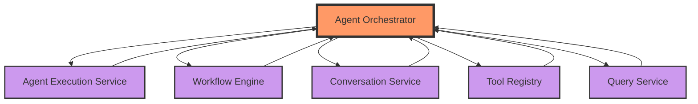
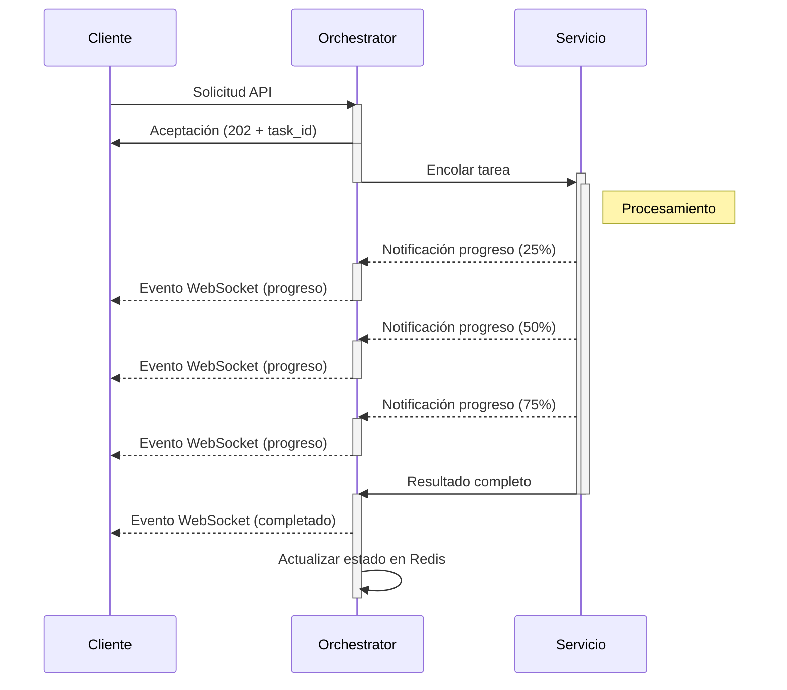
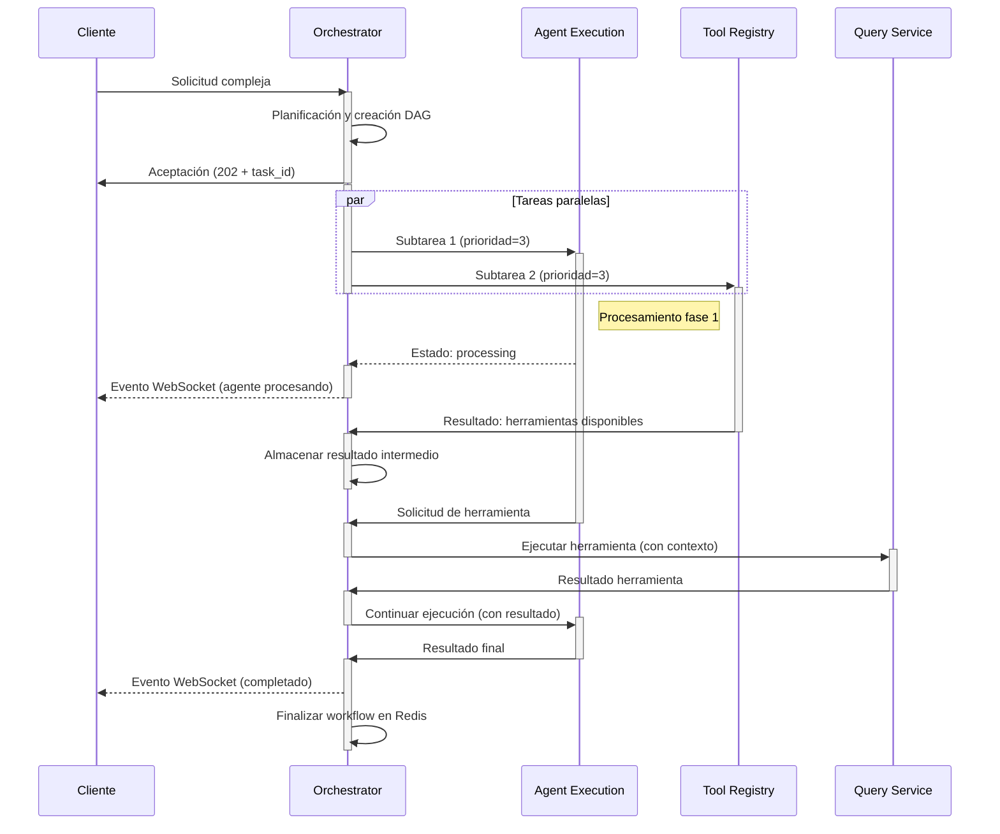
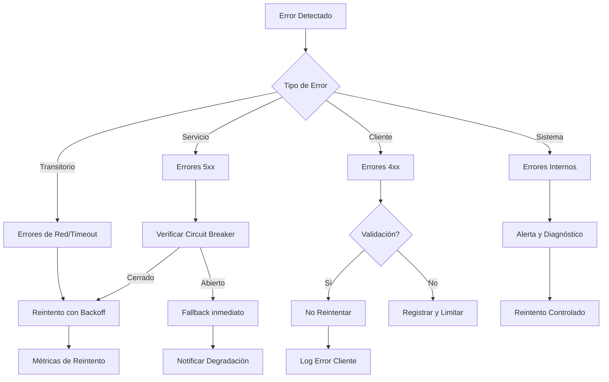
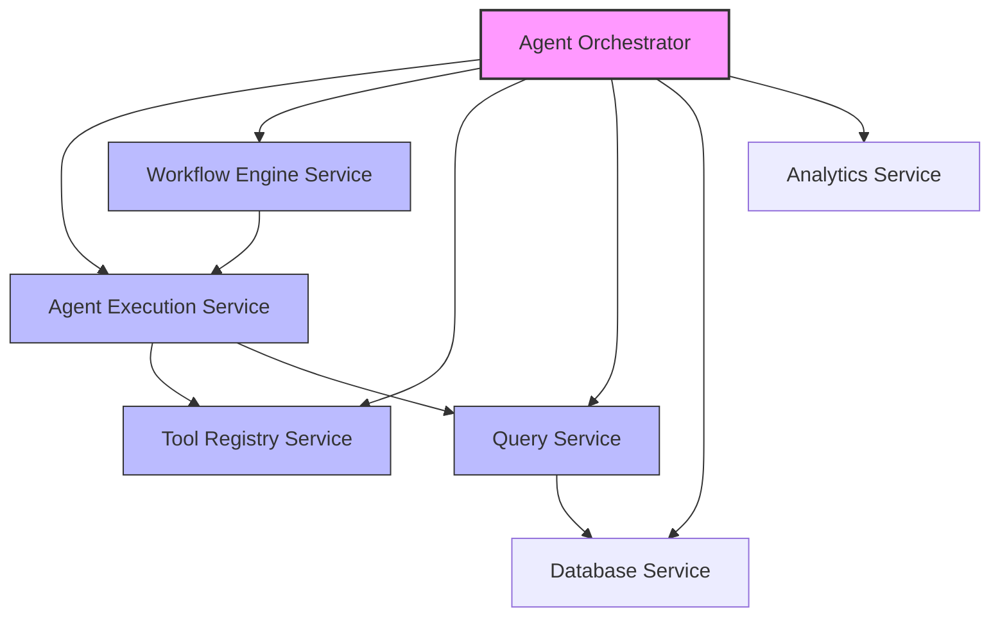

# Comunicación Interna - Agent Orchestrator Service

*Versión: 1.1.0*  
*Última actualización: 2025-06-04*  
*Responsable: Equipo Nooble Backend*

## Índice
- [Comunicación Interna - Agent Orchestrator Service](#comunicación-interna---agent-orchestrator-service)
  - [Índice](#índice)
  - [1. Visión General](#1-visión-general)
    - [1.1 Principios Fundamentales](#11-principios-fundamentales)
    - [1.2 Estándares Aplicados](#12-estándares-aplicados)
    - [1.3 Responsabilidades Centrales](#13-responsabilidades-centrales)
  - [2. Estructura de Colas](#2-estructura-de-colas)
    - [2.1 Jerarquía de Colas](#21-jerarquía-de-colas)
    - [2.2 Colas Principales](#22-colas-principales)
    - [2.3 Topología de Comunicación](#23-topología-de-comunicación)
  - [3. Formato de Mensajes](#3-formato-de-mensajes)
    - [3.1 Formato Estándar de Mensaje](#31-formato-estándar-de-mensaje)
    - [3.2 Tipos de Mensaje Principales](#32-tipos-de-mensaje-principales)
    - [3.3 Consistencia Multi-servicio](#33-consistencia-multi-servicio)
  - [4. Flujos de Comunicación](#4-flujos-de-comunicación)
    - [4.1 Flujo Asíncrono Básico](#41-flujo-asíncrono-básico)
    - [4.2 Flujo de Coordinación Multi-servicio](#42-flujo-de-coordinación-multi-servicio)
    - [4.3 Flujos de Alta Disponibilidad](#43-flujos-de-alta-disponibilidad)
  - [5. Timeouts y Reintentos](#5-timeouts-y-reintentos)
    - [5.1 Configuración de Timeouts](#51-configuración-de-timeouts)
    - [5.2 Política de Reintentos](#52-política-de-reintentos)
  - [6. Manejo de Fallos](#6-manejo-de-fallos)
    - [6.1 Circuit Breaker](#61-circuit-breaker)
    - [6.2 Estrategias de Recuperación](#62-estrategias-de-recuperación)
  - [7. Comunicación con Servicios Específicos](#7-comunicación-con-servicios-específicos)
    - [7.1 Servicios de Nivel 1 (Core)](#71-servicios-de-nivel-1-core)
    - [7.2 Servicios de Nivel 2 (Functional)](#72-servicios-de-nivel-2-functional)
  - [8. Métricas y Monitoreo](#8-métricas-y-monitoreo)
  - [9. Registro de Cambios](#9-registro-de-cambios)

## 1. Visión General

Este documento detalla los mecanismos de comunicación interna utilizados por el Agent Orchestrator Service para coordinar los diferentes microservicios de la plataforma Nooble. Como componente central de orquestación, este servicio implementa patrones avanzados de mensajería asíncrona y notificación en tiempo real para gestionar flujos de trabajo complejos que involucran múltiples servicios.

> **IMPORTANTE**: El Agent Orchestrator Service actuúa como la columna vertebral de comunicación de toda la plataforma Nooble. Cualquier modificación en sus patrones o protocolos de comunicación debe ser cuidadosamente evaluada por el impacto en el ecosistema completo.

### 1.1 Principios Fundamentales

- **Centralización**: El orquestador actúa como punto central para la coordinación de todas las tareas distribuidas
- **Aislamiento Multi-tenant**: Estricta segregación de datos y procesamiento por tenant_id
- **Trazabilidad**: IDs de correlación únicos que permiten seguimiento end-to-end de solicitudes
- **Resiliencia**: Manejo automático de reintentos y recuperación de errores
- **Tiempo Real**: Notificaciones WebSocket para actualizar al cliente sobre el progreso

### 1.2 Estándares Aplicados

Este servicio implementa rigurosamente los siguientes estándares globales de Nooble:

- [Estándares de Comunicación para Microservicios](../../../common-standarts/microservice_communication_standards_part1.md)
- [Estándares de Comunicación - Patrones Avanzados](../../../common-standarts/microservice_communication_standards_part2.md) 
- [Estándares de Manejo de Errores](../../../common-standarts/error_handling_standards.md)
- [Estándares de Métricas](../../../common-standarts/metrics_standards.md)

### 1.3 Responsabilidades Centrales

El Agent Orchestrator Service tiene las siguientes responsabilidades críticas de comunicación:

1. **Punto Único de Entrada**: Centraliza todas las solicitudes de clientes
2. **Enrutamiento Inteligente**: Dirige las solicitudes a los servicios especializados apropiados
3. **Gestión de Estado**: Mantiene el estado de las solicitudes a través de todo su ciclo de vida
4. **Coordinación de Workflows**: Sincroniza secuencias complejas de operaciones entre servicios
5. **Notificación en Tiempo Real**: Gestiona actualizaciones WebSocket hacia clientes
6. **Recuperación ante Fallos**: Implementa estrategias para mantener la integridad del sistema


## 2. Estructura de Colas

### 2.1 Jerarquía de Colas

El Agent Orchestrator Service implementa un sistema jerárquico de colas Redis para gestionar diferentes niveles de tareas, siguiendo el [Estándar de Comunicación entre Microservicios](../../../common-standarts/microservice_communication_standards_part1.md#3-estructura-de-colas-estándar):

```
                  +-----------------------------------+
                  |         COLAS DE ORQUESTADOR      |
                  +-----------------------------------+
                                 |
      +---------------------+--------------------+-------------------+
      |                     |                    |                   |
+----------------+  +------------------+  +---------------+  +---------------+
| Nivel Sesión   |  | Nivel Tarea     |  | Nivel Sistema |  | Nivel Tenant  |
+----------------+  +------------------+  +---------------+  +---------------+
|                |  |                  |  |               |  |               |
| orchestrator:  |  | orchestrator:    |  | orchestrator: |  | orchestrator: |
| session:       |  | tasks:           |  | system:       |  | tenant:       |
| {tenant_id}:   |  | {tenant_id}:     |  | notifications |  | {tenant_id}:  |
| {session_id}   |  | {priority}       |  | :{type}       |  | config        |
+----------------+  +------------------+  +---------------+  +---------------+
```

### 2.2 Colas Principales

| Key Redis | Propósito | Tiempo de vida | Prioridad |
|----------------|-----------|--------------|------------|
| `orchestrator:session:{tenant_id}:{session_id}` | Estado y contexto de sesiones activas | 30 minutos | Alta |
| `orchestrator:tasks:{tenant_id}:{priority}` | Cola de tareas segmentada por prioridad | Variable (5-60 min) | Según nivel |
| `orchestrator:system:notifications:{type}` | Notificaciones internas tipificadas | 10 minutos | Media |
| `orchestrator:tenant:{tenant_id}:config` | Configuraciones específicas por tenant | Permanente | Baja |

> **Nota**: Todas las colas siguen el [Formato Estándar de Claves Redis](../../../common-standarts/database_standards.md#redis) definido en los estándares globales.

### 2.3 Topología de Comunicación

La estructura de comunicación del orquestador sigue un modelo hub-and-spoke, donde:

- **Hub Central**: Agent Orchestrator Service
- **Spokes**: Servicios especializados que reciben y envían tareas
- **Canales Dedicados**: Cada servicio tiene un canal bidireccional con el orquestador



Cada conexión implementa prioridades, timeouts y mecanismos de control de flujo específicos según la criticidad del servicio.

## 3. Formato de Mensajes

### 3.1 Formato Estándar de Mensaje

Todos los mensajes siguen la estructura estandarizada definida en los [Estándares de Comunicación](../../../common-standarts/microservice_communication_standards_part1.md#4-formato-de-mensajes):

```json
{
  "message_id": "uuid-v4",              // ID único del mensaje
  "task_id": "uuid-v4",               // ID de la tarea asociada
  "tenant_id": "tenant-identifier",    // ID del tenant (requerido)
  "session_id": "session-identifier",  // ID de sesión (opcional)
  "conversation_id": "uuid-v4",        // ID de conversación (opcional)
  "correlation_id": "uuid-v4",         // ID de correlación para trazabilidad
  "created_at": "ISO-8601",           // Timestamp de creación
  "expires_at": "ISO-8601",           // Timestamp de expiración (opcional)
  "status": "pending|processing|completed|failed",
  "type": {
    "domain": "agent|workflow|conversation|tool",  // Dominio funcional
    "action": "execute|update|query|notify"        // Acción solicitada
  },
  "priority": 0-9,                     // Prioridad (0 más alta, 9 más baja)
  "source_service": "service-name",     // Servicio que origina el mensaje
  "target_service": "service-name",     // Servicio destinatario
  "delegated_services": [              // Servicios involucrados
    {
      "service": "service-name",
      "task_id": "service-specific-task-id",
      "status": "pending|completed|failed"
    }
  ],
  "metadata": {                        // Metadatos extensibles
    "source": "api|scheduled|system",
    "user_id": "optional-user-id",
    "timeout_ms": 30000,
    "retry_count": 0,
    "expected_duration_ms": 5000,
    "deduplication_key": "optional-key" // Para evitar duplicados
  },
  "payload": {                         // Datos específicos de la tarea
    // Contenido variable según el tipo
  }
}
```

### 3.2 Tipos de Mensaje Principales

| Dominio | Acción | Descripción | Prioridad Típica |
|---------|---------|-------------|------------------|
| `agent` | `execute` | Ejecutar un agente | 3 |
| `agent` | `status` | Actualizar estado de ejecución | 2 |
| `workflow` | `start` | Iniciar un flujo de trabajo | 4 |
| `workflow` | `step` | Ejecutar un paso de flujo | 5 |
| `tool` | `execute` | Llamar a una herramienta | 3 |
| `tool` | `response` | Respuesta de herramienta | 2 |
| `conversation` | `update` | Actualizar contexto de conversación | 6 |
| `system` | `health` | Verificación de salud del servicio | 1 |
| `system` | `metric` | Reporte de métricas | 8 |

> **Nota**: La documentación detallada de esquemas específicos se encuentra en [message_schemas.md](./message_schemas.md).

### 3.3 Consistencia Multi-servicio

El Agent Orchestrator Service garantiza la consistencia del formato de mensajes entre todos los servicios mediante:

1. **Validación Estructural**: Cada mensaje es validado contra un esquema JSON
2. **Enriquecimiento Automático**: Campos faltantes se completan automáticamente
3. **Normalización**: Los mensajes recibidos se normalizan antes de procesarse
4. **Versionado**: Soporte para múltiples versiones de esquemas mediante campo `schema_version`

## 4. Flujos de Comunicación

El Agent Orchestrator Service implementa patrones de comunicación estandarizados siguiendo los [Estándares de Comunicación - Patrones Avanzados](../../../common-standarts/microservice_communication_standards_part2.md) de Nooble.

### 4.1 Flujo Asíncrono Básico

Este es el flujo de comunicación fundamental para operaciones estándar:



### 4.2 Flujo de Coordinación Multi-servicio

Para operaciones complejas que requieren múltiples servicios, el orquestador implementa un patrón de workflow distribuido:



### 4.3 Flujos de Alta Disponibilidad

El orquestador implementa patrones de resiliencia para garantizar la continuidad de operaciones:

```mermaid
sequenceDiagram
    participant C as Cliente
    participant O1 as Orchestrator Primario
    participant O2 as Orchestrator Secundario
    participant R as Redis
    participant S as Servicio
    
    C->>O1: Solicitud
    activate O1
    O1->>R: Almacenar estado
    O1->>C: Aceptación
    O1-x: Fallo
    deactivate O1
    
    Note over O1,O2: Detección de fallo
    
    activate O2
    O2->>R: Recuperar estado
    O2->>+S: Reintento de tarea
    S->>-O2: Resultado
    O2-->>C: Notificación completado
    deactivate O2
```

Cada flujo de comunicación está diseñado para mantener las propiedades de trazabilidad end-to-end, aislamiento multi-tenant y recuperación ante fallos.

## 5. Timeouts y Reintentos

El Agent Orchestrator Service implementa mecanismos de timeout y reintento basados en los [Estándares de Manejo de Errores](../../../common-standarts/error_handling_standards.md#estrategias-de-reintento) de Nooble para garantizar la resiliencia del sistema.

### 5.1 Configuración de Timeouts

Los timeouts se configuran de acuerdo con la criticidad y complejidad de cada operación:

| Tipo de Operación | Nivel de Complejidad | Timeout Base | Timeout Máximo | Factor de Ajuste |
|-------------------|---------------------|-------------|----------------|------------------|
| **Orquestación Básica** | Nivel 1 | 10 segundos | 30 segundos | Multiplicador por tenant (0.5x-2x) |
| **Ejecución de Agente** | Nivel 2 | 30 segundos | 120 segundos | Basado en historial de ejecución |
| **Flujo de Trabajo** | Nivel 3 | 60 segundos | 300 segundos | Proporcional a pasos en workflow |
| **Sesión Completa** | Variable | 1800 segundos | 7200 segundos | Configurable por tenant |
| **WebSocket** | Sistema | 30 segundos (ping) | N/A | Reconexión automática |

> **Importante**: Los timeouts se adaptan dinámicamente basándose en patrones históricos de ejecución y carga del sistema, siguiendo el [Estándar de Adaptación Dinámica](../../../common-standarts/metrics_standards.md#adaptación-dinámica).

### 5.2 Política de Reintentos

La estrategia de reintentos está diseñada para maximizar la probabilidad de éxito sin sobrecarga:

| Nivel de Criticidad | Estrategia | Máx. Intentos | Delay Inicial | Backoff | Jitter |
|--------------------|-----------|--------------|--------------|---------|--------|
| **Alto** (Nivel 0-1) | Inmediato+Expo | 5 | 200ms | 1.5x | 10% |
| **Medio** (Nivel 2-3) | Exponencial | 3 | 1 segundo | 2x | 15% |
| **Bajo** (Nivel 4+) | Lineal | 2 | 2 segundos | +2s | 5% |

**Estrategia de Recuperación por Tipo de Error**:



**Errores Elegibles para Reintento**:
- Timeouts de conexión y respuesta
- Errores de red temporales (DNS, TCP reset)
- Errores HTTP 502, 503, 504
- Conflictos de concurrencia resolubles

**Errores No Elegibles**:
- Validación de datos (400, 422)
- Autenticación/Autorización (401, 403)
- Recursos no encontrados (404)
- Errores de negocio (estructura correcta)

## 6. Manejo de Fallos

El Agent Orchestrator Service implementa estrategias avanzadas de manejo de fallos siguiendo los [Estándares de Manejo de Errores](../../../common-standarts/error_handling_standards.md) y patrones de resiliencia de microservicios.

### 6.1 Circuit Breaker

El patrón Circuit Breaker es implementado para cada servicio conectado:

```mermaid
stateD +agram
    [*] --> Cerrado
    Cerrado --> Abierto: Umbral Fallido
    Abierto --> SemiAbierto: Periodo Espera
    SemiAbierto --> Cerrado: Pruebas Exitosas
    SemiAbierto --> Abierto: Fallo en Prueba
```

**Configuración por Nivel de Servicio**:

| Nivel de Servicio | Umbral de Apertura | Periodo de Reset | Pruebas | Estrategia Fallback |
|-------------------|-------------------|-----------------|---------|---------------------|
| **Crítico** | 30% fallos en 10 solicitudes | 15 segundos | 1 cada 5s | Caché local + Degradación |
| **Estándar** | 50% fallos en 20 solicitudes | 30 segundos | 1 cada 10s | Respuesta degradada estándar |
| **No crítico** | 70% fallos en 30 solicitudes | 60 segundos | 1 cada 20s | Postponer o cancelar |

### 6.2 Estrategias de Recuperación

El orquestador implementa múltiples estrategias para garantizar la consistencia del sistema:

1. **Transacciones Compensatorias**:
   - Registro de acciones realizadas para cada tarea
   - Operaciones inversas (compensación) automáticas en caso de fallo
   - Garantía de consistencia eventual mediante logs de compensación

2. **Patron Saga para Workflows**:
   ```mermaid
   graph LR
       A[Paso 1] -->|Éxito| B[Paso 2]
       B -->|Éxito| C[Paso 3]
       C -->|Fallo| D[Comp. Paso 3]
       D --> E[Comp. Paso 2]
       E --> F[Comp. Paso 1]
   ```

3. **Sistema de Checkpoints**:
   - Guardar estado completo en puntos críticos
   - Recuperación desde último punto estable conocido
   - Reintentos inteligentes desde el punto fallido

4. **Mecanismo de Degradación Controlada**:
   - Niveles progresivos de funcionalidad reducida
   - Priorización de servicios por criticidad
   - Endpoints de contingencia y respuestas alternativas

## 7. Comunicación con Servicios Específicos

Esta sección proporciona enlaces a la documentación detallada sobre la comunicación con cada servicio específico:

### 7.1 Servicios Integrados

El Agent Orchestrator Service mantiene integración directa con los siguientes servicios internos, cada uno con su documentación detallada:

| Servicio | Tipo de Integración | Dirección | Documentación |
|---------|---------------------|-----------|---------------|
| **Agent Execution** | Cola + WebSocket | Bidireccional | [Agent Execution Service](./agent_execution_service.md) |
| **Workflow Engine** | Cola + REST API | Bidireccional | [Workflow Engine Service](./workflow_engine_service.md) |
| **Tool Registry** | Cola + REST API | Unidireccional | [Tool Registry Service](./tool_registry_service.md) |
| **Query Service** | Cola + WebSocket | Bidireccional | [Query Service](./query_service.md) |
| **Database Service** | Cola | Unidireccional | [Database Service](./database_service.md) |
| **Analytics Service** | Cola | Unidireccional | [Analytics Service](./analytics_service.md) |

### 7.2 Tabla de Referencia Rápida por Operación

Usa esta tabla para identificar rápidamente qué servicio manejará cada tipo de tarea:

| Operación | Servicio Principal | Servicios Secundarios | Tipo de Cola | Prioridad |
|-----------|-------------------|----------------------|-------------|----------|
| **Ejecución de Agente** | Agent Execution | Tool Registry, Query | `agent:execution` | 3 |
| **Flujo de Trabajo** | Workflow Engine | Agent Execution | `workflow:engine` | 4 |
| **Herramientas Personalizadas** | Tool Registry | - | `tools:registry` | 3 |
| **Consultas RAG** | Query Service | Database Service | `query:service` | 5 |
| **Operaciones de Sistema** | - | Todos | `system:ops` | 1 |

### 7.3 Diagrama de Dependencias de Servicios



> **Nota**: Para más detalles sobre las integraciones específicas, consulte la documentación de cada servicio enlazada arriba.

## 8. Métricas y Monitoreo

### 8.1 Métricas Clave

El Agent Orchestrator Service expone las siguientes métricas para supervisar la salud y rendimiento de la comunicación:

| Categoría | Métrica | Descripción | Alertable |
|-----------|--------|-------------|----------|
| **Rendimiento** | `queue.depth` | Profundidad actual de cada cola | Sí (>1000) |
| **Rendimiento** | `message.processing_time` | Tiempo de procesamiento por tipo de mensaje | Sí (>5s) |
| **Disponibilidad** | `service.availability` | Disponibilidad de servicios integrados | Sí (<99%) |
| **Errores** | `message.error_rate` | Tasa de errores por tipo de mensaje | Sí (>1%) |
| **Latencia** | `service.latency` | Latencia entre servicios | Sí (>1s) |
| **Resiliencia** | `circuit_breaker.state` | Estado de cada circuit breaker | Sí (si abierto) |
| **Capacidad** | `system.throughput` | Mensajes procesados por segundo | No |
| **Comportamiento** | `retry.count` | Número de reintentos por servicio | Sí (>5/min) |

### 8.2 Dashboard de Monitoreo

Los paneles de control están disponibles en la plataforma de monitoreo con las siguientes vistas:

1. **Vista General**: Estado global del sistema de comunicación
2. **Por Servicio**: Métricas específicas por cada servicio integrado
3. **Por Cola**: Profundidad, latencia y throughput de cada cola
4. **Por Tenant**: Aislamiento y análisis por tenant

Accede al [Dashboard de Comunicaciones](https://monitoring.nooble.ai/dashboards/communication) para visualizaciones en tiempo real.

### 8.3 Alertas y Umbrales

Las alertas se configuran según los siguientes umbrales:

| Nivel | Condición | Acción | Notificación |
|-------|------------|--------|-------------|
| **Crítico** | Servicio caído o latencia >10s | Failover automático | Inmediata (SMS + Email) |
| **Alto** | Error rate >5% o queue depth >5000 | Throttling automático | Inmediata (Email) |
| **Medio** | Error rate >1% o latencia >2s | Monitoreo incrementado | 15 min (Email) |
| **Bajo** | Desvío de patrones normales | Registro para análisis | Diario (Resumen) |

## 9. Registro de Cambios

| Versión | Fecha | Cambios | Autor |
|---------|-------|---------|-------|
| 1.1.0 | 2025-06-04 | Refactorización completa del documento:<br>- Alineación con estándares globales<br>- Ampliación de secciones de formatos de mensajes<br>- Diagramas de flujos de comunicación mejorados<br>- Documentación de circuit breakers y recuperación<br>- Adición de sección de métricas y monitoreo | Equipo Backend |
| 1.0.0 | 2025-06-03 | Versión inicial del documento | Equipo Backend |
