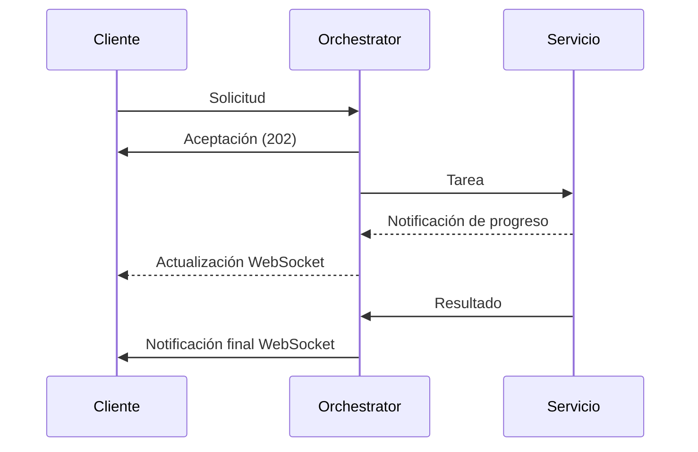
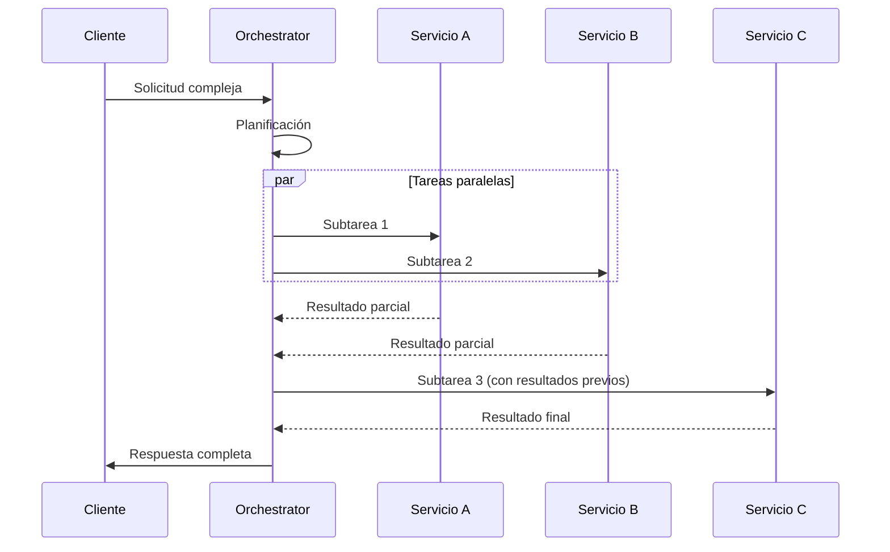

# Comunicación Interna - Agent Orchestrator Service

*Versión: 1.0.0*  
*Última actualización: 2025-06-03*  
*Responsable: Equipo Nooble Backend*

## Índice
- [Comunicación Interna - Agent Orchestrator Service](#comunicación-interna---agent-orchestrator-service)
  - [Índice](#índice)
  - [1. Visión General](#1-visión-general)
  - [2. Estructura de Colas](#2-estructura-de-colas)
  - [3. Formato de Mensajes](#3-formato-de-mensajes)
  - [4. Flujos de Comunicación](#4-flujos-de-comunicación)
  - [5. Timeouts y Reintentos](#5-timeouts-y-reintentos)
  - [6. Manejo de Fallos](#6-manejo-de-fallos)
  - [7. Comunicación con Servicios Específicos](#7-comunicación-con-servicios-específicos)
  - [8. Registro de Cambios](#8-registro-de-cambios)

## 1. Visión General

Este documento detalla los mecanismos de comunicación interna utilizados por el Agent Orchestrator Service para coordinar los diferentes microservicios de la plataforma Nooble. Como componente central de orquestación, este servicio implementa patrones avanzados de mensajería asíncrona y notificación en tiempo real para gestionar flujos de trabajo complejos que involucran múltiples servicios.

> **NOTA**: La documentación detallada sobre comunicación con cada servicio específico se encuentra en archivos separados dentro de la carpeta `/communication`.

### 1.1 Principios Fundamentales

- **Centralización**: El orquestador actúa como punto central para la coordinación de todas las tareas distribuidas
- **Aislamiento Multi-tenant**: Estricta segregación de datos y procesamiento por tenant_id
- **Trazabilidad**: IDs de correlación únicos que permiten seguimiento end-to-end de solicitudes
- **Resiliencia**: Manejo automático de reintentos y recuperación de errores
- **Tiempo Real**: Notificaciones WebSocket para actualizar al cliente sobre el progreso


## 2. Estructura de Colas

### 2.1 Jerarquía de Colas

El Agent Orchestrator Service implementa un sistema jerárquico de colas Redis para gestionar diferentes niveles de tareas:

```
                  +---------------------------+
                  |    COLAS DE ORQUESTADOR   |
                  +---------------------------+
                               |
         +--------------------+-----------------+
         |                    |                 |
+----------------+  +------------------+  +---------------+
| Nivel Sesión   |  | Nivel Tarea     |  | Nivel Sistema |
+----------------+  +------------------+  +---------------+
|                |  |                  |  |               |
| orchestrator:  |  | orchestrator:    |  | orchestrator: |
| session:       |  | tasks:           |  | system:       |
| {tenant_id}:   |  | {tenant_id}      |  | notifications |
| {session_id}   |  |                  |  |               |
+----------------+  +------------------+  +---------------+
```

### 2.2 Colas Principales

| Key Redis | Propósito | Consumidores | Productores |
|----------------|-----------|------------|------------|
| `orchestrator:session:{tenant_id}:{session_id}` | Estado y contexto de sesiones activas | Agent Orchestrator Service | Front-end, Agent Orchestrator Service |
| `orchestrator:tasks:{tenant_id}` | Registro central de tareas del tenant | Agent Orchestrator Service | Agent Orchestrator Service |
| `orchestrator:system:notifications` | Notificaciones internas del sistema | Todos los servicios | Todos los servicios |

La documentación detallada de las colas para cada servicio específico se encuentra en archivos separados.

## 3. Formato de Mensajes

### 3.1 Formato Estándar de Mensaje

Todos los mensajes siguen una estructura estandarizada para garantizar consistencia:

```json
{
  "task_id": "uuid-v4",
  "tenant_id": "tenant-identifier",
  "session_id": "session-identifier",
  "created_at": "ISO-timestamp",
  "status": "pending|processing|completed|failed",
  "type": "query|embedding|workflow|agent_execution",
  "priority": 0-9,
  "delegated_services": [
    {
      "service": "service-name",
      "task_id": "service-specific-task-id"
    }
  ],
  "metadata": {
    "source": "api|scheduled|system",
    "user_id": "optional-user-id",
    "timeout_ms": 30000
  },
  "payload": {
    // Datos específicos de la tarea
  }
}
```

### 3.2 Tipos de Mensaje Principales

Los formatos específicos de mensajes para cada servicio se documentan en los archivos correspondientes.

## 4. Flujos de Comunicación

Esta sección proporciona una visión general de los principales flujos de comunicación. Los flujos detallados con cada servicio se encuentran en la documentación específica.

### 4.1 Flujo Asíncrono Básico



### 4.2 Flujo de Coordinación Multi-servicio



## 5. Timeouts y Reintentos

### 5.1 Configuración de Timeouts

| Tipo de Operación | Timeout Predeterminado | Configurable Por |
|-------------------|------------------------|------------------|
| Solicitud HTTP | 30 segundos | Servicio |
| Tarea en Cola | 60 segundos | Tarea |
| Sesión Completa | 1800 segundos | Tenant |

### 5.2 Política de Reintentos

- **Estrategia**: Backoff exponencial con jitter
- **Máximo de Intentos**: 3 (configurable)
- **Delay Inicial**: 1 segundo
- **Errores Elegibles**: Errores de red, timeouts, errores 5xx
- **Errores No Elegibles**: Errores de validación, errores 4xx

## 6. Manejo de Fallos

### 6.1 Circuit Breaker

El orquestador implementa el patrón Circuit Breaker para prevenir fallos en cascada:

- **Umbral de Apertura**: 50% de fallos en 20 solicitudes
- **Periodo de Reset**: 30 segundos
- **Comportamiento**: Fallback a respuesta degradada

### 6.2 Estrategias de Recuperación

- **Compensación**: Operaciones inversas para revertir cambios parciales
- **Checkpoint**: Estados intermedios para recuperación desde puntos conocidos
- **Saga Pattern**: Para workflows multi-etapa complejos

## 7. Comunicación con Servicios Específicos

Esta sección proporciona enlaces a la documentación detallada sobre la comunicación con cada servicio específico:

- [Comunicación con Conversation Service](./communication/conversation_service.md)
- [Comunicación con Agent Execution Service](./communication/agent_execution_service.md)
- [Comunicación con Workflow Engine Service](./communication/workflow_engine_service.md)
- [Comunicación con Tool Registry Service](./communication/tool_registry_service.md)
- [Comunicación con Agent Management Service](./communication/agent_management_service.md)
- [Comunicación con Query Service](./communication/query_service.md)
- [Comunicación con Embedding Service](./communication/embedding_service.md)

## 8. Registro de Cambios

| Versión | Fecha | Cambios |
|---------|-------|---------|
| 1.0.0 | 2025-06-03 | Versión inicial del documento |
