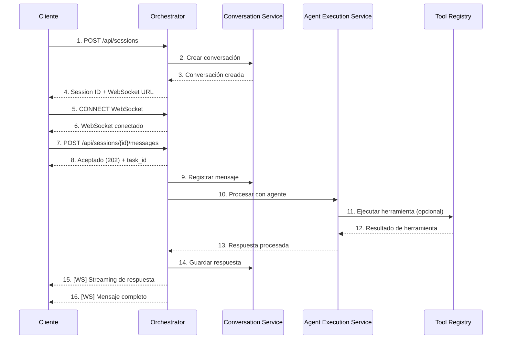
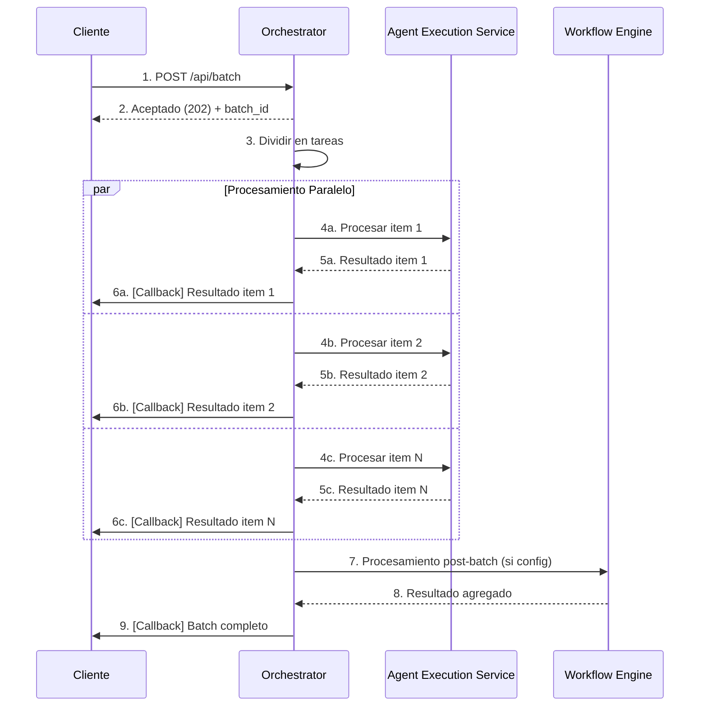
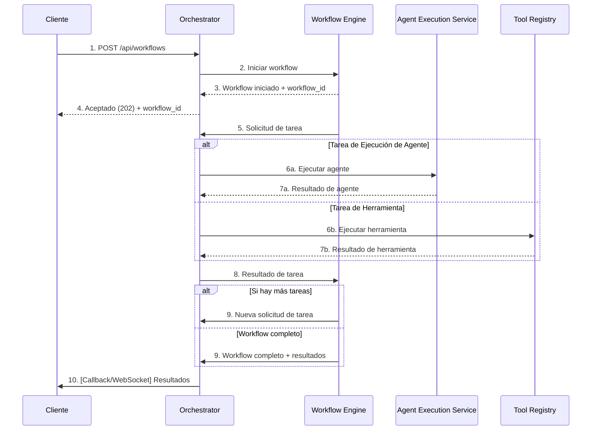
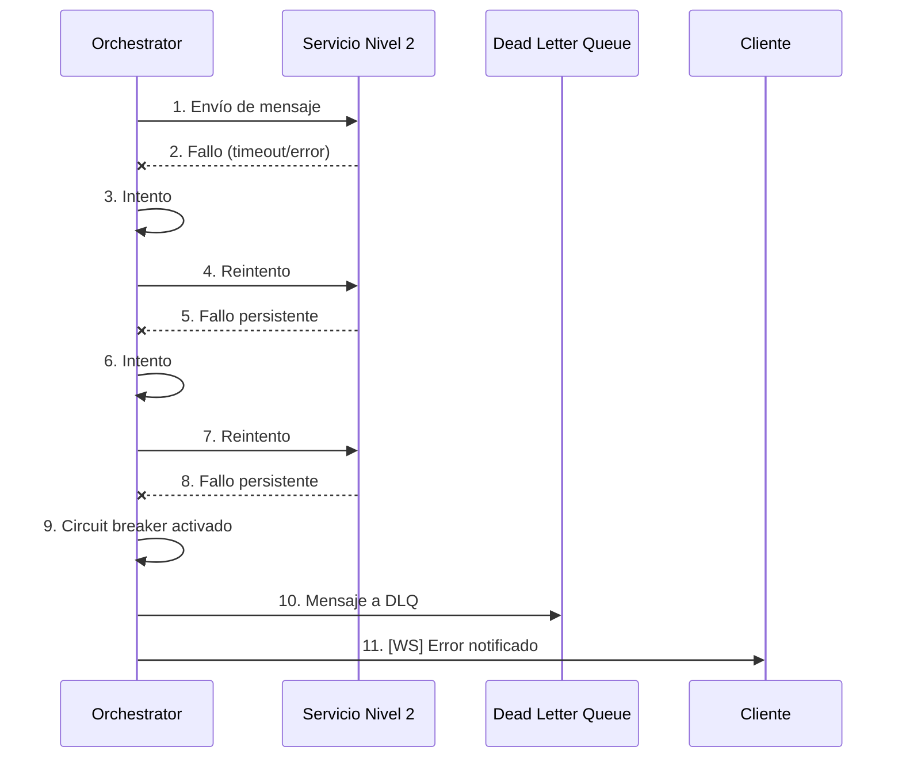
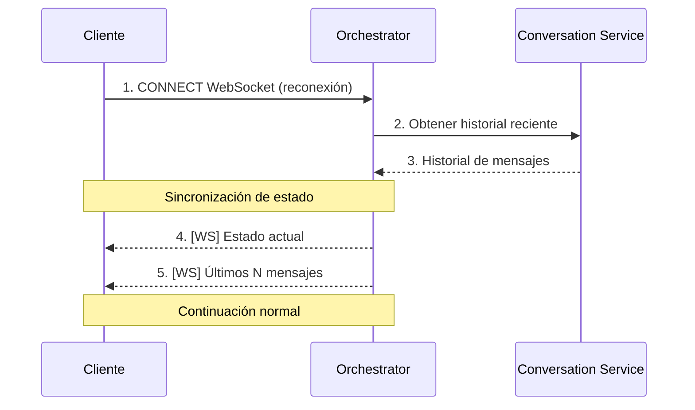
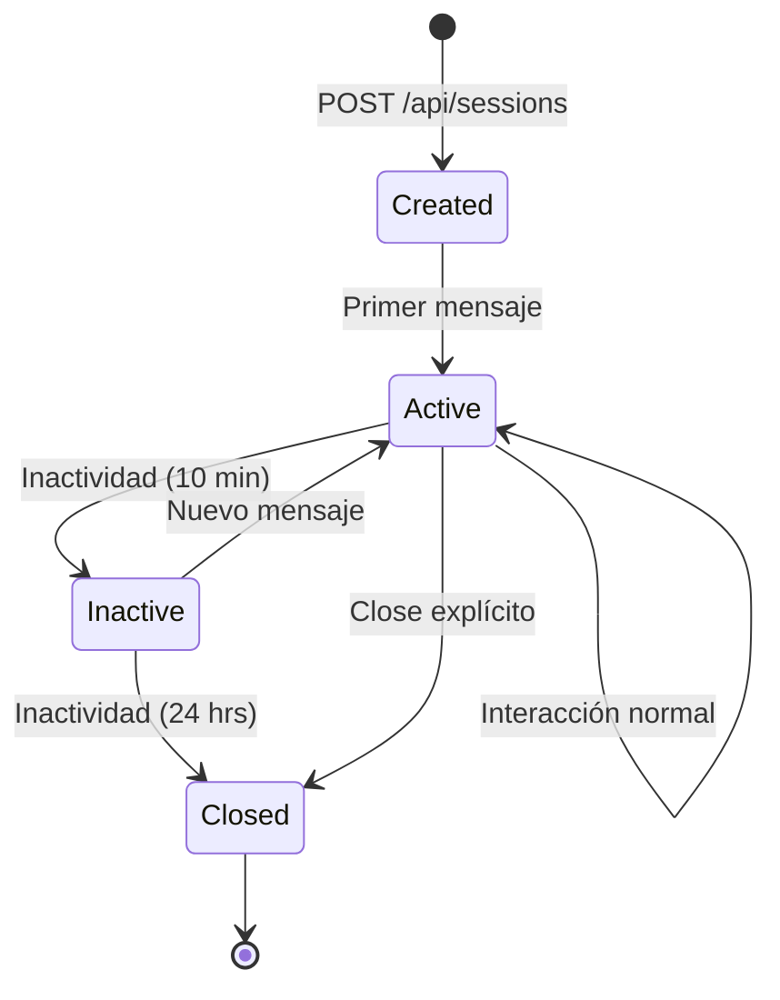

# Flujos End-to-End del Agent Orchestrator Service

*Versión: 1.0.0*  
*Última actualización: 2025-06-04*  
*Responsable: Equipo Nooble Backend*

## Índice
- [Flujos End-to-End del Agent Orchestrator Service](#flujos-end-to-end-del-agent-orchestrator-service)
  - [Índice](#índice)
  - [1. Introducción](#1-introducción)
  - [2. Diagrama de Arquitectura Global](#2-diagrama-de-arquitectura-global)
  - [3. Flujo de Sesión de Chat Interactiva](#3-flujo-de-sesión-de-chat-interactiva)
  - [4. Flujo de Procesamiento por Lotes](#4-flujo-de-procesamiento-por-lotes)
  - [5. Flujo de Ejecución de Workflow](#5-flujo-de-ejecución-de-workflow)
  - [6. Flujo de Recuperación ante Fallos](#6-flujo-de-recuperación-ante-fallos)
  - [7. Ciclo de Vida de una Sesión](#7-ciclo-de-vida-de-una-sesión)

## 1. Introducción

Este documento presenta los flujos completos de comunicación end-to-end entre el Agent Orchestrator Service y otros componentes de la plataforma Nooble AI. Se detallan los intercambios de mensajes, tiempos de respuesta estimados, secuencias de operaciones y manejo de casos especiales.

## 2. Diagrama de Arquitectura Global

```
┌───────────────┐     ┌─────────────────┐      ┌──────────────────┐
│               │     │                 │      │                  │
│   Frontend    │◄────┤  API Gateway    │◄─────┤  Load Balancer   │
│               │     │                 │      │                  │
└───────┬───────┘     └────────┬────────┘      └─────────┬────────┘
        │                      │                         │
        │                      ▼                         │
        │             ┌──────────────────┐               │
        │             │                  │               │
        └──────────►  │ Agent           │ ◄─────────────┘
                      │ Orchestrator    │
                      │ Service         │
                      │ (NIVEL 1)       │
                      │                  │
                      └───┬─────┬────┬───┘
                          │     │    │
          ┌───────────────┘     │    └────────────┐
          │                     │                 │
          ▼                     ▼                 ▼
┌─────────────────┐  ┌──────────────────┐  ┌────────────────┐
│                 │  │                  │  │                │
│ Conversation    │  │ Agent Execution  │  │ Workflow       │
│ Service         │  │ Service          │  │ Engine         │
│ (NIVEL 2)       │  │ (NIVEL 2)        │  │ (NIVEL 2)      │
│                 │  │                  │  │                │
└────────┬────────┘  └─────────┬────────┘  └───────┬────────┘
         │                     │                   │
         │                     │                   │
         ▼                     ▼                   ▼
┌─────────────────┐  ┌──────────────────┐  ┌────────────────┐
│                 │  │                  │  │                │
│ Query Service   │  │ Embedding        │  │ Tool Registry  │
│ (NIVEL 3)       │  │ Service (NIVEL 3)│  │ (NIVEL 2)      │
│                 │  │                  │  │                │
└─────────────────┘  └──────────────────┘  └────────────────┘
```

## 3. Flujo de Sesión de Chat Interactiva

### 3.1 Secuencia de Operaciones



### 3.2 Detalles de Tiempos y Operaciones

| Paso | Operación | Tiempo estimado | Cola/Canal |
|------|-----------|-----------------|------------|
| 1-4 | Creación de sesión | 300-500 ms | HTTP |
| 5-6 | Conexión WebSocket | 100-200 ms | WebSocket |
| 7-8 | Envío de mensaje | 100-200 ms | HTTP |
| 9 | Registro en Conversation | 100-200 ms | `orchestrator:tasks:{tenant_id}` |
| 10-13 | Procesamiento de agente | 1000-5000 ms | `orchestrator:tasks:{tenant_id}` |
| 14 | Guardar respuesta | 100-200 ms | `orchestrator:tasks:{tenant_id}` |
| 15-16 | Envío de respuesta | 100-300 ms | WebSocket |

### 3.3 Manejo de Estado

- El estado de la sesión se mantiene en la base de datos PostgreSQL y se actualiza en cada operación
- Las actualizaciones de estado se transmiten por WebSocket al cliente
- Los timeouts para cada fase son configurables por tenant

## 4. Flujo de Procesamiento por Lotes

### 4.1 Secuencia de Operaciones



### 4.2 Detalles de Cola de Procesamiento

- Cola de alta prioridad: `orchestrator:batch:priority:{tenant_id}`
- Cola estándar: `orchestrator:batch:standard:{tenant_id}`
- Cola de baja prioridad: `orchestrator:batch:low:{tenant_id}`

### 4.3 Monitoreo y Control

- Cada batch tiene un estado global y estados individuales por item
- Se pueden consultar via API los estados: `GET /api/batch/{batch_id}`
- Se puede cancelar un batch en curso: `DELETE /api/batch/{batch_id}`

## 5. Flujo de Ejecución de Workflow

### 5.1 Secuencia de Operaciones



## 6. Flujo de Recuperación ante Fallos

### 6.1 Fallo de Servicio Nivel 2



### 6.2 Reconexión de Cliente WebSocket



## 7. Ciclo de Vida de una Sesión

### 7.1 Estados de Sesión



### 7.2 Persistencia de Datos

Para cada sesión, se almacenan los siguientes datos:

| Entidad | Tabla | Tiempo de retención | Notas |
|---------|-------|---------------------|-------|
| Metadatos de sesión | `sessions` | 90 días | Indefinido para enterprise |
| Mensajes | `session_contexts` | 30 días | Configurable por tenant |
| Estado de agentes | `session_agents` | 90 días | Para análisis |
| Tareas | `tasks` | 7 días | Solo para debugging |
| Logs de operación | `operation_logs` | 30 días | Rotación automática |

### 7.3 Limpieza y Mantenimiento

- Limpieza periódica de sesiones inactivas: Tarea programada cada hora
- Archivado de sesiones antiguas: Tarea diaria (2:00 AM UTC)
- Compactación de tablas: Tarea semanal (domingo, 3:00 AM UTC)
