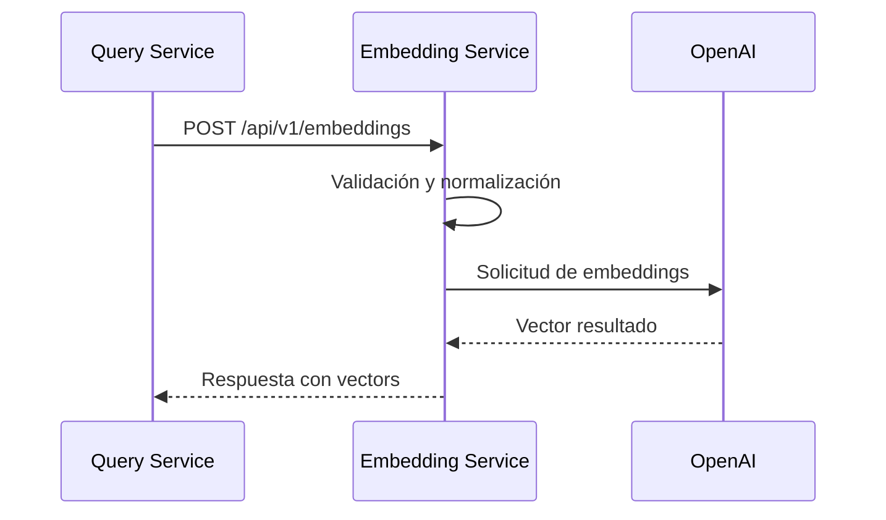
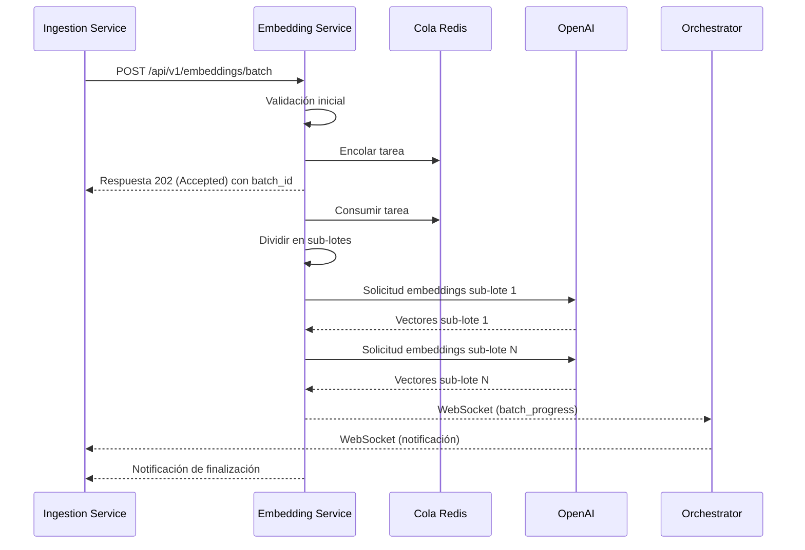

# Comunicación Interna - Embedding Service

*Versión: 1.0.0*  
*Última actualización: 2025-06-03*  
*Responsable: Equipo Nooble Backend*

## Índice
- [Comunicación Interna - Embedding Service](#comunicación-interna---embedding-service)
  - [Índice](#índice)
  - [1. Visión General](#1-visión-general)
  - [2. Estructura de Colas](#2-estructura-de-colas)
  - [3. Formato de Mensajes](#3-formato-de-mensajes)
  - [4. Flujos de Comunicación](#4-flujos-de-comunicación)
  - [5. Timeouts y Reintentos](#5-timeouts-y-reintentos)
  - [6. Manejo de Fallos](#6-manejo-de-fallos)
  - [7. Comunicación con Servicios Específicos](#7-comunicación-con-servicios-específicos)
  - [8. Registro de Cambios](#8-registro-de-cambios)

## 1. Visión General

Este documento detalla los mecanismos de comunicación interna utilizados por el Embedding Service para interactuar con otros microservicios de la plataforma Nooble. El Embedding Service es un componente fundamental de nivel 3 en la infraestructura que proporciona capacidades de generación de embeddings vectoriales para el sistema RAG (Retrieval Augmented Generation).

> **NOTA**: La documentación detallada sobre comunicación con cada servicio específico se encuentra en archivos separados dentro de la carpeta `/communication/internal`.

### 1.1 Principios Fundamentales

- **Optimización**: Alta eficiencia y capacidad de procesamiento de lotes
- **Aislamiento Multi-tenant**: Estricta segregación de datos por tenant_id
- **Trazabilidad**: Seguimiento completo del uso de recursos por tenant
- **Resiliencia**: Manejo inteligente de reintentos con backoff exponencial
- **Transparencia**: Métricas detalladas de uso de tokens y latencias


## 2. Estructura de Colas

### 2.1 Jerarquía de Colas

El Embedding Service implementa un sistema de colas Redis para gestionar solicitudes asíncronas de embeddings:

```
+-------------------------------------+
|          COLAS DE EMBEDDING         |
+-------------------------------------+
|                                     |
| embedding.tasks.{tenant_id}         | → Cola principal de tareas
| embedding.results.{tenant_id}.{id}  | → Resultados temporales
| embedding.batch.{tenant_id}.{batch} | → Procesos de ingestado
|                                     |
+-------------------------------------+
```

### 2.2 Colas Principales

| Key Redis | Propósito | Consumidores | Productores |
|----------------|-----------|------------|------------|
| `embedding.tasks.{tenant_id}` | Cola principal de tareas | Embedding Service | Agent Execution, Query Service, Ingestion Service |
| `embedding.results.{tenant_id}.{id}` | Almacenamiento temporal de resultados | Embedding Service | Embedding Service |
| `embedding.batch.{tenant_id}.{batch_id}` | Procesamiento en lote de documentos | Embedding Service | Ingestion Service |

## 3. Formato de Mensajes

### 3.1 Formato Estándar de Mensaje

Todos los mensajes siguen una estructura estandarizada para garantizar consistencia:

```json
{
  "task_id": "uuid-v4",
  "tenant_id": "tenant-identifier",
  "created_at": "ISO-timestamp",
  "status": "pending|processing|completed|failed",
  "type": "single_embedding|batch_embeddings",
  "priority": 0-9,
  "metadata": {
    "source": "agent_execution|query_service|ingestion_service",
    "collection_id": "optional-collection-id",
    "document_id": "optional-document-id",
    "model": "text-embedding-3-small"
  },
  "payload": {
    "texts": ["texto a vectorizar", "otro texto"],
    "dimensions": 1536,
    "batch_size": 100
  }
}
```

### 3.2 Tipos de Mensaje Principales

#### Solicitud de Embedding Único

```json
{
  "task_id": "uuid-v4",
  "tenant_id": "tenant-identifier",
  "created_at": "2025-06-03T20:15:00Z",
  "status": "pending",
  "type": "single_embedding",
  "priority": 5,
  "metadata": {
    "source": "query_service",
    "collection_id": "knowledge-base-123",
    "model": "text-embedding-3-small"
  },
  "payload": {
    "texts": ["¿Cuál es la política de devoluciones de la empresa?"],
    "dimensions": 1536
  }
}
```

#### Solicitud de Embedding por Lotes

```json
{
  "task_id": "uuid-v4",
  "tenant_id": "tenant-identifier",
  "created_at": "2025-06-03T20:15:00Z",
  "status": "pending",
  "type": "batch_embeddings",
  "priority": 2,
  "metadata": {
    "source": "ingestion_service",
    "collection_id": "knowledge-base-123",
    "batch_id": "ingestion-batch-456",
    "model": "text-embedding-3-small"
  },
  "payload": {
    "texts": ["fragmento 1 del documento", "fragmento 2 del documento", "..."],
    "dimensions": 1536,
    "batch_size": 100
  }
}
```

## 4. Flujos de Comunicación

### 4.1 Flujo de Embedding Interactivo



### 4.2 Flujo de Embedding Asíncrono por Lotes



## 5. Timeouts y Reintentos

### 5.1 Configuración de Timeouts

| Tipo de Operación | Timeout Predeterminado | Configurable Por |
|-------------------|------------------------|------------------|
| Embedding único | 10 segundos | Solicitud |
| Embedding por lotes | 60 segundos | Solicitud, Batch Size |
| Conexión a OpenAI | 30 segundos | Sistema |

### 5.2 Política de Reintentos

- **Estrategia**: Backoff exponencial con jitter
- **Máximo de Intentos**: 3
- **Delay Inicial**: 1 segundo
- **Factor de Backoff**: 2
- **Errores Elegibles**: Errores de red, timeouts, errores 5xx de OpenAI
- **Errores No Elegibles**: Errores de validación, límites de tokens excedidos

## 6. Manejo de Fallos

### 6.1 Circuit Breaker

El servicio implementa el patrón Circuit Breaker para proteger contra fallos en la API de OpenAI:

- **Umbral de Apertura**: 50% de fallos en 10 solicitudes
- **Periodo de Reset**: 60 segundos
- **Comportamiento**: Rechazo inmediato de nuevas solicitudes con error explicativo

### 6.2 Estrategias de Recuperación

- **Subdivisión automática**: Reducción del tamaño de lotes en caso de errores
- **Caché de resultados**: Almacenamiento temporal para evitar reprocesamiento
- **Delegación**: Capacidad para delegar a modelos alternativos en caso de fallo
- **Notificación detallada**: Errores específicos con información sobre el texto problemático

## 7. Comunicación con Servicios Específicos

### 7.1 Integración con Query Service

- **Endpoint principal**: `/api/v1/embeddings` (POST)
- **Propósito**: Embedding de consultas de usuario para búsqueda vectorial
- **Características**: Alta prioridad, baja latencia, optimizado para textos cortos

### 7.2 Integración con Ingestion Service

- **Endpoint principal**: `/api/v1/embeddings/batch` (POST)
- **Propósito**: Procesamiento de grandes volúmenes de texto de documentos
- **Características**: Procesamiento en background, notificación asíncrona de progreso

### 7.3 Integración con Agent Execution Service

- **Endpoint principal**: `/api/v1/embeddings` (POST)
- **Propósito**: Vectorización para agentes RAG y cálculo de similitud semántica
- **Características**: Prioridad media, optimizado para múltiples fragmentos pequeños

## 8. Registro de Cambios

| Versión | Fecha | Cambios |
|---------|-------|---------|
| 1.0.0 | 2025-06-03 | Versión inicial |
