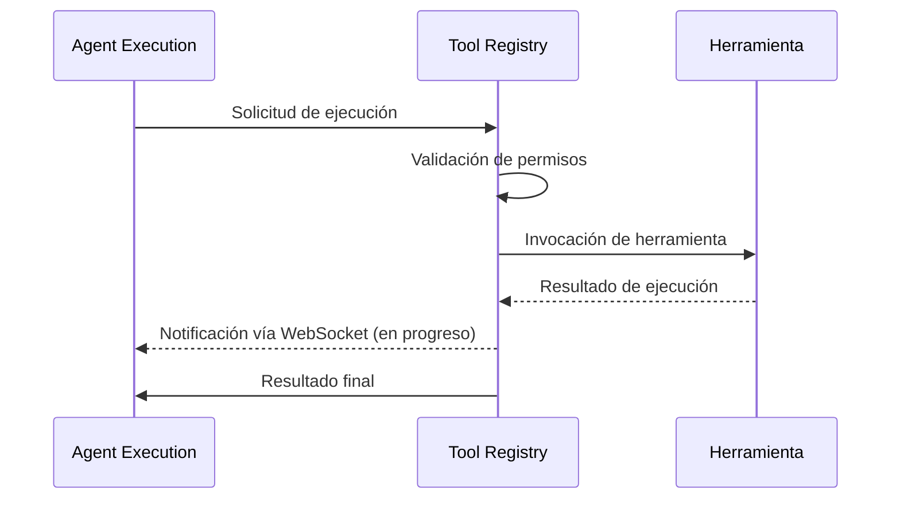
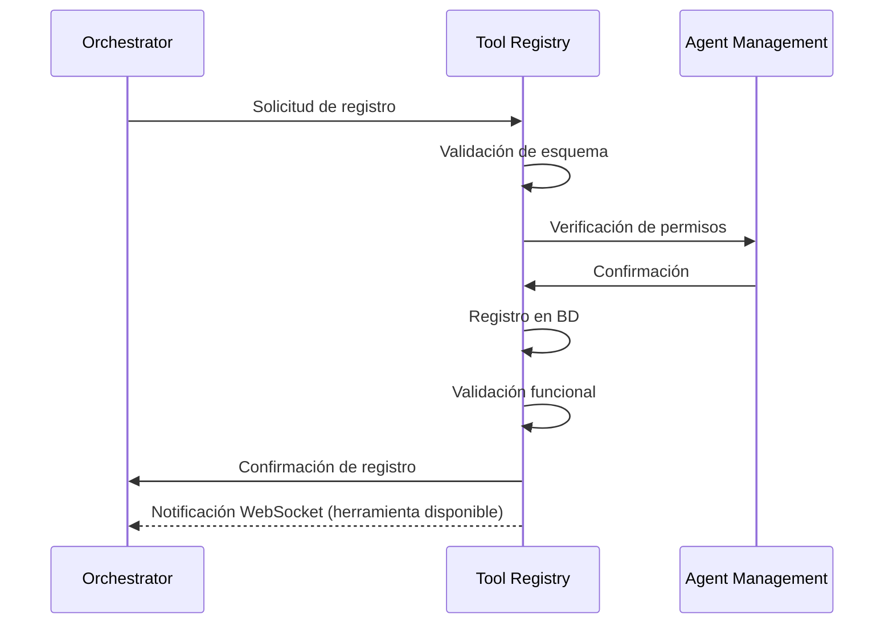

# Comunicación Interna - Tool Registry Service

*Versión: 1.0.0*  
*Última actualización: 2025-06-03*  
*Responsable: Equipo Nooble Backend*

## Índice
- [Comunicación Interna - Tool Registry Service](#comunicación-interna---tool-registry-service)
  - [Índice](#índice)
  - [1. Visión General](#1-visión-general)
  - [2. Estructura de Colas](#2-estructura-de-colas)
  - [3. Formato de Mensajes](#3-formato-de-mensajes)
  - [4. Flujos de Comunicación](#4-flujos-de-comunicación)
  - [5. Timeouts y Reintentos](#5-timeouts-y-reintentos)
  - [6. Manejo de Fallos](#6-manejo-de-fallos)
  - [7. Comunicación con Servicios Específicos](#7-comunicación-con-servicios-específicos)
  - [8. Registro de Cambios](#8-registro-de-cambios)

## 1. Visión General

Este documento detalla los mecanismos de comunicación interna utilizados por el Tool Registry Service para interactuar con otros microservicios de la plataforma Nooble. El Tool Registry Service actúa como un componente central para el registro, descubrimiento y ejecución de herramientas que pueden ser utilizadas por los agentes, implementando patrones de mensajería asíncrona y comunicación en tiempo real.

> **NOTA**: La documentación detallada sobre comunicación con cada servicio específico se encuentra en archivos separados dentro de la carpeta `/communication/internal`.

### 1.1 Principios Fundamentales

- **Centralización**: Punto único de registro y ejecución de herramientas
- **Aislamiento Multi-tenant**: Estricta segregación de datos y herramientas por tenant_id
- **Seguridad**: Control de acceso granular para ejecución de herramientas
- **Resiliencia**: Manejo automático de reintentos y recuperación de errores en ejecuciones
- **Extensibilidad**: Sistema de plugins para fácil incorporación de nuevas herramientas


## 2. Estructura de Colas

### 2.1 Jerarquía de Colas

El Tool Registry Service implementa un sistema de colas Redis para gestionar solicitudes asíncronas de registro y ejecución de herramientas:

```
+-------------------------------------------------+
|             COLAS DE TOOL REGISTRY               |
+-------------------------------------------------+
|                                                 |
| tool_registry.tasks.{tenant_id}                 | → Cola principal de tareas
| tool_registry.execution.{tenant_id}             | → Ejecución de herramientas
| tool_registry.registration.{tenant_id}          | → Registro de herramientas
| tool_registry.validation.{tenant_id}            | → Validación de herramientas
|                                                 |
+-------------------------------------------------+
```

### 2.2 Colas Principales

| Key Redis | Propósito | Consumidores | Productores |
|----------------|-----------|------------|------------|
| `tool_registry.tasks.{tenant_id}` | Cola principal de tareas | Tool Registry Service | Agent Orchestrator Service, Agent Execution Service |
| `tool_registry.execution.{tenant_id}` | Ejecución asíncrona de herramientas | Tool Registry Service | Tool Registry Service |
| `tool_registry.registration.{tenant_id}` | Registro y validación de herramientas | Tool Registry Service | Agent Orchestrator Service |
| `tool_registry.validation.{tenant_id}` | Resultados de validación | Tool Registry Service | Tool Registry Service |

## 3. Formato de Mensajes

### 3.1 Formato Estándar de Mensaje

Todos los mensajes siguen una estructura estandarizada para garantizar consistencia:

```json
{
  "task_id": "uuid-v4",
  "tenant_id": "tenant-identifier",
  "created_at": "ISO-timestamp",
  "status": "pending|processing|completed|failed",
  "type": "tool_execution|tool_registration|tool_discovery",
  "priority": 0-9,
  "metadata": {
    "agent_id": "agent-identifier",
    "session_id": "session-identifier",
    "execution_id": "execution-identifier",
    "source": "agent_execution|workflow|api"
  },
  "payload": {
    "tool_id": "tool-identifier",
    "tool_name": "tool-name",
    "tool_type": "rag|calculator|external_api|...",
    "parameters": {},
    "timeout_ms": 5000
  }
}
```

### 3.2 Tipos de Mensaje Principales

#### Solicitud de Ejecución de Herramienta
```json
{
  "task_id": "uuid-v4",
  "tenant_id": "tenant-identifier",
  "created_at": "ISO-timestamp",
  "status": "pending",
  "type": "tool_execution",
  "priority": 3,
  "metadata": {
    "agent_id": "agent-123",
    "session_id": "session-456",
    "execution_id": "execution-789",
    "source": "agent_execution"
  },
  "payload": {
    "tool_id": "calculator",
    "parameters": {
      "expression": "2 * (3 + 4)"
    },
    "timeout_ms": 3000
  }
}
```

#### Resultado de Ejecución de Herramienta
```json
{
  "task_id": "uuid-v4",
  "tenant_id": "tenant-identifier",
  "created_at": "ISO-timestamp",
  "completed_at": "ISO-timestamp",
  "status": "completed",
  "type": "tool_execution_result",
  "metadata": {
    "agent_id": "agent-123",
    "session_id": "session-456",
    "execution_id": "execution-789",
    "source": "agent_execution"
  },
  "payload": {
    "tool_id": "calculator",
    "result": {
      "value": 14,
      "type": "number",
      "execution_time_ms": 15
    }
  }
}
```

## 4. Flujos de Comunicación

### 4.1 Flujo de Ejecución de Herramienta



### 4.2 Flujo de Registro de Herramienta



## 5. Timeouts y Reintentos

### 5.1 Configuración de Timeouts

| Tipo de Operación | Timeout Predeterminado | Configurable Por |
|-------------------|------------------------|------------------|
| Ejecución de herramienta | 5 segundos | Herramienta, solicitud |
| Registro de herramienta | 30 segundos | Sistema |
| Llamada a API externa | 10 segundos | Herramienta |

### 5.2 Política de Reintentos

- **Estrategia**: Backoff exponencial con jitter
- **Máximo de Intentos**: 2 (configurable por tipo de herramienta)
- **Delay Inicial**: 0.5 segundos
- **Errores Elegibles**: Errores de red, timeouts, errores temporales
- **Errores No Elegibles**: Errores de validación, errores de autenticación

## 6. Manejo de Fallos

### 6.1 Circuit Breaker

El servicio implementa el patrón Circuit Breaker para herramientas externas:

- **Umbral de Apertura**: 60% de fallos en 10 solicitudes
- **Periodo de Reset**: 45 segundos
- **Comportamiento**: Marcar herramienta como no disponible temporalmente

### 6.2 Estrategias de Recuperación

- **Valores por defecto**: Respuestas predeterminadas para herramientas críticas
- **Degradación funcional**: Funcionalidad limitada pero estable en caso de error
- **Logging detallado**: Registro minucioso para análisis posterior

## 7. Comunicación con Servicios Específicos

### 7.1 Integración con Agent Execution Service

El Tool Registry Service se comunica principalmente con el Agent Execution Service para proporcionar funcionalidades a los agentes:

- **Endpoint de ejecución**: `/tools/execute` (POST)
- **Endpoint de descubrimiento**: `/tools/discover` (GET)
- **Notificaciones WebSocket**: Actualizaciones en tiempo real sobre estado de ejecución

### 7.2 Integración con Agent Orchestrator Service

- **Registro de herramientas**: El orquestador coordina el registro de nuevas herramientas
- **Control de acceso**: Verificación centralizada de permisos por tenant y agente
- **Propagación de eventos**: Distribución de eventos de actualización de herramientas

### 7.3 Integración con Agent Management Service

- **Validación de permisos**: Verificación de permisos de agentes para uso de herramientas
- **Configuración de herramientas por agente**: Personalización de parámetros
- **Sincronización de cambios**: Actualizaciones ante cambios en configuración de agentes

## 8. Registro de Cambios

| Versión | Fecha | Cambios |
|---------|-------|---------|
| 1.0.0 | 2025-06-03 | Versión inicial |
