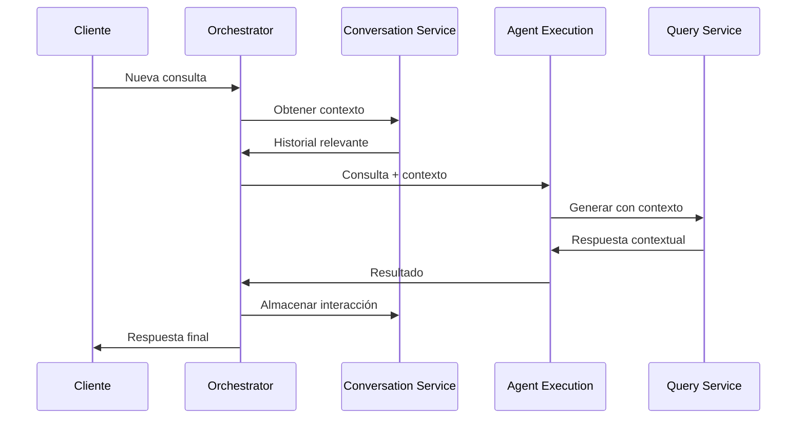
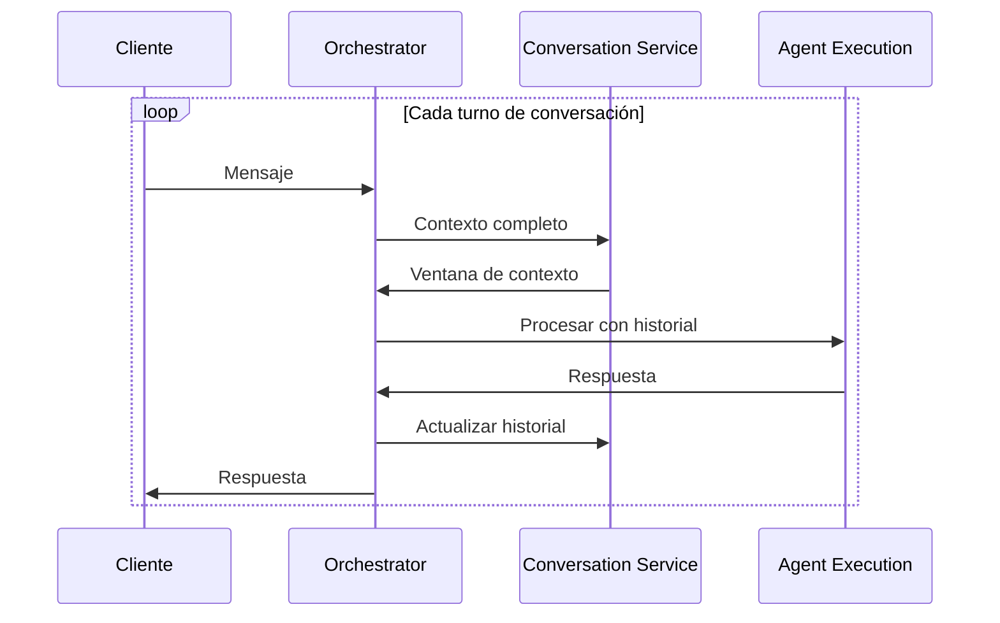
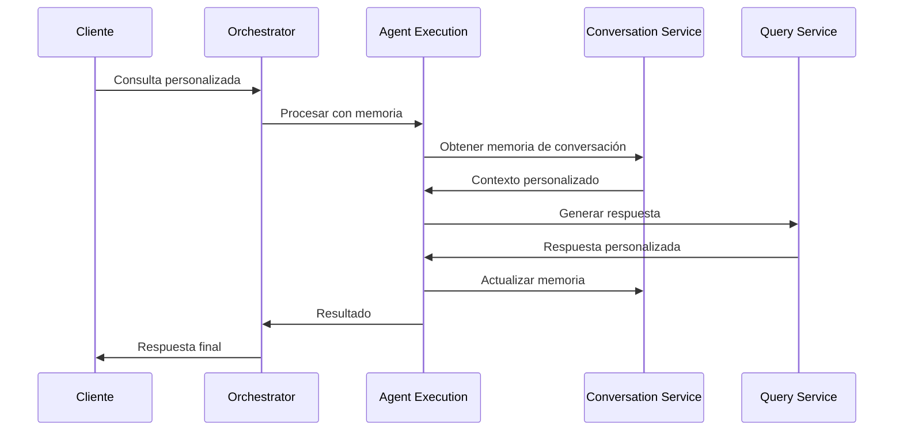
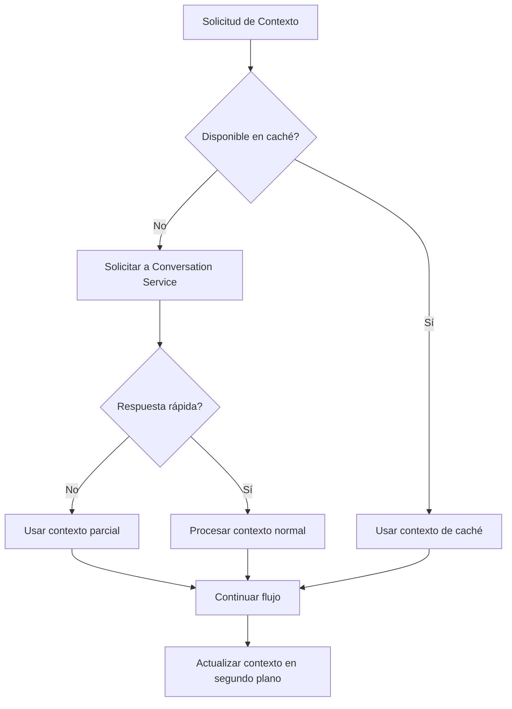

# Comunicación con Conversation Service

*Versión: 1.0.0*  
*Última actualización: 2025-06-03*  
*Responsable: Equipo Nooble Backend*

## Índice
- [Comunicación con Conversation Service](#comunicación-con-conversation-service)
  - [Índice](#índice)
  - [1. Visión General](#1-visión-general)
  - [2. Integración en Flujos de Trabajo](#2-integración-en-flujos-de-trabajo)
  - [3. Estructura de Colas](#3-estructura-de-colas)
  - [4. Formato de Mensajes](#4-formato-de-mensajes)
  - [5. Comunicación WebSocket](#5-comunicación-websocket)
  - [6. REST API](#6-rest-api)
  - [7. Gestión de Errores](#7-gestión-de-errores)

## 1. Visión General

El Agent Orchestrator Service interactúa con el Conversation Service para mantener el historial, el contexto y la memoria de las sesiones de conversación. Esta comunicación es fundamental para la continuidad de las conversaciones multi-turno y para proporcionar contexto relevante a otros servicios como el Agent Execution Service.

### 1.1 Principios de Interacción

- **Fuente de Verdad**: El Conversation Service es la fuente de verdad definitiva para todo el historial y contexto de conversaciones
- **Comunicación Bidireccional**: El Orchestrator tanto consulta como actualiza datos en el Conversation Service
- **Separación de Responsabilidades**: El Conversation Service solo gestiona el almacenamiento y recuperación de conversaciones, mientras que el Orchestrator decide cuándo y cómo utilizarlas
- **Procesamiento Asincrónico**: Las operaciones intensivas de almacenamiento y procesamiento de contexto se delegan al Conversation Service de forma asíncrona


## 2. Integración en Flujos de Trabajo

### 2.1 Consulta con Contexto (Nivel 1)



### 2.2 Conversación Multi-turno (Nivel 2)



### 2.3 Generación con Memoria (Nivel 2)



## 3. Estructura de Colas

El Orchestrator interactúa con el Conversation Service a través de las siguientes colas Redis. Siguiendo el estándar global de comunicación, todas las colas tienen el formato `service-name.[priority].[domain].[action]`:

### 3.1 Colas que Produce el Orchestrator 

| Cola | Domain | Action | Propósito | Prioridad |
|------|--------|--------|------------|----------|
| `conversation_service.high.conversation.task` | `conversation` | `task` | Cola principal para tareas de conversación | Alta |
| `conversation_service.medium.message.store` | `message` | `store` | Almacenamiento de nuevos mensajes | Media |
| `conversation_service.high.context.retrieve` | `context` | `retrieve` | Solicitudes de recuperación de contexto | Alta |
| `conversation_service.low.conversation.history` | `conversation` | `history` | Obtención de historial completo | Baja |
| `conversation_service.high.memory.update` | `memory` | `update` | Actualización de memoria de conversación | Alta |

### 3.2 Colas que Consume el Orchestrator

| Cola | Domain | Action | Propósito | Prioridad |
|------|--------|--------|------------|----------|
| `agent_orchestrator.high.context.result` | `context` | `result` | Resultados de recuperación de contexto | Alta |
| `agent_orchestrator.medium.conversation.update` | `conversation` | `update` | Notificaciones de actualizaciones | Media |
| `agent_orchestrator.high.memory.result` | `memory` | `result` | Respuestas de actualización de memoria | Alta |

### 3.3 Campos de Control Estándar

Todos los mensajes intercambiados en estas colas incluyen los siguientes campos de control estándar:

- `message_id`: Identificador único del mensaje (UUID)
- `correlation_id`: ID para correlacionar solicitudes y respuestas
- `task_id`: Identificador de la tarea asociada
- `tenant_id`: Identificador del tenant
- `schema_version`: Versión del esquema del mensaje (actualmente "1.1")
- `type`: Objeto con campos `domain` y `action` que categorizan el mensaje
- `priority`: Nivel de prioridad (1-10, siendo 10 la mayor prioridad)
- `source_service`: Servicio de origen del mensaje
- `target_service`: Servicio de destino del mensaje

## 4. Formato de Mensajes

### 4.1 Mensaje de Tarea de Conversación

**Domain**: `conversation`  
**Action**: `task`

```json
{
  "message_id": "550e8400-e29b-41d4-a716-446655440000",
  "task_id": "550e8400-e29b-41d4-a716-446655440001",
  "tenant_id": "tenant-identifier",
  "correlation_id": "550e8400-e29b-41d4-a716-446655440002",
  "created_at": "2025-06-03T16:30:45.123Z",
  "schema_version": "1.1",
  "status": "pending",
  "type": {
    "domain": "conversation",
    "action": "task"
  },
  "priority": 5,
  "source_service": "agent_orchestrator",
  "target_service": "conversation_service",
  "metadata": {
    "trace_id": "trace-abc123",
    "session_id": "session-uuid",
    "user_id": "user-uuid",
    "agent_id": "agent-uuid",
    "conversation_id": "conversation-uuid"
  },
  "payload": {
    "task_type": "process",
    "task_parameters": {
      // Parámetros específicos de la tarea
    }
  }
}
```

### 4.2 Mensaje de Almacenamiento 

**Domain**: `message`  
**Action**: `store`

```json
{
  "message_id": "550e8400-e29b-41d4-a716-446655440003",
  "task_id": "550e8400-e29b-41d4-a716-446655440004",
  "tenant_id": "tenant-identifier",
  "correlation_id": "550e8400-e29b-41d4-a716-446655440005",
  "created_at": "2025-06-03T16:32:10.456Z",
  "schema_version": "1.1",
  "status": "pending",
  "type": {
    "domain": "message",
    "action": "store"
  },
  "priority": 5,
  "source_service": "agent_orchestrator",
  "target_service": "conversation_service",
  "metadata": {
    "trace_id": "trace-def456",
    "session_id": "session-uuid",
    "user_id": "user-uuid",
    "agent_id": "agent-uuid",
    "conversation_id": "conversation-uuid"
  },
  "payload": {
    "message": {
      "id": "msg-uuid-1",
      "role": "user",
      "content": "Contenido del mensaje",
      "timestamp": "2025-06-03T16:32:05.789Z",
      "content_type": "text/plain",
      "tokens": 15
    },
    "update_context": true,
    "important": false
  }
}
```

### 4.3 Mensaje de Solicitud de Contexto

**Domain**: `context`  
**Action**: `retrieve`

```json
{
  "message_id": "550e8400-e29b-41d4-a716-446655440006",
  "task_id": "550e8400-e29b-41d4-a716-446655440007",
  "tenant_id": "tenant-identifier",
  "correlation_id": "550e8400-e29b-41d4-a716-446655440008",
  "created_at": "2025-06-03T16:33:20.123Z",
  "schema_version": "1.1",
  "status": "pending",
  "type": {
    "domain": "context",
    "action": "retrieve"
  },
  "priority": 7,
  "source_service": "agent_orchestrator",
  "target_service": "conversation_service",
  "metadata": {
    "trace_id": "trace-ghi789",
    "session_id": "session-uuid",
    "user_id": "user-uuid",
    "agent_id": "agent-uuid",
    "conversation_id": "conversation-uuid"
  },
  "payload": {
    "message_count": 10,
    "include_system_messages": true,
    "max_tokens": 4000,
    "recency_bias": 0.7,
    "context_type": "chat_history",
    "filter": {
      "from_timestamp": "2025-06-01T00:00:00Z",
      "exclude_tags": ["debug", "system-only"]
    }
  }
}
```

### 4.4 Mensaje de Resultado de Contexto

**Domain**: `context`  
**Action**: `result`

```json
{
  "message_id": "550e8400-e29b-41d4-a716-446655440009",
  "task_id": "550e8400-e29b-41d4-a716-446655440010",
  "original_task_id": "550e8400-e29b-41d4-a716-446655440007",
  "tenant_id": "tenant-identifier",
  "correlation_id": "550e8400-e29b-41d4-a716-446655440008",
  "created_at": "2025-06-03T16:33:45.456Z",
  "schema_version": "1.1",
  "status": "completed",
  "type": {
    "domain": "context",
    "action": "result"
  },
  "source_service": "conversation_service",
  "target_service": "agent_orchestrator",
  "metadata": {
    "trace_id": "trace-ghi789",
    "session_id": "session-uuid",
    "user_id": "user-uuid",
    "agent_id": "agent-uuid",
    "conversation_id": "conversation-uuid",
    "processing_time_ms": 235
  },
  "payload": {
    "messages": [
      {
        "id": "msg-uuid-1",
        "role": "user",
        "content": "¿Cómo puedo configurar mi agente?",
        "timestamp": "2025-06-03T16:30:00.000Z",
        "content_type": "text/plain",
        "tokens": 12
      },
      {
        "id": "msg-uuid-2",
        "role": "assistant",
        "content": "Puedes configurar tu agente desde el dashboard...",
        "timestamp": "2025-06-03T16:30:20.000Z",
        "content_type": "text/plain",
        "tokens": 15
      },
      // ... más mensajes ...
    ],
    "context_summary": "Conversación sobre configuración de agentes y opciones disponibles",
    "total_messages": 12,
    "included_messages": 10,
    "total_tokens": 1250,
    "has_more": true,
    "relevance_score": 0.85,
    "context_type": "chat_history"
  }
}
```

### 4.5 Mensaje de Actualización de Conversación

**Domain**: `conversation`  
**Action**: `update`

```json
{
  "message_id": "550e8400-e29b-41d4-a716-446655440011",
  "tenant_id": "tenant-identifier",
  "correlation_id": "550e8400-e29b-41d4-a716-446655440012",
  "created_at": "2025-06-03T16:34:10.789Z",
  "schema_version": "1.1",
  "type": {
    "domain": "conversation",
    "action": "update"
  },
  "priority": 4,
  "source_service": "conversation_service",
  "target_service": "agent_orchestrator", 
  "metadata": {
    "trace_id": "trace-jkl012",
    "session_id": "session-uuid",
    "user_id": "user-uuid"
  },
  "payload": {
    "update_type": "new_message",
    "conversation_id": "conversation-uuid",
    "agent_id": "agent-uuid",
    "messages_count": 12,
    "last_message": {
      "id": "msg-uuid-12",
      "role": "assistant",
      "content_preview": "Aquí tienes las opciones de configuración...",
      "timestamp": "2025-06-03T16:34:05.456Z",
      "content_type": "text/plain",
      "tokens": 18
    },
    "requires_attention": false,
    "update_channels": ["websocket", "notification"],
    "importance": "normal"
  }
}
```

## 5. Comunicación WebSocket

El Orchestrator recibe y envía mensajes WebSocket al Conversation Service para actualizaciones en tiempo real, siguiendo el formato domain/action.

### 5.1 Mensajes que Recibe el Orchestrator

| Domain | Action | Propósito | Origen | Procesamiento |
|--------|--------|------------|--------|---------------|
| `task` | `completed` | Notificación de tarea completada | Conversation Service | Actualizar estado y notificar al cliente |
| `task` | `failed` | Error en tarea de procesamiento | Conversation Service | Manejo de errores y reintentos |
| `conversation` | `update` | Actualización de datos de conversación | Conversation Service | Actualizar caché y propagar |
| `memory` | `update` | Actualización de memoria de conversación | Conversation Service | Propagar a todos los servicios relevantes |
| `system` | `status` | Estado y estadísticas del servicio | Conversation Service | Monitoreo y alertas |

### 5.2 Mensajes que Envía el Orchestrator

| Domain | Action | Propósito | Destino | Procesamiento |
|--------|--------|------------|---------|---------------|
| `conversation` | `create` | Creación de nueva conversación | Conversation Service | Inicialización de conversación |
| `task` | `cancel` | Cancelar tarea en proceso | Conversation Service | Detener procesamiento de tarea |
| `session` | `register` | Registrar sesión para actualizaciones | Conversation Service | Activar notificaciones para sesión |
| `system` | `ping` | Verificación de conexión | Conversation Service | Mantener conexión activa |

### 5.3 Implementación

```python
# En el Orchestrator - Manejador de Mensajes WebSocket
async def handle_websocket_message(message_data):
    # Extraer domain y action del mensaje
    message_type = message_data.get("type", {})
    domain = message_type.get("domain")
    action = message_type.get("action")
    
    # Procesar mensaje basado en domain/action
    if domain == "task" and action == "completed":
        # Procesar tarea completada
        task_id = message_data["payload"]["task_id"]
        tenant_id = message_data["tenant_id"]
        correlation_id = message_data.get("correlation_id")
        
        # Log para trazabilidad
        logger.info(f"Tarea completada. task_id={task_id}, trace_id={message_data['metadata'].get('trace_id')}")
        
        # Actualizar estado de tarea y notificar al cliente
        await update_task_status(task_id, tenant_id, "completed", correlation_id)
        await notify_client(tenant_id, message_data["payload"], correlation_id)
        
    elif domain == "task" and action == "failed":
        # Manejar error en tarea
        error = message_data["payload"]["error"]
        task_id = message_data["payload"]["task_id"]
        tenant_id = message_data["tenant_id"]
        trace_id = message_data["metadata"].get("trace_id")
        
        # Registrar error y posiblemente reintentar
        logger.error(f"Error en tarea: {error}. task_id={task_id}, trace_id={trace_id}")
        await handle_task_failure(task_id, tenant_id, error)
        
    elif domain == "conversation" and action == "update":
        # Actualizar cache de conversación
        conversation_id = message_data["payload"]["conversation_id"]
        tenant_id = message_data["tenant_id"]
        update_type = message_data["payload"]["update_type"]
        
        logger.debug(f"Actualización de conversación: {update_type} para {conversation_id}")
        await update_conversation_cache(tenant_id, conversation_id, message_data["payload"])
```

### 5.4 Registro de Suscripciones

Para recibir actualizaciones específicas, el Orchestrator debe registrarse utilizando un mensaje de suscripción:

```python
async def register_for_conversation_updates(websocket, tenant_id, session_id=None, conversation_id=None):
    # Crear mensaje de registro con formato domain/action
    registration_message = {
        "message_id": str(uuid.uuid4()),
        "tenant_id": tenant_id,
        "created_at": datetime.utcnow().isoformat() + "Z",
        "schema_version": "1.1",
        "type": {
            "domain": "subscription",
            "action": "register"
        },
        "source_service": "agent_orchestrator",
        "target_service": "conversation_service",
        "payload": {
            "topics": [
                "conversation.update",
                "task.completed",
                "task.failed"
            ],
            "filters": {
                "session_id": session_id,
                "conversation_id": conversation_id
            }
        }
    }
    
    # Enviar mensaje de registro
    await websocket.send(json.dumps(registration_message))
```

## 6. REST API

Además de la comunicación asíncrona, el Orchestrator utiliza las siguientes APIs REST del Conversation Service. Todos los endpoints son accesibles mediante comunicación HTTP/HTTPS y siguen el patrón domain/action en sus mensajes JSON.

### 6.1 Endpoints Utilizados

| Endpoint | Método | Domain | Action | Propósito | Parámetros Principales |
|----------|--------|--------|--------|------------|------------------------|
| `/api/v1/conversations` | POST | `conversation` | `create` | Crear nueva conversación | tenant_id, agent_id, user_id, metadata |
| `/api/v1/conversations/{id}` | GET | `conversation` | `retrieve` | Obtener detalles de conversación | conversation_id |
| `/api/v1/conversations/{id}/messages` | GET | `message` | `list` | Listar mensajes de conversación | conversation_id, limit, offset |
| `/api/v1/conversations/{id}/messages` | POST | `message` | `create` | Añadir mensaje a conversación | conversation_id, role, content |
| `/api/v1/internal/context/{conversation_id}` | GET | `context` | `retrieve` | Obtener contexto (uso interno) | conversation_id, max_tokens, message_count |
| `/api/v1/conversations/{id}/memory` | GET | `memory` | `retrieve` | Obtener memoria de conversación | conversation_id, memory_key |
| `/api/v1/conversations/{id}/memory` | PUT | `memory` | `update` | Actualizar memoria de conversación | conversation_id, memory_key, memory_value |

### 6.2 Headers Estándar

Todas las solicitudes REST deben incluir los siguientes headers estándar:

```
Authorization: Bearer {SERVICE_TOKEN}
X-Tenant-ID: {tenant_id}
X-Correlation-ID: {correlation_id}
X-Request-ID: {request_id}
X-Schema-Version: 1.1
Content-Type: application/json
```

### 6.3 Ejemplos de Comunicación REST

**Crear Conversación**:
```python
async def create_conversation(tenant_id, agent_id, user_id, metadata=None):
    url = f"{CONVERSATION_SERVICE_URL}/api/v1/conversations"
    correlation_id = str(uuid.uuid4())
    request_id = str(uuid.uuid4())
    trace_id = str(uuid.uuid4())
    
    # Preparar cuerpo del mensaje siguiendo el estándar domain/action
    payload = {
        "message_id": str(uuid.uuid4()),
        "tenant_id": tenant_id,
        "schema_version": "1.1",
        "created_at": datetime.utcnow().isoformat() + "Z",
        "type": {
            "domain": "conversation",
            "action": "create"
        },
        "source_service": "agent_orchestrator",
        "metadata": {
            "trace_id": trace_id,
            "session_id": None,  # Se asignará posteriormente
            "user_id": user_id
        },
        "payload": {
            "agent_id": agent_id,
            "metadata": metadata or {},
            "initial_context": [],
            "tags": []
        }
    }
    
    # Headers estandarizados
    headers = {
        "Authorization": f"Bearer {SERVICE_TOKEN}",
        "X-Tenant-ID": tenant_id,
        "X-Correlation-ID": correlation_id,
        "X-Request-ID": request_id,
        "X-Schema-Version": "1.1",
        "Content-Type": "application/json"
    }
    
    async with httpx.AsyncClient(timeout=10.0) as client:
        try:
            response = await client.post(url, json=payload, headers=headers)
            response.raise_for_status()
            
            # Procesar respuesta con domain/action
            response_data = response.json()
            
            # Verificar que la respuesta cumple con el formato esperado
            if (response_data.get("type", {}).get("domain") == "conversation" and 
                response_data.get("type", {}).get("action") == "created"):
                
                return response_data.get("payload", {})
            else:
                logger.error(f"Formato de respuesta inesperado: {response_data}")
                raise ServiceCommunicationError("Formato de respuesta inesperado")
                
        except httpx.HTTPStatusError as e:
            logger.error(f"Error HTTP: {e.response.status_code} - {e.response.text}")
            raise ServiceCommunicationError(f"Error creando conversación: {e.response.text}")
            
        except (httpx.RequestError, httpx.TimeoutException) as e:
            logger.error(f"Error de conexión: {str(e)}")
            raise ServiceCommunicationError(f"Error de conexión: {str(e)}")
```

**Obtener Contexto (para consultas síncronas rápidas)**:
```python
async def get_conversation_context_sync(tenant_id, conversation_id, message_count=10, max_tokens=4000):
    url = f"{CONVERSATION_SERVICE_URL}/api/v1/internal/context/{conversation_id}"
    correlation_id = str(uuid.uuid4())
    request_id = str(uuid.uuid4())
    trace_id = get_current_trace_id() or str(uuid.uuid4())
    
    # Parámetros de consulta
    params = {
        "message_count": message_count,
        "max_tokens": max_tokens
    }
    
    # Headers estandarizados
    headers = {
        "Authorization": f"Bearer {SERVICE_TOKEN}",
        "X-Tenant-ID": tenant_id,
        "X-Correlation-ID": correlation_id,
        "X-Request-ID": request_id,
        "X-Trace-ID": trace_id,
        "X-Schema-Version": "1.1"
    }
    
    async with httpx.AsyncClient(timeout=5.0) as client:
        try:
            response = await client.get(url, params=params, headers=headers)
            response.raise_for_status()
            
            # Procesar respuesta con domain/action
            response_data = response.json()
            
            # Verificar formato de respuesta
            if (response_data.get("type", {}).get("domain") == "context" and 
                response_data.get("type", {}).get("action") == "result"):
                
                return response_data.get("payload", {})
            else:
                logger.warning(f"Formato de respuesta inesperado: {response_data}")
                return {"messages": []}
                
        except httpx.HTTPStatusError as e:
            logger.error(f"Error obteniendo contexto: {e.response.status_code} - {e.response.text}")
            return {"messages": []}
            
        except (httpx.RequestError, httpx.TimeoutException) as e:
            logger.error(f"Error de conexión al obtener contexto: {str(e)}")
            return {"messages": []}
```

**Actualizar Memoria de Conversación**:
```python
async def update_conversation_memory(tenant_id, conversation_id, memory_key, memory_value):
    url = f"{CONVERSATION_SERVICE_URL}/api/v1/conversations/{conversation_id}/memory"
    correlation_id = str(uuid.uuid4())
    request_id = str(uuid.uuid4())
    trace_id = get_current_trace_id() or str(uuid.uuid4())
    
    # Preparar cuerpo del mensaje siguiendo el estándar domain/action
    payload = {
        "message_id": str(uuid.uuid4()),
        "tenant_id": tenant_id,
        "schema_version": "1.1",
        "created_at": datetime.utcnow().isoformat() + "Z",
        "type": {
            "domain": "memory",
            "action": "update"
        },
        "source_service": "agent_orchestrator",
        "metadata": {
            "trace_id": trace_id,
            "conversation_id": conversation_id
        },
        "payload": {
            "memory_key": memory_key,
            "memory_value": memory_value,
            "ttl": 86400  # 24 horas en segundos
        }
    }
    
    # Headers estandarizados
    headers = {
        "Authorization": f"Bearer {SERVICE_TOKEN}",
        "X-Tenant-ID": tenant_id,
        "X-Correlation-ID": correlation_id,
        "X-Request-ID": request_id,
        "X-Trace-ID": trace_id,
        "X-Schema-Version": "1.1",
        "Content-Type": "application/json"
    }
    
    async with httpx.AsyncClient(timeout=5.0) as client:
        try:
            response = await client.put(url, json=payload, headers=headers)
            response.raise_for_status()
            return True
        except Exception as e:
            logger.error(f"Error actualizando memoria: {str(e)}")
            return False
```

## 7. Gestión de Errores

### 7.1 Estructura de Códigos de Error

Siguiendo el estándar global de comunicación, los códigos de error siguen el formato `domain.action.error_type` para facilitar la categorización, el diagnóstico y la respuesta adecuada:

| Código de Error | Significado | HTTP Status | Acción Recomendada |
|-----------------|------------|-------------|--------------------|
| `conversation.retrieve.not_found` | Conversación solicitada no existe | 404 | Crear nueva conversación o mostrar mensaje al usuario |
| `conversation.create.duplicate` | Ya existe una conversación con el mismo ID | 409 | Usar la conversación existente |
| `message.store.validation_error` | Formato de mensaje inválido | 400 | Corregir formato del mensaje y reintentar |
| `context.retrieve.processing_error` | Error al procesar o extraer contexto | 500 | Utilizar contexto parcial o continuar sin contexto |
| `memory.update.exceeded_limit` | Límite de tamaño de memoria excedido | 413 | Reducir tamaño de datos de memoria |
| `system.auth.unauthorized` | Credenciales inválidas o expiradas | 401 | Renovar token de servicio |
| `system.rate.limit_exceeded` | Límite de tasa excedido | 429 | Implementar backoff y reducir frecuencia |
| `system.resource.unavailable` | Servicio temporalmente no disponible | 503 | Activar circuit breaker y usar fallbacks |

### 7.2 Formato de Mensaje de Error

```json
{
  "message_id": "550e8400-e29b-41d4-a716-446655440099",
  "correlation_id": "550e8400-e29b-41d4-a716-446655440098",
  "created_at": "2025-06-03T16:35:00.123Z",
  "schema_version": "1.1",
  "type": {
    "domain": "context",
    "action": "error"
  },
  "source_service": "conversation_service",
  "target_service": "agent_orchestrator",
  "metadata": {
    "trace_id": "trace-xyz123",
    "original_request_id": "550e8400-e29b-41d4-a716-446655440097"
  },
  "error": {
    "code": "context.retrieve.processing_error",
    "message": "Error al procesar contexto para la conversación",
    "details": "Se excedió el tiempo de procesamiento al extraer vectores semánticos",
    "retry_after": 5,  // Segundos recomendados para reintentar
    "severity": "error",
    "user_message": "Estamos experimentando problemas al procesar tu historial de conversación"
  },
  "status": 500
}
```

### 7.3 Circuito de Recuperación



### 7.4 Implementación de Circuit Breaker

```python
from circuit_breaker import CircuitBreaker

# Configuración del patrón circuit breaker
context_service_breaker = CircuitBreaker(
    name="conversation_context_service",
    failure_threshold=5,           # Fallos consecutivos para abrir circuito
    recovery_timeout=30,           # Segundos antes de probar conexión nuevamente
    expected_exception=ServiceCommunicationError  # Excepciones a considerar como fallos
)

@context_service_breaker
async def get_conversation_context_with_circuit_breaker(tenant_id, conversation_id, **params):
    try:
        # Crear identificadores para trazabilidad
        correlation_id = str(uuid.uuid4())
        trace_id = get_current_trace_id() or str(uuid.uuid4())
        
        # Preparar mensaje de solicitud con domain/action
        request = {
            "message_id": str(uuid.uuid4()),
            "tenant_id": tenant_id,
            "correlation_id": correlation_id,
            "created_at": datetime.utcnow().isoformat() + "Z",
            "schema_version": "1.1",
            "type": {
                "domain": "context",
                "action": "retrieve"
            },
            "source_service": "agent_orchestrator",
            "metadata": {
                "trace_id": trace_id,
                "conversation_id": conversation_id
            },
            "payload": params
        }
        
        # Realizar solicitud con reintento exponencial
        for attempt in range(3):
            try:
                # Implementación de solicitud...
                response = await send_request(request)
                
                # Verificar formato de respuesta
                if (response.get("type", {}).get("domain") == "context" and 
                    response.get("type", {}).get("action") == "result"):
                    return response.get("payload", {})
                    
                # Manejar error con formato estandarizado
                elif response.get("type", {}).get("action") == "error":
                    error_code = response.get("error", {}).get("code")
                    error_message = response.get("error", {}).get("message")
                    logger.error(f"Error recuperando contexto: {error_code} - {error_message}")
                    
                    # Verificar si es un error temporal
                    if error_code.startswith("system.rate") or error_code.endswith("unavailable"):
                        retry_after = response.get("error", {}).get("retry_after", 1)
                        await asyncio.sleep(retry_after * (2 ** attempt) * (0.8 + 0.4 * random.random()))  # Backoff con jitter
                        continue
                        
            except (httpx.RequestError, httpx.TimeoutException) as e:
                if attempt < 2:  # Reintento para excepciones de conexión
                    await asyncio.sleep(1 * (2 ** attempt) * (0.8 + 0.4 * random.random()))  # Backoff con jitter
                else:
                    raise ServiceCommunicationError(f"Error de comunicación después de reintentos: {str(e)}")
                    
        # Si llegamos aquí, agotar reintentos sin éxito
        return {"messages": [], "error": "No se pudo recuperar contexto después de reintentos"}
        
    except Exception as e:
        # Propagar la excepción para que la maneje el circuit breaker
        context_service_breaker.record_failure()
        logger.error(f"Circuit breaker registrando fallo: {str(e)}")
        raise

# Uso del servicio con circuit breaker
async def get_context_safe(tenant_id, conversation_id, **params):
    try:
        return await get_conversation_context_with_circuit_breaker(tenant_id, conversation_id, **params)
    except Exception as e:
        logger.warning(f"Circuit breaker activo o error en servicio: {str(e)}")
        # Fallback a plan alternativo si el circuit breaker está abierto
        return {"messages": [], "fallback": True}
```

### 7.5 Política de Reintentos

- **Exponential Backoff**: Retraso inicial de 1s, duplicando hasta 16s
- **Jitter**: +/- 20% del valor de retraso para prevenir tormentas de sincronización
- **Máximo de Intentos**: 3 para operaciones críticas, 1 para operaciones no críticas
- **Circuit Breaker**: Se activa después de 5 fallos consecutivos, timeout de reset de 30s
- **Prioridad de Fallo**: En caso de error parcial, priorizar continuar la operación con datos degradados en lugar de fallar completamente
