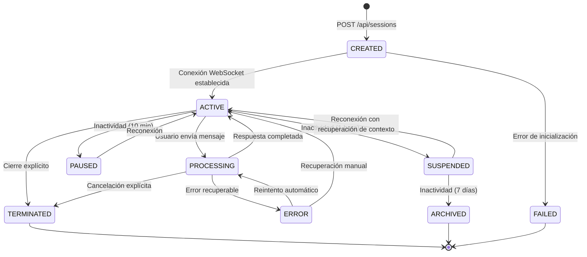

# Estados de Sesión del Agent Orchestrator Service

*Versión: 1.0.0*  
*Última actualización: 2025-06-04*  
*Responsable: Equipo Nooble Backend*

## Índice
- [Estados de Sesión del Agent Orchestrator Service](#estados-de-sesión-del-agent-orchestrator-service)
  - [Índice](#índice)
  - [1. Introducción](#1-introducción)
  - [2. Diagrama de Transición de Estados](#2-diagrama-de-transición-de-estados)
  - [3. Definición de Estados](#3-definición-de-estados)
  - [4. Restricciones de Transición](#4-restricciones-de-transición)
  - [5. Eventos de Transición](#5-eventos-de-transición)
  - [6. Persistencia y Modelo de Datos](#6-persistencia-y-modelo-de-datos)
  - [7. Integración con Frontend](#7-integración-con-frontend)

## 1. Introducción

Este documento define el ciclo de vida completo de las sesiones en el Agent Orchestrator Service y estandariza los estados posibles en los que puede encontrarse una sesión. Esta documentación sirve como referencia canónica para todos los servicios de la plataforma Nooble que necesitan información sobre estados de sesión.

## 2. Diagrama de Transición de Estados



## 3. Definición de Estados

| Estado | Código | Descripción | Duración Típica | Persistente |
|--------|-------|------------|----------------|------------|
| CREATED | 10 | Sesión creada pero sin conexión activa | < 30 segundos | Sí |
| ACTIVE | 20 | Sesión activa con conexión establecida | Minutos a horas | Sí |
| PROCESSING | 30 | Procesando solicitud del usuario | Segundos a minutos | Sí |
| ERROR | 40 | Error recuperable en la sesión | Segundos a minutos | Sí |
| PAUSED | 50 | Temporalmente inactiva pero recuperable sin contexto | Hasta 1 hora | Sí |
| SUSPENDED | 60 | Inactiva pero recuperable con contexto completo | Hasta 7 días | Sí |
| TERMINATED | 70 | Sesión finalizada explícitamente | - | Sí |
| ARCHIVED | 80 | Sesión archivada para consulta histórica | Indefinido | Sí |
| FAILED | 90 | Sesión fallida irrecuperablemente | - | Sí |

## 4. Restricciones de Transición

Las transiciones entre estados deben seguir las siguientes restricciones para mantener consistencia en el ciclo de vida de las sesiones:

```sql
CREATE TABLE session_state_transitions (
    current_state_id INT NOT NULL,
    next_state_id INT NOT NULL,
    description VARCHAR(100) NOT NULL,
    PRIMARY KEY (current_state_id, next_state_id)
);

-- Insertar transiciones permitidas
INSERT INTO session_state_transitions VALUES
    (10, 20, 'CREATED → ACTIVE'),      -- Establecimiento de conexión
    (10, 90, 'CREATED → FAILED'),      -- Error en inicialización
    (20, 30, 'ACTIVE → PROCESSING'),   -- Usuario envía mensaje
    (20, 50, 'ACTIVE → PAUSED'),       -- Inactividad temporal
    (20, 60, 'ACTIVE → SUSPENDED'),    -- Inactividad prolongada
    (20, 70, 'ACTIVE → TERMINATED'),   -- Cierre explícito
    (30, 20, 'PROCESSING → ACTIVE'),   -- Respuesta completada
    (30, 40, 'PROCESSING → ERROR'),    -- Error en procesamiento
    (30, 70, 'PROCESSING → TERMINATED'), -- Cancelación
    (40, 30, 'ERROR → PROCESSING'),    -- Reintento automático
    (40, 20, 'ERROR → ACTIVE'),        -- Recuperación manual
    (50, 20, 'PAUSED → ACTIVE'),       -- Reconexión desde pausa
    (50, 60, 'PAUSED → SUSPENDED'),    -- Excedido tiempo de pausa
    (60, 20, 'SUSPENDED → ACTIVE'),    -- Reconexión desde suspensión
    (60, 80, 'SUSPENDED → ARCHIVED');  -- Excedido tiempo de suspensión

-- Función para validar transición de estado
CREATE OR REPLACE FUNCTION validate_state_transition(
    p_current_state_id INT,
    p_next_state_id INT
) RETURNS BOOLEAN AS $$
BEGIN
    RETURN EXISTS (
        SELECT 1
        FROM session_state_transitions
        WHERE current_state_id = p_current_state_id
        AND next_state_id = p_next_state_id
    );
END;
$$ LANGUAGE plpgsql;
```

## 5. Eventos de Transición

Cada transición de estado debe emitir un evento específico para permitir la sincronización entre servicios y frontend:

| Transición | Evento WebSocket | Publicación Queue | 
|------------|-------------------|-------------------|
| → CREATED | N/A | `orchestrator:sessions:{tenant_id}:created` |
| → ACTIVE | `session_active` | `orchestrator:sessions:{tenant_id}:active` |
| → PROCESSING | `processing_started` | `orchestrator:sessions:{tenant_id}:processing` |
| → ERROR | `processing_error` | `orchestrator:sessions:{tenant_id}:error` |
| → PAUSED | `session_paused` | `orchestrator:sessions:{tenant_id}:paused` |
| → SUSPENDED | `session_suspended` | `orchestrator:sessions:{tenant_id}:suspended` |
| → TERMINATED | `session_terminated` | `orchestrator:sessions:{tenant_id}:terminated` |
| → ARCHIVED | N/A | `orchestrator:sessions:{tenant_id}:archived` |

## 6. Persistencia y Modelo de Datos

### Modelo de Sesión

```sql
CREATE TABLE sessions (
    session_id UUID PRIMARY KEY,
    tenant_id VARCHAR(50) NOT NULL,
    user_id VARCHAR(50) NOT NULL,
    state_id INT NOT NULL,
    created_at TIMESTAMP WITH TIME ZONE NOT NULL DEFAULT NOW(),
    updated_at TIMESTAMP WITH TIME ZONE NOT NULL DEFAULT NOW(),
    last_active_at TIMESTAMP WITH TIME ZONE NOT NULL DEFAULT NOW(),
    metadata JSONB,
    CONSTRAINT valid_state CHECK (state_id IN (10, 20, 30, 40, 50, 60, 70, 80, 90))
);

CREATE INDEX idx_sessions_tenant_user ON sessions(tenant_id, user_id);
CREATE INDEX idx_sessions_state ON sessions(state_id);
CREATE INDEX idx_sessions_last_active ON sessions(last_active_at);
```

### Registro de Cambios de Estado

```sql
CREATE TABLE session_state_history (
    history_id SERIAL PRIMARY KEY,
    session_id UUID NOT NULL,
    previous_state_id INT,
    new_state_id INT NOT NULL,
    changed_at TIMESTAMP WITH TIME ZONE NOT NULL DEFAULT NOW(),
    reason TEXT,
    correlation_id UUID,
    FOREIGN KEY (session_id) REFERENCES sessions(session_id) ON DELETE CASCADE
);

CREATE INDEX idx_state_history_session ON session_state_history(session_id);
```

## 7. Integración con Frontend

### Mapeo de Estados para Frontend

Para una mejor experiencia de usuario, estos estados se mapean a estados UI más simples:

| Estado Interno | Estado UI | Color | Icono | Mensaje |
|---------------|-----------|-------|-------|---------|
| CREATED | "Iniciando" | Azul | spinning | "Iniciando sesión..." |
| ACTIVE | "Activo" | Verde | check-circle | "Sesión activa" |
| PROCESSING | "Procesando" | Azul | spinner | "Procesando..." |
| ERROR | "Error" | Ámbar | exclamation | "Error recuperable, reintentando..." |
| PAUSED | "Inactivo" | Gris | pause | "Sesión en pausa" |
| SUSPENDED | "Suspendido" | Gris oscuro | sleep | "Sesión suspendida" |
| TERMINATED | "Finalizado" | Gris | power-off | "Sesión finalizada" |
| ARCHIVED | "Archivado" | Gris | archive | "Sesión archivada" |
| FAILED | "Fallido" | Rojo | error | "Error irrecuperable" |

### Comportamiento del Frontend por Estado

- **CREATED**: Mostrar pantalla de carga, preparar UI para la sesión
- **ACTIVE**: Permitir interacción plena con el usuario
- **PROCESSING**: Mostrar indicadores de actividad, deshabilitar envío de nuevos mensajes
- **ERROR**: Mostrar mensaje de error con opción de reintentar
- **PAUSED**: Mostrar mensaje de reconexión y reconectar automáticamente
- **SUSPENDED**: Solicitar reconexión explícita, cargar historial al reconectar
- **TERMINATED**: Mostrar mensaje de finalización, opción para crear nueva sesión
- **ARCHIVED**: Mostrar en historial, acceso de solo lectura
- **FAILED**: Mostrar mensaje de error grave, opción de contactar soporte
