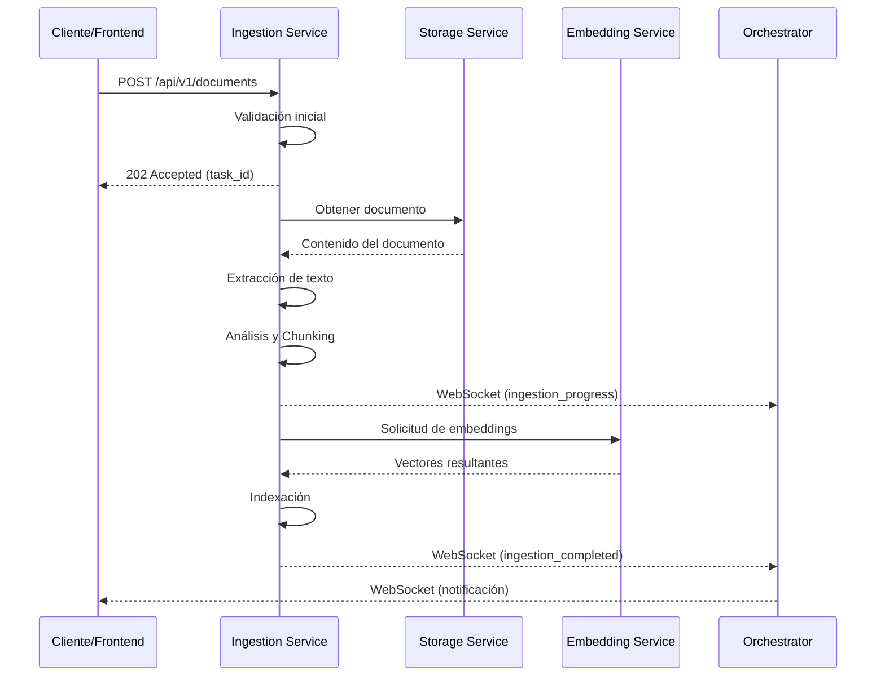
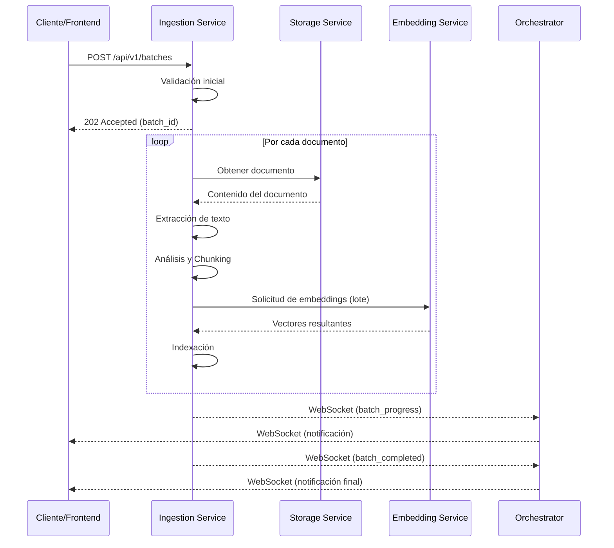

# Comunicación Interna - Ingestion Service

*Versión: 1.0.0*  
*Última actualización: 2025-06-03*  
*Responsable: Equipo Nooble Backend*

## Índice
- [Comunicación Interna - Ingestion Service](#comunicación-interna---ingestion-service)
  - [Índice](#índice)
  - [1. Visión General](#1-visión-general)
  - [2. Estructura de Colas](#2-estructura-de-colas)
  - [3. Formato de Mensajes](#3-formato-de-mensajes)
  - [4. Flujos de Comunicación](#4-flujos-de-comunicación)
  - [5. Timeouts y Reintentos](#5-timeouts-y-reintentos)
  - [6. Manejo de Fallos](#6-manejo-de-fallos)
  - [7. Comunicación con Servicios Específicos](#7-comunicación-con-servicios-específicos)
  - [8. Registro de Cambios](#8-registro-de-cambios)

## 1. Visión General

Este documento detalla los mecanismos de comunicación interna utilizados por el Ingestion Service para interactuar con otros microservicios de la plataforma Nooble. El Ingestion Service es responsable del procesamiento, análisis, chunking y preparación de documentos para su indexación y posterior recuperación en el sistema RAG (Retrieval Augmented Generation).

> **NOTA**: La documentación detallada sobre comunicación con cada servicio específico se encuentra en archivos separados dentro de la carpeta `/communication/internal`.

### 1.1 Principios Fundamentales

- **Procesamiento Asíncrono**: Manejo eficiente de grandes volúmenes de documentos
- **Aislamiento Multi-tenant**: Estricta segregación de datos y procesamiento por tenant_id
- **Modularidad**: Sistema de plugins para soportar múltiples formatos de documentos
- **Trazabilidad**: Seguimiento end-to-end del estado de ingestión de documentos
- **Confiabilidad**: Recuperación automática ante fallos y procesamiento parcial


## 2. Estructura de Colas

### 2.1 Jerarquía de Colas

El Ingestion Service implementa un sistema jerárquico de colas Redis para gestionar diferentes etapas del procesamiento de documentos:

```
+------------------------------------------+
|          COLAS DE INGESTION              |
+------------------------------------------+
|                                          |
| ingestion.tasks.{tenant_id}              | → Cola principal de tareas
| ingestion.extraction.{tenant_id}         | → Extracción de contenido
| ingestion.chunking.{tenant_id}           | → División en fragmentos
| ingestion.embedding.{tenant_id}          | → Generación de embeddings
| ingestion.indexing.{tenant_id}           | → Indexación final
| ingestion.status.{tenant_id}.{batch_id}  | → Estado de procesos batch
|                                          |
+------------------------------------------+
```

### 2.2 Colas Principales

| Key Redis | Propósito | Consumidores | Productores |
|----------------|-----------|------------|------------|
| `ingestion.tasks.{tenant_id}` | Cola principal de tareas | Ingestion Service | Agent Orchestrator, Frontend |
| `ingestion.extraction.{tenant_id}` | Extracción de texto y metadatos | Ingestion Service | Ingestion Service |
| `ingestion.chunking.{tenant_id}` | División inteligente en fragmentos | Ingestion Service | Ingestion Service |
| `ingestion.embedding.{tenant_id}` | Solicitudes de embeddings | Embedding Service | Ingestion Service |
| `ingestion.indexing.{tenant_id}` | Indexación final de documentos | Ingestion Service | Ingestion Service |

## 3. Formato de Mensajes

### 3.1 Formato Estándar de Mensaje

Todos los mensajes siguen una estructura estandarizada para garantizar consistencia:

```json
{
  "task_id": "uuid-v4",
  "tenant_id": "tenant-identifier",
  "created_at": "ISO-timestamp",
  "status": "pending|processing|completed|failed",
  "type": "document_ingestion|batch_ingestion",
  "priority": 0-9,
  "metadata": {
    "source": "api|frontend|agent",
    "collection_id": "collection-identifier",
    "batch_id": "batch-identifier",
    "user_id": "user-identifier"
  },
  "payload": {
    // Datos específicos de la tarea
  }
}
```

### 3.2 Tipos de Mensaje Principales

#### Solicitud de Ingestión de Documento

```json
{
  "task_id": "uuid-v4",
  "tenant_id": "tenant-identifier",
  "created_at": "2025-06-03T21:15:00Z",
  "status": "pending",
  "type": "document_ingestion",
  "priority": 3,
  "metadata": {
    "source": "frontend",
    "collection_id": "collection-123",
    "batch_id": "batch-456",
    "user_id": "user-789"
  },
  "payload": {
    "document_id": "doc-123",
    "document_name": "manual_usuario.pdf",
    "document_type": "pdf",
    "file_size_bytes": 2458000,
    "storage_location": "s3://nooble-documents/tenant-identifier/collection-123/manual_usuario.pdf",
    "chunking_strategy": "semantic",
    "metadata": {
      "title": "Manual de Usuario - Sistema XYZ",
      "author": "Departamento Técnico",
      "creation_date": "2025-05-20"
    }
  }
}
```

#### Estado de Procesamiento de Batch

```json
{
  "task_id": "uuid-v4",
  "tenant_id": "tenant-identifier",
  "created_at": "2025-06-03T21:15:00Z",
  "updated_at": "2025-06-03T21:25:00Z",
  "status": "processing",
  "type": "batch_status",
  "metadata": {
    "collection_id": "collection-123",
    "batch_id": "batch-456"
  },
  "payload": {
    "total_documents": 15,
    "processed_documents": 8,
    "failed_documents": 1,
    "current_stage": "chunking",
    "estimated_completion": "2025-06-03T21:35:00Z",
    "documents": [
      {
        "document_id": "doc-123",
        "status": "completed",
        "stages": {
          "extraction": "completed",
          "chunking": "completed",
          "embedding": "completed",
          "indexing": "completed"
        },
        "chunks_generated": 42,
        "tokens_processed": 15800
      },
      {
        "document_id": "doc-124",
        "status": "processing",
        "stages": {
          "extraction": "completed",
          "chunking": "processing",
          "embedding": "pending",
          "indexing": "pending"
        }
      }
    ],
    "errors": [
      {
        "document_id": "doc-125",
        "error": "extraction_failed",
        "message": "Formato de archivo no soportado",
        "recoverable": false
      }
    ]
  }
}
```

## 4. Flujos de Comunicación

### 4.1 Flujo de Ingestión de Documento Individual



### 4.2 Flujo de Ingestión por Lotes



## 5. Timeouts y Reintentos

### 5.1 Configuración de Timeouts

| Tipo de Operación | Timeout Predeterminado | Configurable Por |
|-------------------|------------------------|------------------|
| Extracción de contenido | 60 segundos | Tipo de documento |
| Chunking | 30 segundos | Tamaño de documento |
| Embedding batch | 120 segundos | Batch size |
| Proceso completo | 1800 segundos | Tenant |

### 5.2 Política de Reintentos

- **Estrategia**: Backoff exponencial con jitter
- **Máximo de Intentos**: 3 para extracción, 2 para embedding
- **Delay Inicial**: 2 segundos
- **Errores Elegibles**: Errores de red, timeouts, errores temporales
- **Errores No Elegibles**: Errores de formato, archivos corruptos

## 6. Manejo de Fallos

### 6.1 Circuit Breaker

El servicio implementa el patrón Circuit Breaker para proteger servicios dependientes:

- **Umbral de Apertura**: 5 fallos consecutivos
- **Periodo de Reset**: 120 segundos
- **Comportamiento**: Pausar procesamiento del batch afectado

### 6.2 Estrategias de Recuperación

- **Procesamiento parcial**: Continuar con documentos válidos si algunos fallan
- **Skip de etapas**: Capacidad para omitir etapas problemáticas en ciertos casos
- **Reinicio selectivo**: Reanudar procesamiento desde el último punto conocido
- **Degradación controlada**: Chunking más simple si el semántico falla

## 7. Comunicación con Servicios Específicos

### 7.1 Integración con Embedding Service

- **Endpoint principal**: `/api/v1/embeddings/batch` (POST)
- **Propósito**: Vectorización de fragmentos de documentos
- **Características**: Procesamiento en lotes, alta prioridad para completar ingestiones

Una solicitud típica al servicio de embeddings:

```json
{
  "batch_id": "batch-456",
  "collection_id": "collection-123",
  "texts": ["fragmento 1...", "fragmento 2...", "..."],
  "model": "text-embedding-3-small",
  "dimensions": 1536
}
```

### 7.2 Integración con Storage Service

- **Operaciones**: Lectura de documentos originales, almacenamiento de chunks procesados
- **Características**: Compatibilidad con S3, Azure Blob Storage y almacenamiento local

### 7.3 Integración con Agent Orchestrator Service

- **Notificaciones**: Eventos de progreso y finalización de ingestión
- **Control**: Pausar, reanudar o cancelar procesos de ingestión

### 7.4 Formatos Soportados y Adaptadores

| Formato | Extractor | Requisitos Especiales | Chunking Recomendado |
|---------|-----------|----------------------|---------------------|
| PDF | pdf-extractor | Ninguno | Semántico + Layout |
| DOCX | office-extractor | Ninguno | Semántico |
| HTML | web-extractor | Ninguno | HTML-aware |
| CSV/Excel | table-extractor | Análisis de estructura | Tabular |
| Markdown | text-extractor | Ninguno | Markdown-aware |
| Código fuente | code-extractor | Lenguaje como metadata | Función/Clase |

## 8. Registro de Cambios

| Versión | Fecha | Cambios |
|---------|-------|---------|
| 1.0.0 | 2025-06-03 | Versión inicial |
