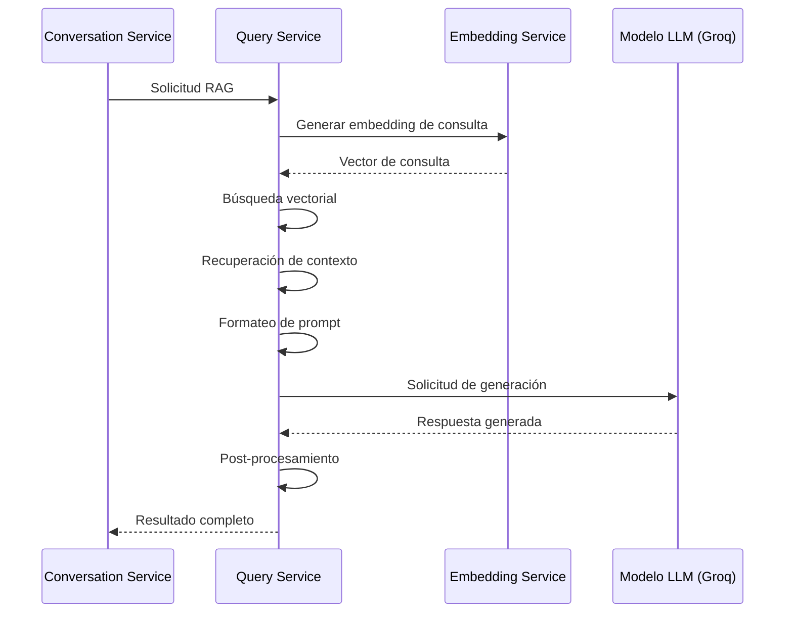
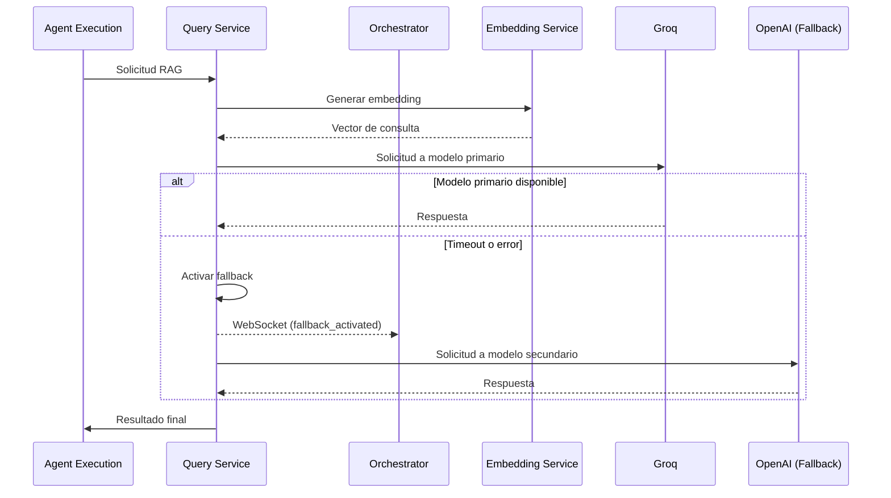

# Comunicación Interna - Query Service

*Versión: 1.0.0*  
*Última actualización: 2025-06-03*  
*Responsable: Equipo Nooble Backend*

## Índice
- [Comunicación Interna - Query Service](#comunicación-interna---query-service)
  - [Índice](#índice)
  - [1. Visión General](#1-visión-general)
  - [2. Estructura de Colas](#2-estructura-de-colas)
  - [3. Formato de Mensajes](#3-formato-de-mensajes)
  - [4. Flujos de Comunicación](#4-flujos-de-comunicación)
  - [5. Timeouts y Reintentos](#5-timeouts-y-reintentos)
  - [6. Manejo de Fallos](#6-manejo-de-fallos)
  - [7. Comunicación con Servicios Específicos](#7-comunicación-con-servicios-específicos)
  - [8. Registro de Cambios](#8-registro-de-cambios)

## 1. Visión General

Este documento detalla los mecanismos de comunicación interna utilizados por el Query Service para interactuar con otros microservicios de la plataforma Nooble. El Query Service se encarga del procesamiento avanzado de consultas RAG (Retrieval Augmented Generation), con optimización para modelos LLM de Groq y OpenAI, implementando búsqueda vectorial con contexto enriquecido.

> **NOTA**: La documentación detallada sobre comunicación con cada servicio específico se encuentra en archivos separados dentro de la carpeta `/communication/internal`.

### 1.1 Principios Fundamentales

- **Eficiencia**: Optimización para bajo tiempo de respuesta con alta relevancia
- **Aislamiento Multi-tenant**: Estricta segregación de datos y procesamiento por tenant_id
- **Fallbacks Inteligentes**: Estrategias de degradación controlada en caso de indisponibilidad
- **Observabilidad**: Tracking completo de tokens, latencias y métricas de relevancia
- **Adaptabilidad**: Soporte para múltiples modelos y proveedores de LLM


## 2. Estructura de Colas

### 2.1 Jerarquía de Colas

El Query Service implementa un sistema de colas Redis para gestionar solicitudes asíncronas de procesamiento:

```
+------------------------------------+
|          COLAS DE QUERY            |
+------------------------------------+
|                                    |
| query.tasks.{tenant_id}            | → Cola principal de tareas
| query.results.{tenant_id}.{id}     | → Resultados temporales
| query.metrics.{tenant_id}          | → Métricas de rendimiento
|                                    |
+------------------------------------+
```

### 2.2 Colas Principales

| Key Redis | Propósito | Consumidores | Productores |
|----------------|-----------|------------|------------|
| `query.tasks.{tenant_id}` | Cola principal de tareas | Query Service | Agent Execution, Conversation Service |
| `query.results.{tenant_id}.{id}` | Almacenamiento temporal de resultados | Query Service | Query Service |
| `query.metrics.{tenant_id}` | Métricas de rendimiento y uso | Query Service, Monitoring Service | Query Service |

## 3. Formato de Mensajes

### 3.1 Formato Estándar de Mensaje

Todos los mensajes siguen una estructura estandarizada para garantizar consistencia:

```json
{
  "task_id": "uuid-v4",
  "tenant_id": "tenant-identifier",
  "created_at": "ISO-timestamp",
  "status": "pending|processing|completed|failed",
  "type": "rag_query|semantic_search|hybrid_search",
  "priority": 0-9,
  "metadata": {
    "source": "agent_execution|conversation_service",
    "session_id": "session-identifier",
    "collection_ids": ["collection-id1", "collection-id2"],
    "model": "groq-mixtral-8x7b",
    "timestamp": "ISO-timestamp"
  },
  "payload": {
    "query": "texto de la consulta del usuario",
    "top_k": 5,
    "similarity_threshold": 0.75,
    "context_window": 8000,
    "system_prompt": "instrucciones adicionales"
  }
}
```

### 3.2 Tipos de Mensaje Principales

#### Consulta RAG

```json
{
  "task_id": "uuid-v4",
  "tenant_id": "tenant-identifier",
  "created_at": "2025-06-03T19:45:00Z",
  "status": "pending",
  "type": "rag_query",
  "priority": 4,
  "metadata": {
    "source": "conversation_service",
    "session_id": "session-456",
    "collection_ids": ["support-docs-123"],
    "model": "groq-mixtral-8x7b"
  },
  "payload": {
    "query": "¿Cómo configuro mi cuenta para recibir alertas de seguridad?",
    "top_k": 5,
    "similarity_threshold": 0.75,
    "context_window": 8000,
    "system_prompt": "Responde basándote en la documentación proporcionada"
  }
}
```

#### Resultado de Consulta RAG

```json
{
  "task_id": "uuid-v4",
  "tenant_id": "tenant-identifier",
  "created_at": "2025-06-03T19:45:00Z",
  "completed_at": "2025-06-03T19:45:10Z",
  "status": "completed",
  "type": "rag_query_result",
  "metadata": {
    "source": "conversation_service",
    "session_id": "session-456",
    "collection_ids": ["support-docs-123"],
    "model": "groq-mixtral-8x7b",
    "metrics": {
      "tokens_input": 1200,
      "tokens_output": 320,
      "processing_time_ms": 650,
      "embedding_time_ms": 120,
      "retrieval_time_ms": 85,
      "llm_time_ms": 445
    }
  },
  "payload": {
    "answer": "Para configurar las alertas de seguridad en tu cuenta, debes seguir estos pasos:\n1. Inicia sesión en tu panel de control\n2. Ve a Configuración > Seguridad\n3. Habilita 'Alertas de seguridad' y selecciona los canales de notificación (email, SMS)\n4. Configura los tipos de alertas que deseas recibir\n5. Guarda los cambios\n\nPuedes personalizar la frecuencia de las alertas y los eventos específicos que las activan desde la sección 'Reglas de alertas'.",
    "sources": [
      {
        "document_id": "doc-789",
        "title": "Guía de configuración de seguridad",
        "url": "https://example.com/docs/security-settings",
        "snippet": "Las alertas de seguridad se configuran desde el panel de control en Configuración > Seguridad...",
        "similarity_score": 0.92
      },
      {
        "document_id": "doc-456",
        "title": "Opciones de notificación",
        "url": "https://example.com/docs/notifications",
        "snippet": "Las alertas pueden enviarse por email, SMS o notificaciones push dependiendo de la configuración...",
        "similarity_score": 0.85
      }
    ]
  }
}
```

## 4. Flujos de Comunicación

### 4.1 Flujo Básico de Consulta RAG



### 4.2 Flujo Asíncrono con Fallbacks



## 5. Timeouts y Reintentos

### 5.1 Configuración de Timeouts

| Tipo de Operación | Timeout Predeterminado | Configurable Por |
|-------------------|------------------------|------------------|
| Consulta RAG completa | 20 segundos | Tenant, solicitud |
| Llamada a Embedding | 5 segundos | Sistema |
| Llamada a LLM | 15 segundos | Modelo, solicitud |
| Búsqueda vectorial | 3 segundos | Colección |

### 5.2 Política de Reintentos

- **Estrategia**: Backoff exponencial con jitter
- **Máximo de Intentos**: 2 para LLM, 3 para embedding
- **Delay Inicial**: 0.5 segundos
- **Factor de Backoff**: 2
- **Errores Elegibles**: Errores de red, timeouts, errores 5xx
- **Errores No Elegibles**: Errores de validación, límites de tokens

## 6. Manejo de Fallos

### 6.1 Circuit Breaker

El servicio implementa el patrón Circuit Breaker para cada proveedor de LLM:

- **Umbral de Apertura**: 3 fallos consecutivos
- **Periodo de Reset**: 45 segundos
- **Half-open State**: Prueba con solicitudes sintéticas cada 15 segundos

### 6.2 Estrategias de Degradación Controlada

En caso de fallos, el servicio aplica una serie de degradaciones controladas:

1. **Cambio de modelo**: Groq → OpenAI → Anthropic (según disponibilidad)
2. **Reducción de contexto**: Disminuir número de documentos recuperados
3. **Simplificación de prompt**: Eliminar instrucciones complejas
4. **Respuesta limitada**: Dar solo referencias sin generación completa

## 7. Comunicación con Servicios Específicos

### 7.1 Integración con Embedding Service

- **Endpoint principal**: `/api/v1/embeddings` (POST)
- **Propósito**: Vectorizar consultas para búsqueda semántica
- **Flujo crítico**: Alta prioridad, sin fallback posible

### 7.2 Integración con Conversation Service

- **Endpoint principal**: `/api/v1/query/rag` (POST)
- **Propósito**: Proporcionar respuestas enriquecidas con conocimiento
- **Características**: Soporte para historiales de conversación, personalización

### 7.3 Integración con Agent Execution Service

- **Endpoint principal**: `/api/v1/query/tool` (POST)
- **Propósito**: Funcionar como herramienta RAG para agentes
- **Características**: Formato específico para integración con frameworks de agentes

### 7.4 Proveedores Externos

- **Groq API**: Proveedor principal para inferencia rápida
- **OpenAI API**: Alternativa para casos específicos o fallback
- **Pinecone/Weaviate**: Opcional para búsqueda vectorial avanzada

## 8. Registro de Cambios

| Versión | Fecha | Cambios |
|---------|-------|---------|
| 1.0.0 | 2025-06-03 | Versión inicial |
