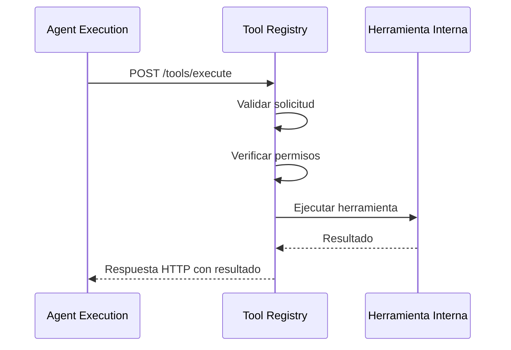
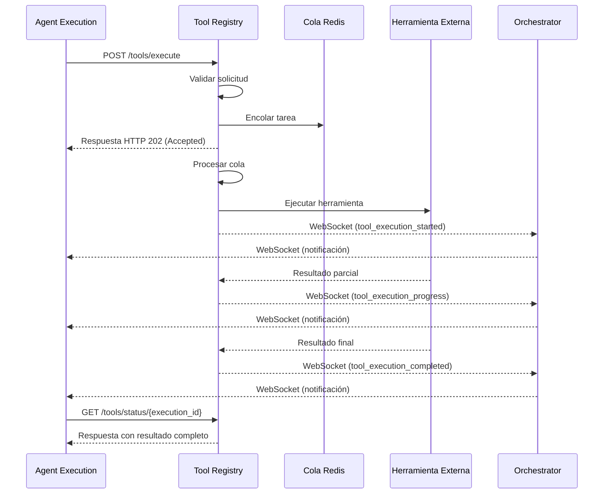

# Comunicación con Agent Execution Service

*Versión: 1.0.0*  
*Última actualización: 2025-06-03*  
*Responsable: Equipo Nooble Backend*

## Índice
- [Comunicación con Agent Execution Service](#comunicación-con-agent-execution-service)
  - [Índice](#índice)
  - [1. Visión General](#1-visión-general)
  - [2. Endpoints API](#2-endpoints-api)
  - [3. Mensajes de Cola](#3-mensajes-de-cola)
  - [4. Eventos WebSocket](#4-eventos-websocket)
  - [5. Flujos de Trabajo](#5-flujos-de-trabajo)
  - [6. Manejo de Errores](#6-manejo-de-errores)
  - [7. Registro de Cambios](#7-registro-de-cambios)

## 1. Visión General

Este documento detalla la comunicación entre el Tool Registry Service y el Agent Execution Service. La interacción entre estos servicios es crítica para que los agentes puedan descubrir y ejecutar herramientas durante su proceso de razonamiento y toma de decisiones.

### 1.1 Propósito de la Comunicación

La comunicación entre estos servicios permite:
- Descubrimiento dinámico de herramientas disponibles para un agente específico
- Ejecución segura de herramientas solicitadas por los agentes
- Notificación en tiempo real sobre el progreso de ejecución
- Validación de permisos y contexto para uso de herramientas

### 1.2 Características Principales

- **Alto Rendimiento**: Optimizado para baja latencia en herramientas interactivas
- **Seguridad Contextual**: Verificación de permisos basada en tenant, agente y contexto
- **Ejecución Asíncrona**: Soporte para herramientas de ejecución prolongada
- **Streaming de Resultados**: Para herramientas que generan resultados incrementales
- **Validación Estricta**: Verificación de parámetros de entrada y resultados

## 2. Endpoints API

### 2.1 Endpoints Expuestos por Tool Registry Service

| Endpoint | Método | Descripción | Autenticación |
|----------|--------|-------------|---------------|
| `/api/v1/tools/discover` | GET | Descubre herramientas disponibles para un agente | Bearer Token + Tenant ID |
| `/api/v1/tools/execute` | POST | Ejecuta una herramienta específica | Bearer Token + Tenant ID |
| `/api/v1/tools/status/{execution_id}` | GET | Verifica estado de ejecución | Bearer Token + Tenant ID |
| `/internal/tools/schema/{tool_id}` | GET | Obtiene el esquema JSON de una herramienta | Service Token |

### 2.2 Ejemplos de Solicitud/Respuesta

#### Descubrimiento de Herramientas

**Solicitud**
```http
GET /api/v1/tools/discover?agent_id=agent-123
Host: tool-registry-service
Authorization: Bearer {token}
X-Tenant-ID: tenant-abc
```

**Respuesta**
```json
{
  "tools": [
    {
      "id": "calculator",
      "name": "Calculadora básica",
      "description": "Realiza cálculos matemáticos simples",
      "version": "1.0",
      "categories": ["math", "utility"],
      "parameters": {
        "type": "object",
        "properties": {
          "expression": {
            "type": "string",
            "description": "Expresión matemática a evaluar"
          }
        },
        "required": ["expression"]
      }
    },
    {
      "id": "weather_lookup",
      "name": "Consulta del clima",
      "description": "Obtiene información meteorológica actual",
      "version": "2.1",
      "categories": ["external_api", "utility"],
      "parameters": {
        "type": "object",
        "properties": {
          "location": {
            "type": "string",
            "description": "Ciudad o coordenadas"
          }
        },
        "required": ["location"]
      }
    }
  ],
  "count": 2
}
```

#### Ejecución de Herramienta

**Solicitud**
```http
POST /api/v1/tools/execute
Host: tool-registry-service
Authorization: Bearer {token}
X-Tenant-ID: tenant-abc
Content-Type: application/json

{
  "tool_id": "calculator",
  "agent_id": "agent-123",
  "execution_id": "exec-456",
  "session_id": "session-789",
  "parameters": {
    "expression": "2 * (3 + 4)"
  },
  "timeout_ms": 5000
}
```

**Respuesta**
```json
{
  "execution_id": "exec-456",
  "status": "completed",
  "tool_id": "calculator",
  "result": {
    "value": 14,
    "type": "number"
  },
  "execution_time_ms": 15
}
```

## 3. Mensajes de Cola

### 3.1 Cola de Ejecución Asíncrona

Para herramientas de ejecución prolongada, se utiliza una cola Redis:

**Cola**: `tool_registry.execution.{tenant_id}`

**Formato del Mensaje**:
```json
{
  "task_id": "task-uuid",
  "tool_id": "external_search_tool",
  "agent_id": "agent-123",
  "execution_id": "exec-456",
  "session_id": "session-789",
  "tenant_id": "tenant-abc",
  "created_at": "2025-06-03T18:30:00Z",
  "status": "pending",
  "parameters": {
    "query": "información sobre cambio climático",
    "max_results": 5
  },
  "priority": 2,
  "timeout_ms": 30000,
  "callback_url": "http://agent-execution:8000/internal/tool/callback"
}
```

### 3.2 Cola de Notificación de Resultados

**Cola**: `tool_registry.results.{tenant_id}.{execution_id}`

**Formato del Mensaje**:
```json
{
  "task_id": "task-uuid",
  "tool_id": "external_search_tool",
  "execution_id": "exec-456",
  "tenant_id": "tenant-abc",
  "status": "completed",
  "created_at": "2025-06-03T18:30:00Z",
  "completed_at": "2025-06-03T18:30:15Z",
  "result": {
    "status": "success",
    "results": [
      {
        "title": "Informe IPCC 2025",
        "url": "https://example.org/climate-report",
        "snippet": "Los últimos datos muestran un incremento..."
      },
      // más resultados
    ],
    "metadata": {
      "result_count": 5,
      "source": "web_search"
    }
  }
}
```

## 4. Eventos WebSocket

### 4.1 Canal de Eventos

El Tool Registry Service emite eventos WebSocket que son consumidos por el Agent Execution Service a través del Orchestrator:

**Canal**: `ws://agent-orchestrator:8000/ws/task_updates`

### 4.2 Eventos Principales

#### Inicio de Ejecución de Herramienta

```json
{
  "event": "tool_execution_started",
  "service": "tool-registry",
  "task_id": "task-uuid",
  "tenant_id": "tenant-abc",
  "timestamp": "2025-06-03T18:30:02Z",
  "data": {
    "tool_id": "external_search_tool",
    "execution_id": "exec-456",
    "agent_id": "agent-123",
    "estimated_time_ms": 15000
  }
}
```

#### Progreso de Ejecución

```json
{
  "event": "tool_execution_progress",
  "service": "tool-registry",
  "task_id": "task-uuid",
  "tenant_id": "tenant-abc",
  "timestamp": "2025-06-03T18:30:07Z",
  "data": {
    "tool_id": "external_search_tool",
    "execution_id": "exec-456",
    "progress_percentage": 50,
    "message": "Procesando resultados preliminares",
    "partial_result": {
      "results_so_far": 2
    }
  }
}
```

#### Finalización de Ejecución

```json
{
  "event": "tool_execution_completed",
  "service": "tool-registry",
  "task_id": "task-uuid",
  "tenant_id": "tenant-abc",
  "timestamp": "2025-06-03T18:30:15Z",
  "data": {
    "tool_id": "external_search_tool",
    "execution_id": "exec-456",
    "status": "success",
    "execution_time_ms": 13045,
    "result_size_bytes": 2458
  }
}
```

#### Error en Ejecución

```json
{
  "event": "tool_execution_failed",
  "service": "tool-registry",
  "task_id": "task-uuid",
  "tenant_id": "tenant-abc",
  "timestamp": "2025-06-03T18:30:10Z",
  "data": {
    "tool_id": "external_search_tool",
    "execution_id": "exec-456",
    "error": {
      "code": "external_api_error",
      "message": "La API externa no está disponible actualmente",
      "details": "Timeout after 10000ms"
    },
    "retryable": true
  }
}
```

## 5. Flujos de Trabajo

### 5.1 Flujo de Ejecución Síncrona



### 5.2 Flujo de Ejecución Asíncrona



## 6. Manejo de Errores

### 6.1 Códigos de Error Específicos

| Código | Descripción | Acción Recomendada |
|--------|-------------|-------------------|
| `tool_not_found` | La herramienta solicitada no existe | Verificar la lista de herramientas disponibles |
| `invalid_parameters` | Los parámetros no cumplen el esquema | Revisar la documentación de la herramienta |
| `permission_denied` | El agente no tiene permisos | Verificar la configuración del agente |
| `execution_timeout` | La ejecución superó el timeout | Incrementar el timeout o optimizar la consulta |
| `tool_error` | Error interno de la herramienta | Revisar los logs específicos de la herramienta |
| `external_api_error` | Error en API externa | Verificar la disponibilidad del servicio externo |

### 6.2 Estrategias de Recuperación

- **Reintentos Automáticos**: Para errores transitorios (externos)
- **Herramientas Alternativas**: Fallback a herramientas similares si están configuradas
- **Respuestas Parciales**: Devolución de resultados parciales cuando es posible
- **Sugerencias de Corrección**: Recomendaciones para corregir parámetros inválidos

## 7. Registro de Cambios

| Versión | Fecha | Cambios |
|---------|-------|---------|
| 1.0.0 | 2025-06-03 | Versión inicial |
